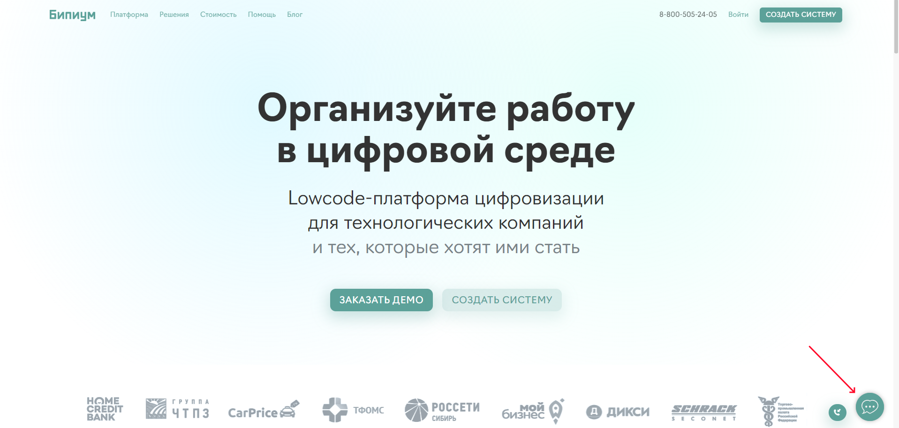

# Задать вопрос

Где можно задать вопрос

### Телеграм-канал

Каждый день в 11:00 Мск проводим трансляцию в телеграме, на которой отвечаем на ваши вопросы и помогаем создать систему на Бипиуме.

[Переходите в телеграм-канал](https://t.me/bpiumhelp) и заходите на трансляцию.

### Наш сайт

На любой странице сайта есть виджет чата, в который можно написать вопрос. Нажмите на кнопку, показанную на скрине:

<figure><figcaption>
Виджет чата на сайте
</figcaption></figure>

Перед вами откроется чат с нашим менеджером поддержки. Опишите суть вашей проблемы и вам ответят в течение 2-4 часов.

<figure><figcaption>
Окно чата поддержки на сайте
</figcaption></figure>

### Внутри Бипиума

Внутри вашей системы на Бипиуме тоже есть возможность обратиться в поддержку. Кнопка сделана для удобства отправки обращений, чтобы вам не приходилось лишний раз искать куда писать.

Где находится кнопка показано на скриншоте:

<figure><figcaption>
Кнопка для обращения в поддержку в Бипиум
</figcaption></figure>

<figure><figcaption>
Кнопка для обращенияв поддержку в Бипиум
</figcaption></figure>

В открывшемся окне введите контактные данные для того, чтобы с вами связались по вашему вопросу.

<figure><figcaption>
Окно для обращения в поддержку
</figcaption></figure>

### Почта техподдержки

Напишите на [support@bpium.ru](mailto:support@bpium.ru) и опишите ваш запрос. Можете прикрепить скрины или видео, чтобы наш специалист быстрее разобрался в вопросе и решил вашу задачу. Время ответа: 4 рабочих часа. Время работы: по будням с 10:00 до 18:00 по московскому времени.
