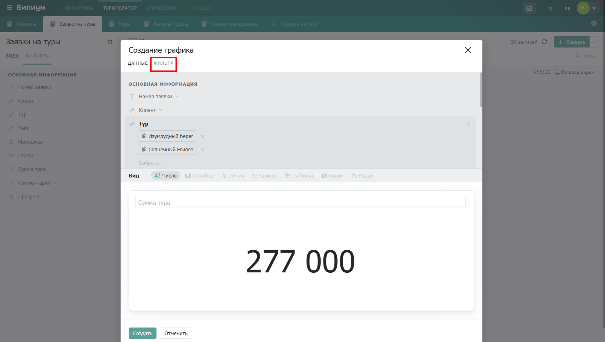
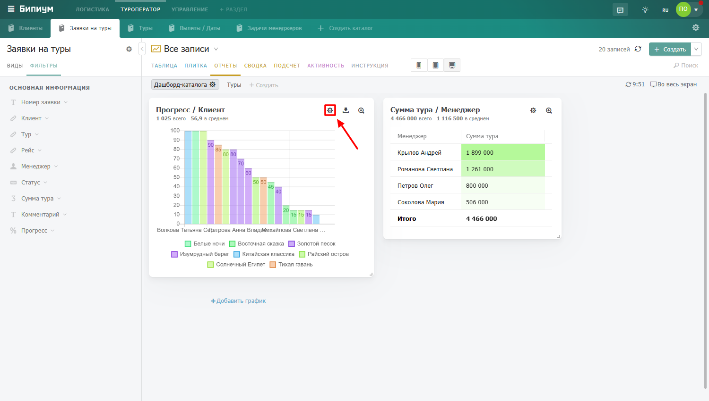

# Настраиваем дашборды

## Что такое дашборд

**Дашборд** — это экран с набором графиков, которые показывают данные из каталога в разных разрезах. Каждый дашборд привязан к конкретному каталогу и создаётся автоматически при его появлении.

<figure><figcaption>
Дашборд во вкладке отчеты
</figcaption></figure>

Графики на дашборде расположены на сетке. Администратор может менять их размеры и порядок. Над каждым графиком отображаются агрегатные значения — суммарное и среднее по всем данным, чтобы сразу видеть ключевые показатели. Эти значения учитывают все записи каталога, а не только те, которые попали в график (например, если график показывает топ-100 сотрудников, агрегат посчитается по всем).

## **Доступ к дашборду:**

* Просматривать дашборд могут сотрудники, у которых есть право видеть хотя бы одну запись в каталоге.
* Создавать, изменять и удалять графики могут сотрудники с правом администрирования каталога.

**Особенность работы с фильтрами:**\
Графики учитывают фильтры, заданные в каталоге и в выбранном виде. Если вы измените фильтры или переключите вид — графики перестроятся автоматически на основе записей, попавших под условия поиска. Кроме того, у каждого графика есть собственный фильтр на вкладке «Фильтры» — он действует независимо от общих фильтров каталога.

## Создание дашборда

1. Откройте нужный каталог.
2. Перейдите во вкладку **«Отчёты»**.
3. Нажмите кнопку **«Создать»**, чтобы создать новый дашборд.
4. Придумайте и укажите название дашборда.

<figure><figcaption>
Создание нового дашборда
</figcaption></figure>

<figure><figcaption>
Создание нового дашборда
</figcaption></figure>

После создания дашборда можно приступать к добавлению графиков.

## Создание графика

Нажмите кнопку **«Добавить график»** — откроется окно конструктора с настройками.

<figure><figcaption>
Добавить график
</figcaption></figure>

### Вкладка «Данные»

<figure><figcaption>
Вкладка «Данные» с обозначением полей
</figcaption></figure>

#### **1. «Посчитать» — что считаем (значение по оси Y)**

Выберите числовой показатель для отображения:

* **Число записей** — количество записей, попадающих в группу.
*   **Агрегатная функция по полю** доступна для полей типа:

    * Число
    * Прогресс
    * Звёзды
    * Продолжительность (для полей типа «категория», «вопрос», «набор галочек» — считается время активности каждого варианта)

    <figure><figcaption>
Выпадающий список поля «Посчитать»
</figcaption></figure>

#### **2. «Функция (f)» — как агрегируем**

Для числовых показателей доступны функции:

* Сумма
* Среднее
* Среднее по всем
* Максимальное
* Минимальное

**Разница между «среднее» и «среднее по всем»:**

* **Среднее** — пустые значения («не указано») не учитываются при расчёте. Записи с неуказанным числовым полем просто пропускаются.
* **Среднее по всем** — пустые значения приравниваются к 0 и участвуют в расчёте.

<figure><figcaption>
Выпадающий список поля «Функция»
</figcaption></figure>

#### **3. «Разложить по» — по чему группируем (ось X)**

Выберите поле, по которому данные будут разбиваться на группы. Доступны поля:

* Дата (с возможностью группировки по интервалам)
* Категория, вопрос, набор галочек
* Прогресс (шаг 10%)
* Звёзды
* Сотрудник
* Связанный объект (например, заказы по клиентам)
* Текст (например, имена клиентов)
* Число
* Дата создания

<figure><figcaption>
Выпадающий список поля «Разложить по»
</figcaption></figure>

Если в поле может быть выбрано несколько значений, одна запись может попасть в несколько групп. В этом случае общее количество записей на графике может не совпадать с агрегатным значением сверху.

**Интервалы группировки для полей типа «дата»**

* Час — последовательные часы
* Час дня — данные за всё время группируются по 24 часам суток
* День — последовательные дни
* День месяца — данные за все месяцы группируются по 31 дню
* Неделя — последовательные недели
* Неделя года — данные за все года группируются по 54 неделям
* Месяц — последовательные месяцы
* Месяц года — данные за все года группируются по 12 месяцам
* Год — последовательные годы

`[СКРИНШОТ: выбор интервала группировки для поля «Дата»]`

#### **4. «Разбить по» (сплит) — дополнительная группировка (ось Z)**

Необязательный параметр. Позволяет разбить значения внутри каждой группы по другому полю. Доступные поля те же, что и для оси X.

<figure><figcaption>
Выпадающий список поля «Разбить по»
</figcaption></figure>

**Примеры:**

* Сумма сделок (значение) → по менеджерам (ось) → разложить по статусам
* Число обращений (значение) → по месяцам (ось) → разложить по звёздам качества

#### **5. «Сложить значения»**

Включает режим, при котором значения, разложенные по полю «разложить по», располагаются друг над другом (Stacked), а не независимо рядом. Также эта опция фиксирует нижнюю границу оси Y в нуле. При выключенной опции нижняя граница определяется автоматически.

#### **6. «Сортировка»**

Настройка сортировки состоит из двух параметров, которые задаются вручную.

**Первое поле — «Сортировать по»**\
Выберите, на основании чего будут упорядочены значения на графике:

* **По названию** — алфавитный или хронологический порядок (в зависимости от типа поля)
* **По значению** — по числовому значению выбранной агрегации (сумме, среднему и т.д.)

**Второе поле — направление сортировки**

* **По возрастанию** — от меньшего к большему или от А до Я
* **По убыванию** — от большего к меньшему или от Я до А

#### **7. «Учитывать» — какие записи брать для расчёта**

* **Все записи каталога** — учитываются все записи, даже если сотрудник не имеет права их просматривать. Пример: сотрудник, видящий только свои обращения, увидит на графике общее число обращений компании.
* **Только доступные сотруднику записи** — учитываются только те записи, которые сотрудник может просматривать. Пример: тот же сотрудник увидит только количество своих обращений.

#### **8. «Тип» — вид графика**

Доступные типы визуализации:

* **Столбцы** — горизонтальная гистограмма
* **Линия** — линейный график (закрашенный, если нет сплита или включено «Сложить значения»)
* **Список** — вертикальная гистограмма
* **Пирог** — круговая диаграмма
* **Радар** — лепестковая диаграмма
* **Число** — отображает только последнее значение по оси (без графика)
* **Календарь** — температурное распределение по времени (пока не доступна)
* **Плоскость** — температурная таблица по двум осям (пока не доступна)
* **Таблица** — текстовая таблица (пока не доступна)

#### **9. Название графика**

Придумайте короткое и понятное название, которое будет отображаться над графиком.

***

### Вкладка «Фильтр»

<figure><figcaption>
Вкладка «Фильтр»
</figcaption></figure>

Здесь можно задать собственный фильтр для конкретного графика. Он будет действовать независимо от фильтров каталога и выбранного вида. При изменении этих фильтров график перестраивается, учитывая только те записи, которые соответствуют заданным условиям.

***

### Редактирование и размещение графиков

* **Перемещение** — перетащите график за шапку в нужное место на сетке.
* **Изменение размера** — потяните за нижний правый угол графика.
* **Редактирование свойств** — наведите мышь на график, в правом верхнем углу появится иконка шестерёнки. Нажмите её, чтобы открыть форму редактирования параметров.

<figure><figcaption>
График с иконкой шестеренки при наведении
</figcaption></figure>

<figure><figcaption>
Форма редактирования графика
</figcaption></figure>

Сетка дашборда состоит из 12 колонок. График может занимать от 1 до 12 колонок в ширину. На разных разрешениях экрана применяются разные сетки:

* На небольших экранах минимальная ширина графика — 12 колонок (на всю ширину).
* На больших экранах — от 3 колонок.

<figure><figcaption></figcaption></figure>

### Пример настройки графика: сумма туров по статусам

Задача: создать график, который отображает сумму заказов каждого клиента.

<table data-header-hidden><thead><tr><th width="180"></th><th></th></tr></thead><tbody><tr><td>Поле</td><td>Значение</td></tr><tr><td>Посчитать</td><td>Сумма тура</td></tr><tr><td>Разложить по</td><td>Статус</td></tr><tr><td>Разбить по</td><td>Тур</td></tr><tr><td>Сортировать по</td><td>По убыванию (чтобы видеть самого крупного клиента первым)</td></tr><tr><td>Сложить значения</td><td>Включить</td></tr><tr><td>Учитывать</td><td>По выбору (все записи или только доступные сотруднику)</td></tr><tr><td>Вид</td><td>Столбцы</td></tr></tbody></table>

<figure><figcaption>
Заполненный конструктор с примера выше
</figcaption></figure>

Сохраните график — он появится на дашборде.

<figure><figcaption>
Готовый дашборд с созданным графиком
</figcaption></figure>

### Важное замечание про дашборды каталогов

Дашборд создаётся автоматически при создании каталога. У каждого каталога может быть несколько дашбордов — например, разные для разных целей или отделов. Администратор может добавлять новые дашборды через кнопку «Создать» во вкладке «Отчёты».
