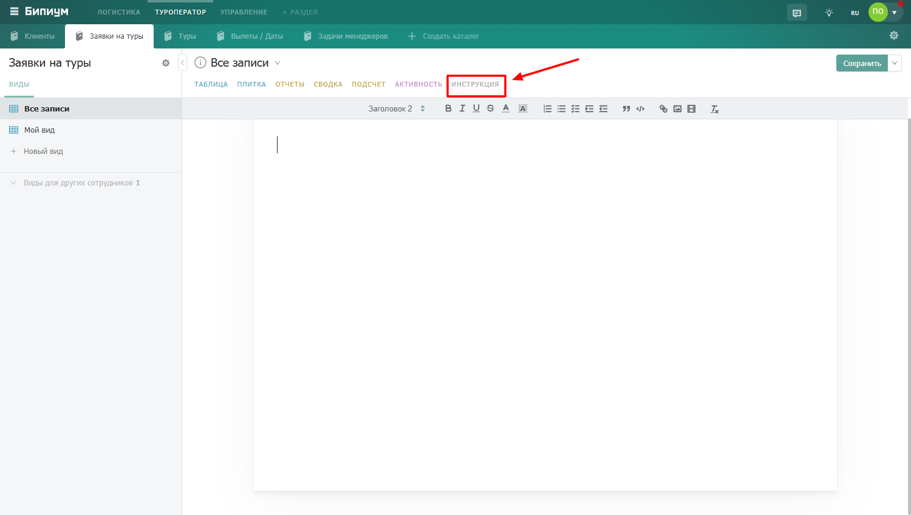

# Пишем инструкции

## Что такое инструкция

Инструкция — это текстовое описание, которое администратор каталога может добавить для пользователей. Она отображается на отдельной вкладке каталога и может содержать правила заполнения, алгоритмы работы, ссылки на внешние ресурсы и любую другую полезную информацию.

<figure><figcaption>
Открытая вкладка «Инструкция»
</figcaption></figure>

Инструкция доступна для просмотра всем сотрудникам, у которых есть доступ к каталогу. Редактировать инструкцию могут только пользователи с правом администрирования каталога.

## Текстовый редактор инструкции

1. Заголовки
2. Инструменты для выделения текста и фона
3. Инструменты для упорядочивания и нумерации текста
4. Инструменты для выделения кода и цитирования
5. Инструменты для прикрепления файлов, изображений и видео
6. Область для написания инструкции

<figure><figcaption>
Редактор текста во вкладке «Инструкция».
</figcaption></figure>

## Создание новой инструкции

Откройте вкладку Инструкции в нужном каталоге и нажмите «Создать». Откроется окно со следующими инструментами для редактирования текста.&#x20;

<figure><figcaption>
Создание новой инструкции.
</figcaption></figure>

Напишите инструкцию, структурируя текст и выделяя важные части заголовками.&#x20;

* Чтобы  прикрепить скриншот используйте команды буфера обмена&#x20;
* Чтобы  прикрепить Изображение, нажмите на иконку картины в инструментах редактирования и в открывшемся окне выберите файл с изображением, который хотите прикрепить. Задайте размер изображения, потянув один из углов изображения.
* Чтобы  прикрепить Видеозапись, нажмите на иконку киноленты в инструментах редактирования и в открывшемся окне введите ссылку на видеозапись, после этого нажмите на кнопку «Сохранить».

<figure><figcaption>
Прикрепление ссылки на видео в инструкции.
</figcaption></figure>

* Чтобы  прикрепить Ссылку, выделите текст и нажмите на иконку ссылки в инструментах редактирования. В открывшемся поле введите ссылку и нажмите «Сохранить». Система прикрепит ссылку к  выделенному тексту.

<figure><figcaption>
Прикрепление ссылки в инструкции.
</figcaption></figure>

<figure><figcaption>
Прикрепление ссылки в инструкции.
</figcaption></figure>

* Сохраните инструкцию, нажав «Сохранить»

<figure><figcaption>
Сохранение созданной инструкции.
</figcaption></figure>

## Редактирование инструкции

Откройте вкладку Инструкции в нужном каталоге и нажмите «Изменить». Откроется окно с инструментами для редактирования текста. Внесите изменения в инструкцию и нажмите «Сохранить».

<figure><figcaption>
Редактирование инструкции.
</figcaption></figure>

#### Отменить внесенные изменения в инструкцию

Отменить внесенные изменения в инструкцию можно только до этапа сохранения инструкции. Для этого необходимо нажать на галочку рядом с кнопкой «Сохранить» и нажать «Сбросить». Система вернет Инструкцию в изначальную версию без внесенных вами изменений.

<figure><figcaption>
Сброс внесённых изменений в инструкцию.
</figcaption></figure>
