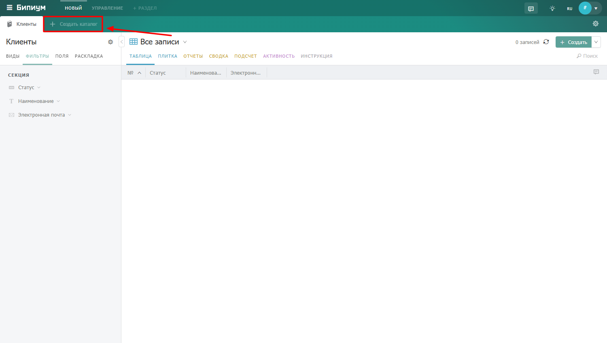
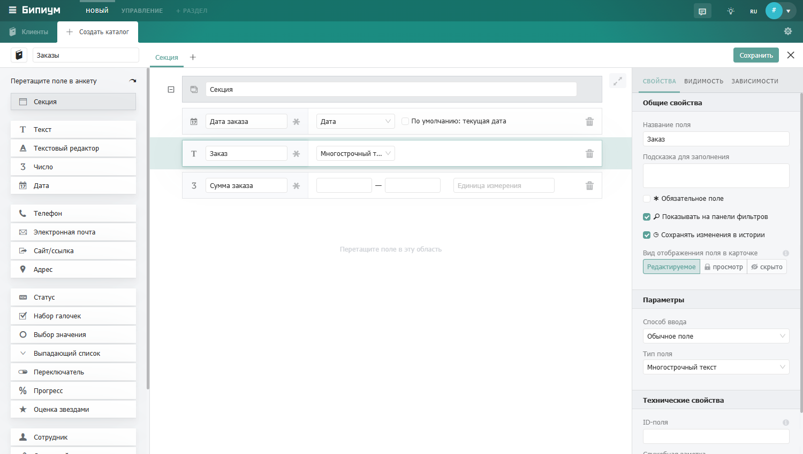

# Создаем каталоги и записи

### 1. Создаем каталог «Клиенты»

Нажмите на кнопку **«Cоздать каталог»** в центре экрана, чтобы создать первый каталог.&#x20;

<figure><figcaption>
Создание первого каталога
</figcaption></figure>

Откроется окно редактора каталога.

Редактор каталога содержит следующие основные элементы:

1. **Наименование каталога** — введите название. Назовём его «Клиенты».
2. **Палитра типов полей** — отсюда перетаскиваются поля в центральную часть для добавления в каталог.
3. **Анкета каталога** — область, где отображаются выбранные вами поля.
4. **Кнопка «Сохранить»** — сохраняет созданную структуру каталога.

<figure><figcaption>
Окно редактора каталога
</figcaption></figure>

#### Добавляем поля в каталог «Клиенты»

Добавим три поля:

<table data-header-hidden><thead><tr><th width="211.27276611328125"></th><th></th></tr></thead><tbody><tr><td>Поле</td><td>Тип поля</td></tr><tr><td>Статус</td><td>Статус — добавим два статуса: «Действующий» и «Бывший»</td></tr><tr><td>Наименование</td><td>Текст</td></tr><tr><td>Электронная почта</td><td>Электронная почта</td></tr></tbody></table>

Для каждого поля выберите соответствующий тип в палитре и перетащите его в анкету  каталога.

После добавления всех полей нажмите **«Сохранить»** в правом верхнем углу.

<figure><figcaption>
Редактор каталога «Клиенты» с настроенными полями
</figcaption></figure>

### 2. Создаем каталог «Заказы»

Теперь создадим второй каталог. Нажмите на **«Создать каталог»** рядом с уже созданным каталогом «Клиенты».

<figure><figcaption>
Создание нового каталога
</figcaption></figure>

Добавим в него поля:

<table data-header-hidden><thead><tr><th width="193.99993896484375"></th><th></th></tr></thead><tbody><tr><td>Поле</td><td>Тип поля</td></tr><tr><td>Дата заказа</td><td>Дата</td></tr><tr><td>Заказ</td><td>Многострочный текст</td></tr><tr><td>Сумма заказа</td><td>Число</td></tr></tbody></table>

<figure><figcaption>
Редактор каталога «Заказы» с настроенными полями
</figcaption></figure>

Если нужно отредактировать структуру уже созданного каталога, нажмите на значок шестерёнки рядом с названием каталога и выберите **«Настроить поля каталога»**.

<figure><figcaption>
Кнопка для перехода в редактор каталога
</figcaption></figure>

### 3. Связываем каталоги между собой

Теперь свяжем заказы с клиентами. Для этого в каталоге «Заказы» добавим новое поле.

В редакторе каталога «Заказы» выберите тип поля **«Связанный каталог»,** перетащите его в анкету и дайте ему название «Клиент».

<figure><figcaption>
Поле типа «Связанный каталог»
</figcaption></figure>

В настройках поля укажите:

<table data-header-hidden><thead><tr><th width="262.18182373046875">Параметр</th><th>Значение</th></tr></thead><tbody><tr><td><strong>Каталог</strong></td><td>Клиенты (с каким каталогом связываем)</td></tr><tr><td><strong>Вид отображения</strong></td><td>Список / Карточки / Таблица (как будут выглядеть связанные записи)</td></tr><tr><td><strong>Можно связывать несколько записей</strong></td><td>Отметьте, если нужно привязать несколько клиентов к одному заказу</td></tr></tbody></table>

Если оставить поле **«Поля»** пустым, в записи будет отображаться значение первого текстового поля связанной записи (в нашем случае — «Наименование»).

<figure><figcaption>
Настроенное поле типа «Связанный каталог»
</figcaption></figure>

### 4. Создаем записи

Теперь заполним каталоги данными. Для этого откройте каталог «Клиенты» и нажмите **«Создать»** в правом верхнем углу.

<figure><figcaption>
Кнопка создания записи
</figcaption></figure>

После нажатия на «Создать» откроется карточка записи, заполните поля в карточке и нажмите на кнопку  «Сохранить». Запись успешно сохранится.

<figure><figcaption>
Карточка записи
</figcaption></figure>

<figure><figcaption>
Созданные несколько записей в каталоге «Клиенты»
</figcaption></figure>

После создания клиентов перейдите в каталог «Заказы» и создайте несколько заказов, привязывая их к уже существующим клиентам через поле «Связанный каталог».

<figure><figcaption>
Создание записи в каталоге «Заказы»
</figcaption></figure>

<figure><figcaption>
Созданные несколько записей в каталоге «Заказы»
</figcaption></figure>

Готово. Вы создали два связанных каталога и заполнили их записями.
