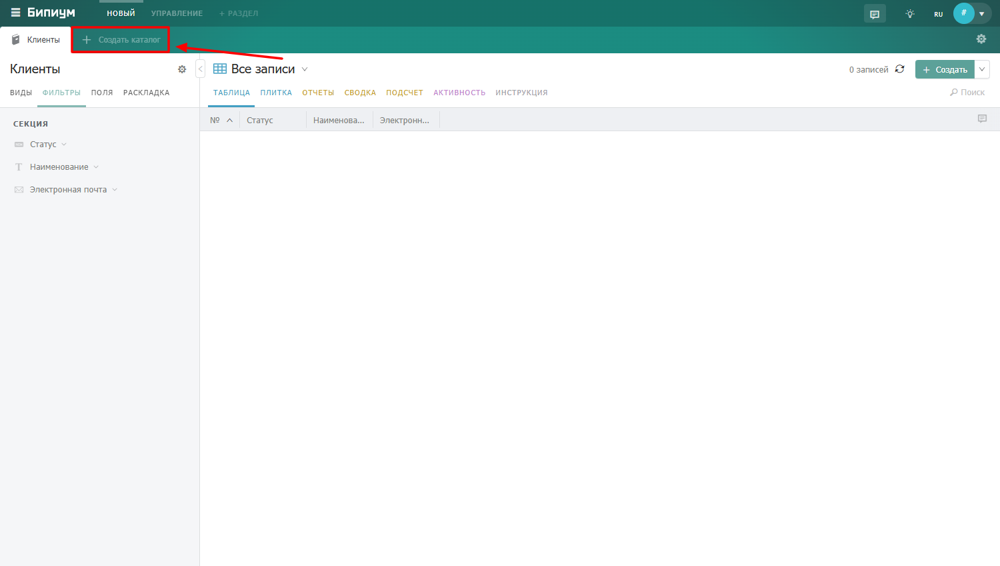
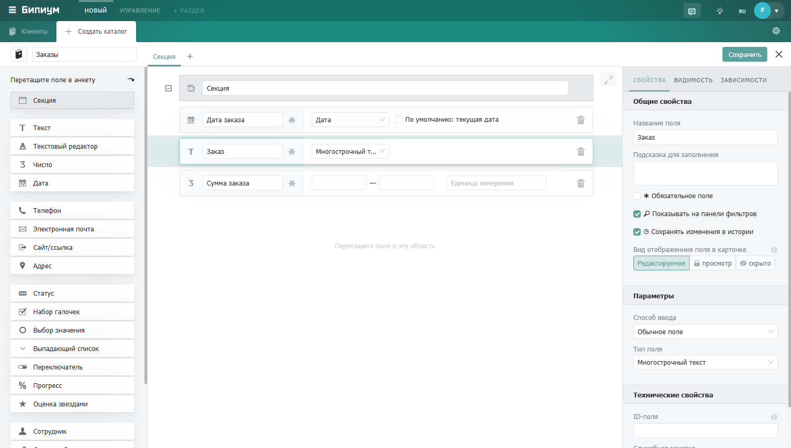

Попробуем настроить небольшую систему, состоящую из двух связанных каталогов: «Клиенты» и «Заказы».

### 1\. Создаем каталог «Клиенты»

Нажмите на кнопку **«Cоздать каталог»** в центре экрана, чтобы создать первый каталог.

{width=1500px height=850px}

Откроется окно редактора каталога.

Редактор каталога содержит следующие основные элементы:

1. **Наименование каталога** -- введите название. Назовём его «Клиенты».

2. **Палитра типов полей** -- отсюда перетаскиваются поля в центральную часть для добавления в каталог.

3. **Анкета каталога** -- область, где отображаются выбранные вами поля.

4. **Кнопка «Сохранить»** -- сохраняет созданную структуру каталога.

{width=1500px height=850px}

#### Добавляем поля в каталог «Клиенты»

Добавим три поля:



---

*  

   Поле

*  

   Тип поля

---

*  

   Статус

*  

   Статус -- добавим два статуса: «Действующий» и «Бывший»

---

*  

   Наименование

*  

   Текст

---

*  

   Электронная почта

*  

   Электронная почта



Для каждого поля выберите соответствующий тип в палитре и перетащите его в анкету  каталога.

После добавления всех полей нажмите **«Сохранить»** в правом верхнем углу.

{width=1500px height=850px}

### 2\. Создаем каталог «Заказы»

Теперь создадим второй каталог. Нажмите на **«Создать каталог»** рядом с уже созданным каталогом «Клиенты».

{width=1500px height=850px}

Добавим в него поля:



---

*  

   Поле

*  

   Тип поля

---

*  

   Дата заказа

*  

   Дата

---

*  

   Заказ

*  

   Многострочный текст

---

*  

   Сумма заказа

*  

   Число



{width=1500px height=850px}

Если нужно отредактировать структуру уже созданного каталога, нажмите на значок шестерёнки рядом с названием каталога и выберите **«Настроить поля каталога»**.

{width=1500px height=850px}

### 3\. Связываем каталоги между собой

Теперь свяжем заказы с клиентами. Для этого в каталоге «Заказы» добавим новое поле.

В редакторе каталога «Заказы» выберите тип поля **«Связанный каталог»,** перетащите его в анкету и дайте ему название «Клиент».

.png> "Поле типа «Связанный каталог»"){width=1500px height=850px}

В настройках поля укажите:



---

*  

   Каталог

*  

   Клиенты (с каким каталогом связываем)

---

*  

   Вид отображения

*  

   Список / Карточки / Таблица (как будут выглядеть связанные записи)

---

*  

   Можно связывать несколько записей

*  

   Отметьте, если нужно привязать несколько клиентов к одному заказу



Если оставить поле **«Поля»** пустым, в записи будет отображаться значение первого текстового поля связанной записи (в нашем случае -- «Наименование»).

.png> "Настроенное поле типа «Связанный каталог»"){width=1500px height=850px}

### 4\. Создаем записи

Теперь заполним каталоги данными. Для этого откройте каталог «Клиенты» и нажмите **«Создать»** в правом верхнем углу.

.png> "Кнопка создания записи"){width=1500px height=850px}

После нажатия на «Создать» откроется карточка записи, заполните поля в карточке и нажмите на кнопку  «Сохранить». Запись успешно сохранится.

{width=1500px height=850px}

{width=1500px height=850px}

После создания клиентов перейдите в каталог «Заказы» и создайте несколько заказов, привязывая их к уже существующим клиентам через поле «Связанный каталог».

{width=1500px height=850px}

{width=1500px height=850px}

Готово. Вы создали два связанных каталога и заполнили их записями.