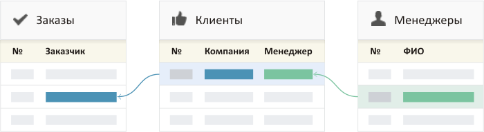

# Настройка каталогов

## Структура Бипиум

Экран каталога состоит из двух частей:

* Левая панель для фильтрации записей
* Основная часть с отображением записей

Одна из основных задач Бипиума — хранить и работать с информацией.

## Каталоги и Разделы

**Каталоги.** Информация в Бипиуме структурирована. Записи с одинаковой структурой хранятся в каталогах. Например, каталоги клиентов, товаров, обращений, сделок, задач или проектов. В Бипиуме может быть неограниченное количество каталогов и записей в каждом из них.

**Разделы.** Для порядка каталоги со смежными данными объединяются в разделы. Это позволяет сотрудникам разных разделов работать независимо в одной системе. Разделы располагаются над каталогами.

<figure><figcaption></figcaption></figure>

## Структура данных каталога

Каждый каталог имеет свою структуру, которую вы определяете самостоятельно. Структура каталога собирается из полей. Поля бывают простые — текстовые данные, или сложные — набор нескольких значений. Например, у «клиента» может быть несколько видов деятельности.

<figure><figcaption></figcaption></figure>

Для визуального удобства, предусмотрены разные виды представления данных: текстовые поля, категории, вопросы, наборы галочек, прогрессы.

## Связи между данными

Записи в каталогах могут быть связаны между собой. Например, заказы могут быть привязаны к клиентам, а клиенты закреплены за менеджерами.

## Создание нового каталога

В конце списка каталогов раздела находится кнопка создания нового каталога. Кнопка будет скрыта, если у сотрудника нет прав на администрирование раздела.

При создании нового каталога вы переходите в режим [редактирования его структуры](broken-reference).

## Изменение каталога

В верхней части левой панели расположена кнопка управления свойствами каталога:

* Доступ к каталогу — назначение прав на каталог и его записи
* Настроить поля — изменение названия, иконки и структуры данных
* Удалить все записи — удаление всех записей в каталоге
* Удалить каталог — удаление каталога со всеми данными

.png>)

В зависимости от назначенных прав набор действий может быть ограничен.

## Сортировка каталогов

Каталоги можно разместить в нужном порядке, перетащив их мышкой за иконку каталога. Сортировать каталоги может сотрудник с правом администрировать раздел.
