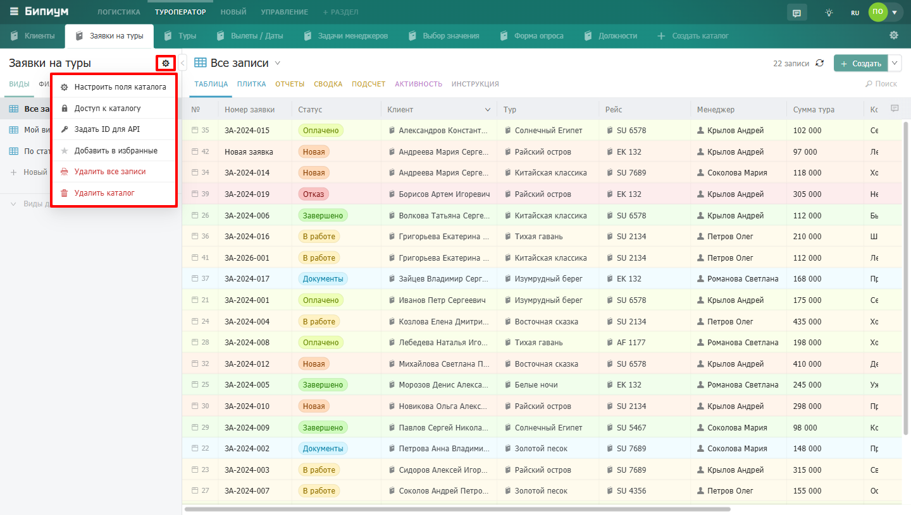
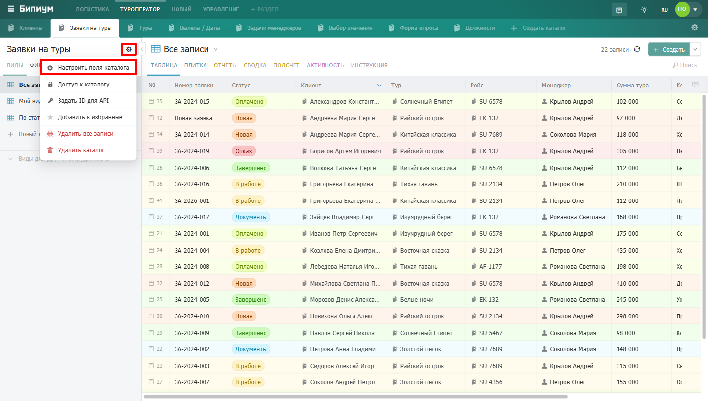
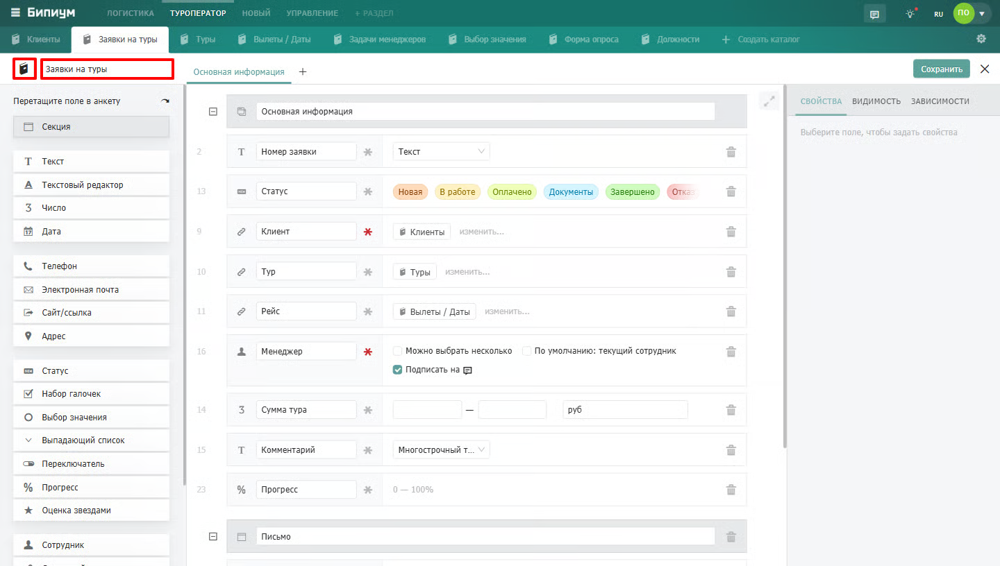
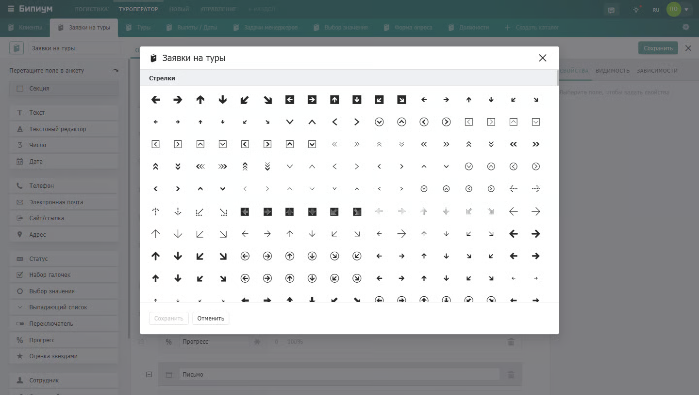
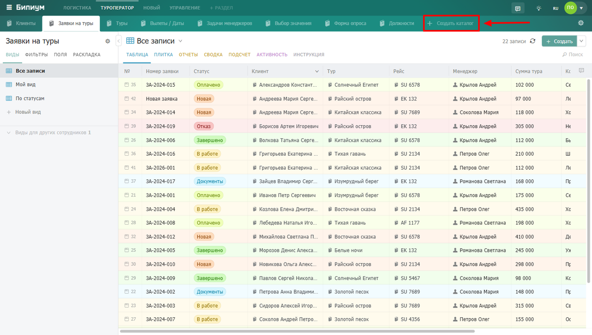
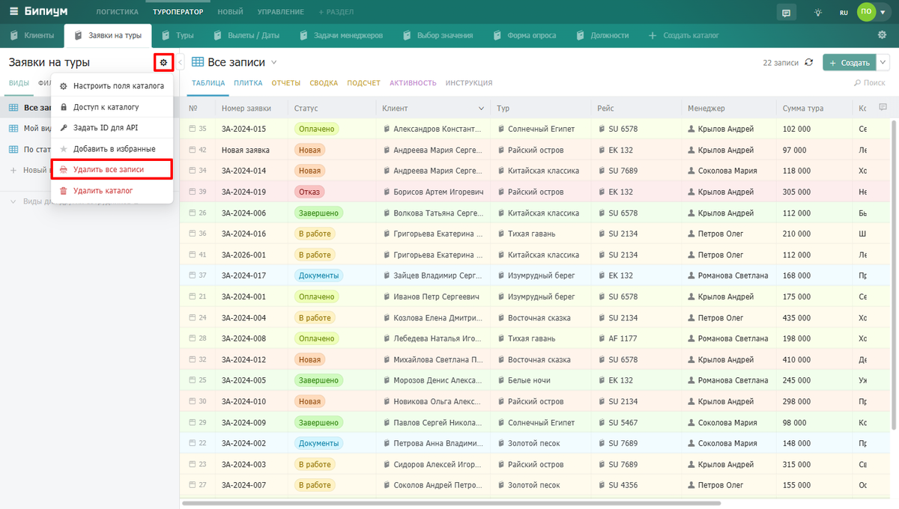
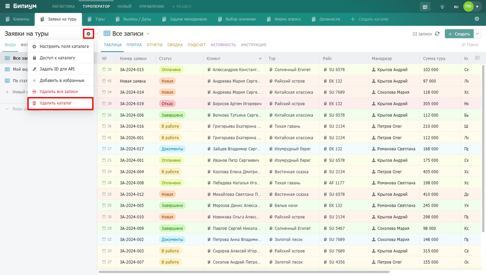
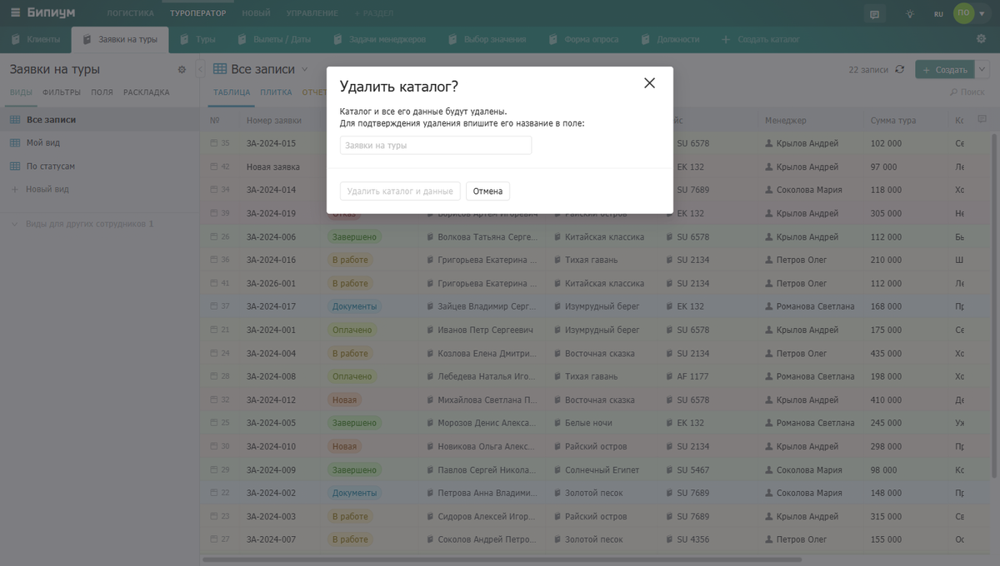

Каталоги -- основа структуры данных в Бипиуме. Каталог -- список однотипных записей.

## Свойства каталога

Нажмите на иконку настроек рядом с названием каталога. Откроется меню:

-  ​Настроить поля -- изменение названия, иконки и структуры данных

-  ​Доступ к каталогу -- права на каталог и его записи

-  ​Задать ID для API -- назначение технического идентификатора для работы через API

-  ​Добавить в избранное -- добавления в группу избранных каталогов, подходит для каталогов, которыми сотрудник пользуется чаще всего.

-  ​Удалить все записи -- полная очистка каталога без удаления его структуры

-  ​Удалить каталог -- удаление каталога со всеми данными

Набор доступных действий зависит от назначенных прав.

{width=1440px height=816px}

### Сортировка каталогов

Каталоги можно переставлять в любом порядке -- перетаскиванием за иконку каталога. Данные при этом не теряются. Сортировать каталоги может сотрудник с правом администрировать раздел.

### Перенос каталога между разделами

Каталог можно перемещать из раздела в раздел, аналогично сортировке, просто перетаскивая каталог в нужный раздел. Перемещение каталога происходит без потери данных.

## Конструктор каталога

Конструктор -- экран настройки структуры записей каталога. Откройте его через «Настроить поля» в меню каталога.

{width=1440px height=816px}

## Структура конструктора каталога

Конструктор каталога состоит из полей разного типа: в левой части расположен список возможных элементов (типов полей). В правой -- карточка каталога. Поля в карточке разбиты на секции. Секции объединяют близкие по смыслу поля для большего порядка.

Чтобы добавить в каталог новое поле, мышкой перетащите его из левой панели в свободное место анкеты справа.

Поля в карточке можно менять местами перетаскиванием, схватив за иконку поля.

**Название каталога и иконка.** В верхней части конструктора указано название каталога. Рядом -- кнопка выбора иконки: Бипиум предлагает более 1000 иконок, разбитых по категориям.

{width=1440px height=816px}

{width=1440px height=816px}

## Действия с каталогом

### Создание нового каталога

В конце списка каталогов раздела находится кнопка создания нового каталога. Кнопка будет скрыта, если у сотрудника нет прав на администрирование раздела.

При создании нового каталога вы переходите в режим редактирования его структуры.

{width=1200px height=680px}

### Удаление всех записей каталога

При удалении всех записей каталога также происходит удаление всех связей и историй каждой из удаляемых записей. Для подтверждения удаления всех записей система попросит повторно ввести название каталога во избежание случайной очистки. Механизм удаления всех записей в каталоге оказывается полезен, когда необходимо быстро очистить все содержимое каталога, не прибегая к сценариям автоматизаций. Такое, например, возникает при разработке каталога и наполнения его тестовыми записями, которые в последствие не будут использоваться.

{width=1200px height=680px}

### **Удаление каталога**

При удалении Каталога также удаляются и все записи этого каталога. При этом, если другие записи ссылаются на записи удаленного каталога, то эти связи останутся. Но открыть удаленные связанные записи будет нельзя.

{width=1200px height=680px}

{width=1200px height=680px}

В зависимости от назначенных прав набор действий может быть ограничен.