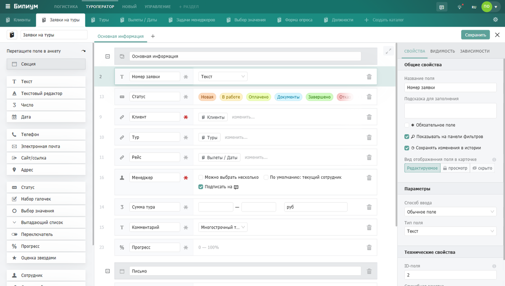
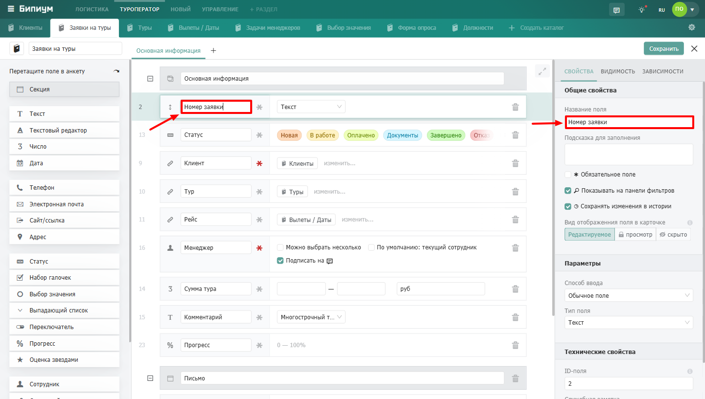
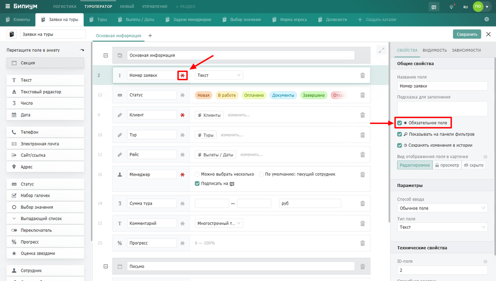
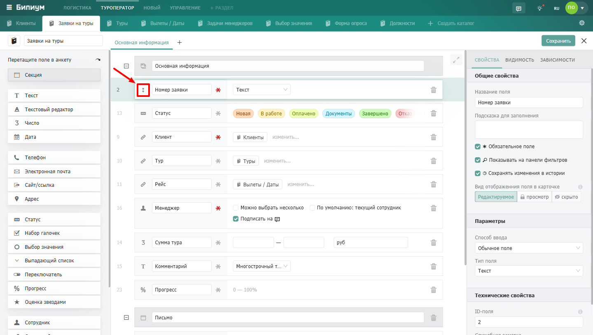
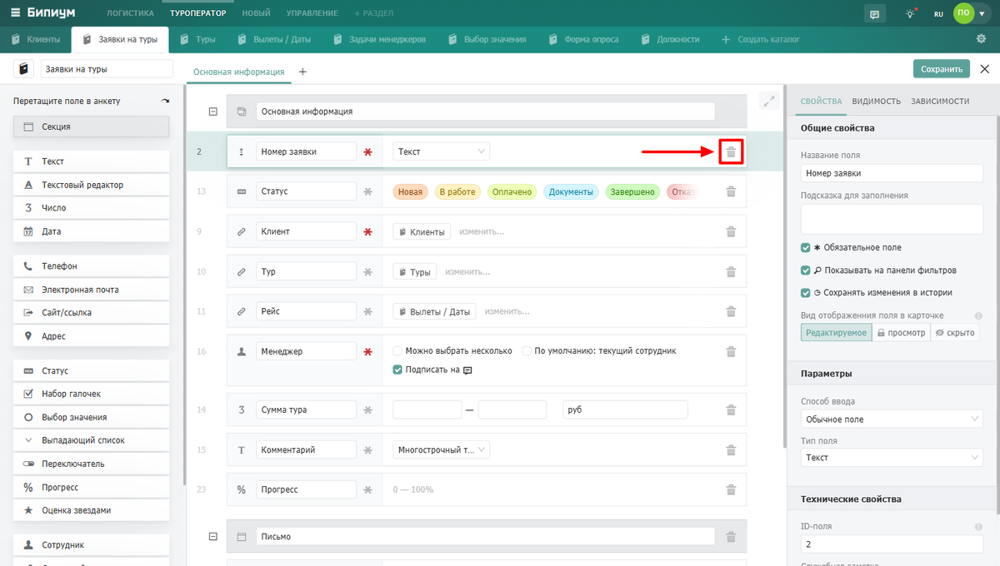
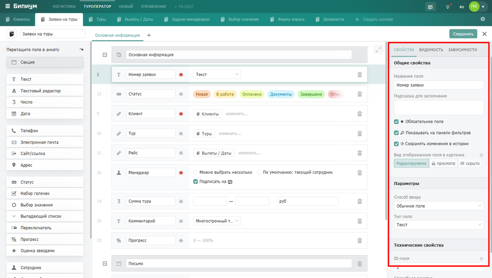

Поля -- это строительные блоки каталога. Каждое поле хранит определённый тип данных: текст, число, дату, статус или связь с другим каталогом. Совокупность полей определяет структуру анкеты записи.

{width=1200px height=680px}

## Группы полей

[Основные:](null)

Универсальные поля для хранения базовых данных: чисел, текста, дат, файлов. Сюда же входят структурные элементы анкеты -- секции и вкладки.

-  [Секция и вкладки ](./osnovnye/sekciya-i-vkladki)
-  [Число](./osnovnye/chislo)
-  [Текст](./osnovnye/tekst)
-  [Текстовый редактор](./osnovnye/tekstovyi-redaktor)
-  [ИИ-поле](./osnovnye/ii-pole)
-  [Дата](./osnovnye/data)
-  [Файл](./osnovnye/fail)

[Контактные данные:](null)

Поля для хранения контактной информации.

-  [Телефон](./kontaktnye-dannye/telefon)
-  [Электронная почта](./kontaktnye-dannye/elektronnaya-pochta)
-  [Сайт / Ссылка](./kontaktnye-dannye/sait-ssylka)
-  [Адрес](./kontaktnye-dannye/adres)

[Оценочные:](null)

Поля для оценки состояния или степени чего-либо. Удобны для отслеживания этапов, прогресса и субъективных оценок.

-  [Статус](./ocenochnye/status)
-  [Набор галочек](./ocenochnye/nabor-galochek)
-  [Переключатель](./ocenochnye/pereklyuchatel)
-  [Прогресс](./ocenochnye/progress)
-  [Оценка звёздами](./ocenochnye/ocenka-zvyozdami)

[Вариативные:](null)

Поля для выбора значений из предопределённого набора или из данных другого каталога. Используются для фильтрации, связей между каталогами и сегментации данных.

-  [Выбор значения](./variantivnye/vybor-znacheniya)
-  [Выпадающий список](./variantivnye/vypadayushii-spisok)
-  [Связанный каталог](./variantivnye/svyazannyi-katalog)
-  [Сотрудник](./variantivnye/sotrudnik)

[Действия:](null)

Интерактивные элементы анкеты. Кнопка позволяет запускать сценарии автоматизации прямо из карточки записи.

-  [Кнопка](./deistviya/knopka)

## **Как добавить поле**

1. Откройте конструктор каталога -- нажмите на иконку шестерёнки рядом с названием каталога.

2. Слева вы увидите список Полей, которые можно добавить в структуру каталога.

3. Выберите тип поля из списка и перетащите его в анкету каталога.

4. Задайте название и настройте свойства в панели справа.

5. Сохраните изменения.

## Действия с полем в конструкторе

### **Переименовать.**

Для каждого поля в конструкторе доступен набор базовых действий. Чтобы открыть настройки поля, нажмите на него -- справа откроется панель свойств.

{width=1440px height=816px}

### **Сделать обязательным.**

Нажмите на иконку звёздочки рядом с полем -- поле станет обязательным для заполнения. Сотрудник не сможет сохранить запись без заполнения обязательного поля.

{width=1200px height=680px}

### **Изменить порядок.**

Захватите поле за иконку слева от названия и перетащите вверх или вниз. Порядок полей в конструкторе соответствует порядку отображения в анкете записи.

{width=1440px height=816px}

### **Удаление поля.**

Кнопка с иконкой корзины предназначена для удаления поля из структуры каталога.

{width=1200px height=680px}

### **Настройка свойств поля.**

Панель с настройками позволяет настроить поле под свои нужды. Свойства бывают общие для всех полей (подробнее в [Свойства](./../svoistva)) и индивидуальные для каждого поля (подробнее в статье каждого поля).

{width=1200px height=680px}

Помимо свойств у каждого поля есть две дополнительные вкладки:

-  [**Видимость**](https://docs.bpium.ru/bpium-setup/catalogs-setup/vidimost) -- позволяет скрывать поле в зависимости от значений других полей.

-  [**Зависимости**](https://docs.bpium.ru/bpium-setup/catalogs-setup/zavisimosti) -- позволяет делать поле обязательным или менять его параметры в зависимости от условий.