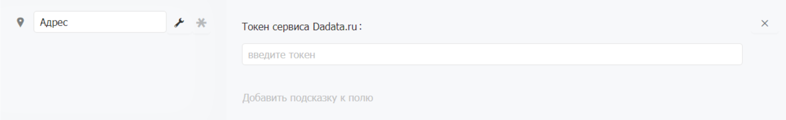

# Адрес

## Когда использовать

Используйте поле Адрес, когда важно хранить точный почтовый адрес с корректной структурой — регион, город, улица, дом, квартира, индекс. Типичные примеры:

* Адрес доставки клиента
* Юридический и фактический адрес компании
* Адрес объекта или точки обслуживания

Если точность адреса не критична — например, нужно просто записать район или город — достаточно обычного поля [Текст](../osnovnye/tekst.md).

## Подсказки при вводе

При вводе адреса система показывает подсказки из справочников КЛАДР и ФИАС. Можно вводить адрес в любом порядке и любой его части — сервис найдёт нужный вариант и подставит полный адрес с индексом и координатами.

Примеры поиска:

* <mark style="color:$primary;">тверская нижний 14</mark> → «Нижегородская обл, г Нижний Новгород, ул Тверская, д 14»
* <mark style="color:$primary;">105568</mark> → «г Москва, ул Магнитогорская»

## Настройка токена Dadata.ru

Подсказки адресов работают через внешний сервис Dadata.ru. Для подключения нужен API-токен — код доступа к сервису.


**Как получить токен сервиса Dadata.ru**

Для того, чтобы получить токен необходимо зарегистрироваться на [Dadata.ru](https://dadata.ru/clean/#registration_popup). Далее в в разделе «Ключи» в  [Личном кабинете](https://dadata.ru/profile/#info) нужно сгенерировать уникальный API-ключ (токен). Полученный API-ключ необходимо ввести в поле «Токен сервиса Dadata.ru» в Бипиуме.

При необходимости также можно выбрать подходящий тариф на сервисе. Платные тарифы позволяют увеличить число обращений к сервису в сутки. Также есть и бесплатный тариф, но число обращений в сутки в нем ограничено значением в 10000.

