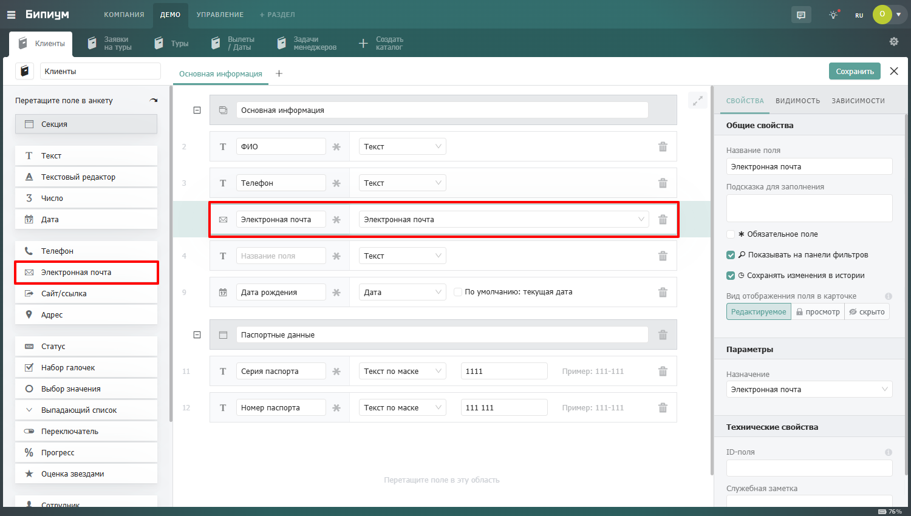

# Электронная почта

<figure><figcaption></figcaption></figure>

## Когда использовать

Используйте поле Электронная почта вместо обычного Текста везде, где хранится email-адрес. Типичные примеры:

* Рабочий и личный адрес клиента или контактного лица
* Email для счетов и email для технических уведомлений
* Корпоративный адрес сотрудника

## Несколько адресов в одном поле

В одно поле можно добавить несколько адресов. Каждому можно дать подпись — произвольный текст для идентификации: «Рабочий», «Личный», «Бухгалтерия» и любой другой. Новый адрес добавляется кнопкой «Добавить…» под уже введенными.

## Написать письмо из анкеты

Рядом с каждым адресом в анкете отображается кнопка «**Написать**». При нажатии открывается почтовый клиент, установленный на устройстве сотрудника, с уже заполненным полем «Кому».

## Использование в автоматизациях

Значение поля Электронная почта можно использовать в автоматизациях — например, подставить адрес получателя в компонент «Отправка почты». Это позволяет автоматически отправлять письма на адрес из записи при наступлении нужного события.

Подробнее об отправке писем читайте в разделе [Отправка почты](../../../processes/components/kommunikacii/email.md).\
 
