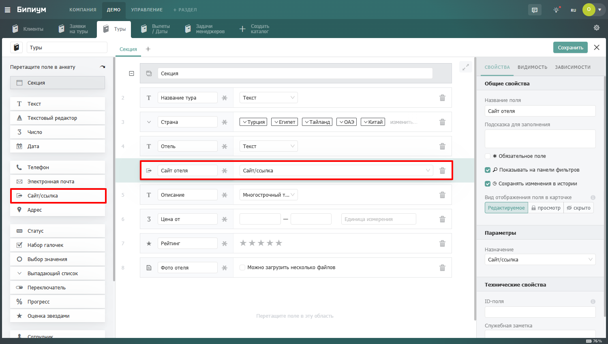

# Сайт / Ссылка

<figure><figcaption></figcaption></figure>

### Когда использовать

Используйте поле Сайт / Ссылка вместо обычного Текста везде, где хранится URL. Типичные примеры:

* Сайт компании или клиента
* Ссылка на профиль в социальной сети или мессенджере
* Ссылка на документ в облачном хранилище

### Несколько ссылок в одном поле

В одно поле можно добавить несколько ссылок. К каждой можно добавить описание — произвольный текст для идентификации: «Сайт», «ВКонтакте», «Договор в Google Docs» и любой другой. Новая ссылка добавляется кнопкой «Добавить…» под уже введенными.

### Переход по ссылке из анкеты

Рядом с каждой ссылкой в анкете отображается кнопка «Открыть». При нажатии ссылка открывается в новой вкладке браузера.
