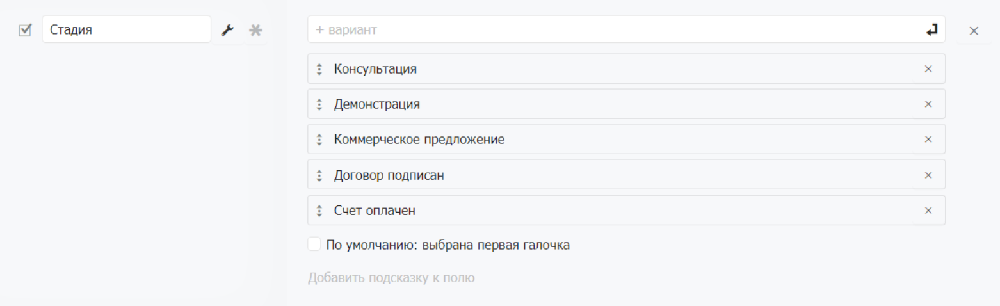

# Набор галочек

### Когда использовать

Используйте Набор галочек когда к одной записи могут одновременно относиться несколько признаков. Типичные примеры:

* Пройденные этапы процесса: Согласовано / Подписано / Оплачено
* Выполненные пункты чек-листа
* Категории или теги с множественным выбором
* Отмеченные характеристики товара

### Настройка

#### Добавление значений

В конструкторе нажмите на поле — откроется панель свойств. В разделе «Параметры» добавьте значения. Порядок значений можно менять перетаскиванием.

#### Значение по умолчанию

Опция **«По умолчанию: первый элемент»** автоматически отмечает первый пункт при создании новой записи.

### Отображение в анкете

В режиме просмотра анкеты значения отображаются списком в виде галочек с подписями — сотрудник видит какие пункты отмечены, а какие нет.
