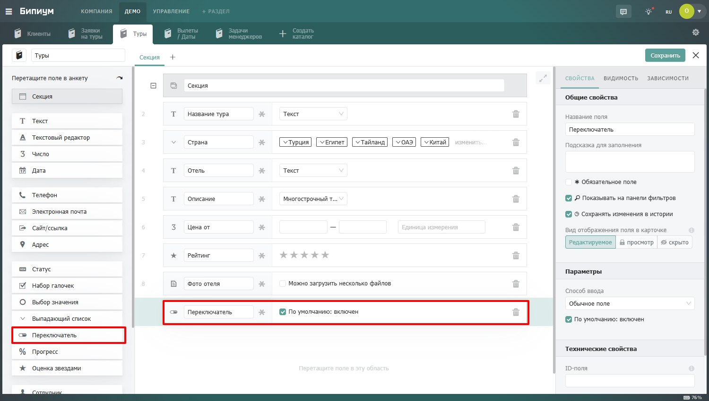

# Переключатель

<figure><figcaption></figcaption></figure>

### Описание

Поле отображается в виде переключателя.

Пользователь может установить одно из значений:

* включено
* выключено

Значение можно изменить одним нажатием.\
\
Галочка «По умолчанию: включен» устанавливает переключатель в значение «Включен» при создании новой записи.
