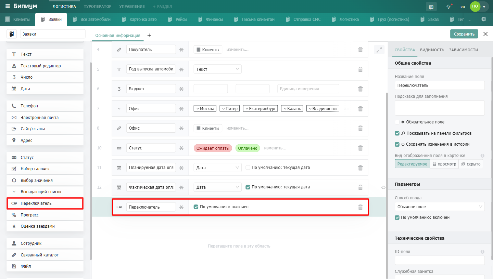

Поле с двумя состояниями: включено или выключено. Простейший способ зафиксировать бинарный признак записи.

{width=1440px height=816px}

### Когда использовать

Используйте Переключатель когда у записи есть признак, который может быть только в двух состояниях. Типичные примеры:

-  Активен / Неактивен -- для клиентов, сотрудников, товаров

-  Оплачено / Не оплачено

-  Согласовано / Не согласовано

-  Публично / Скрыто

### Настройка

#### Включён по умолчанию

Опция **«Включён по умолчанию»** устанавливает переключатель в положение «включено» при создании новой записи.