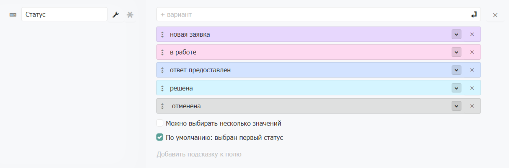

# Статус

### Когда использовать

Используйте Статус когда запись может находиться в одном из нескольких фиксированных состояний и важно видеть это состояние с первого взгляда. Типичные примеры:

* Этапы сделки: Новый → В работе → Выиграли → Проиграли
* Состояние задачи: Открыта / В процессе / Выполнена / Отменена
* Тип клиента: Потенциальный / Действующий / Нецелевой
* Приоритет: Низкий / Средний / Высокий

### Настройка

#### Добавление значений

В конструкторе нажмите на поле Статус — откроется панель свойств. В разделе «Параметры» добавьте значения: введите название и выберите цвет для каждого. Порядок значений можно менять перетаскиванием.

#### Несколько значений одновременно

Опция **«Можно выбирать несколько значений»** позволяет выбирать несколько статусов для одной записи одновременно.

#### Значение по умолчанию

Опция **«По умолчанию: выбран первый статус»** автоматически подставляет первое значение из списка при создании новой записи.
