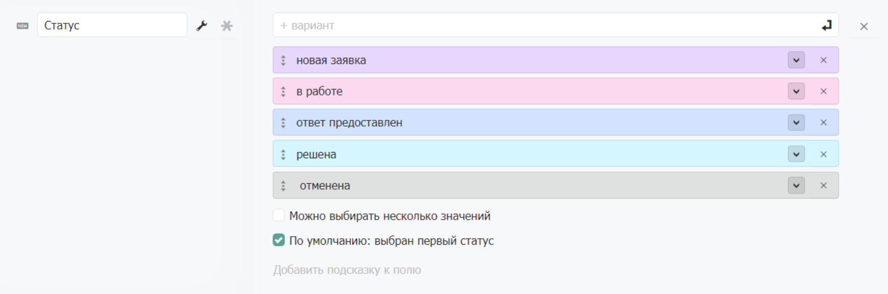

# Статус

### Статус

Поле для выбора одного или нескольких значений из предустановленных вариантов. Каждый вариант имеет цвет для визуального отличия данных в таблице. Подходит для отображения статусов или состояний. Варианты значений можно пересортировать мышкой.

**Галочка «Можно выбирать несколько значений»** включает возможность одновременно выбирать несколько вариантов для каждой записи.

**Галочка «По умолчанию: выбран первый статус»** выделяет первый элемент при создании новой записи.

В режиме просмотра анкеты варианты значений показаны в ряд.
