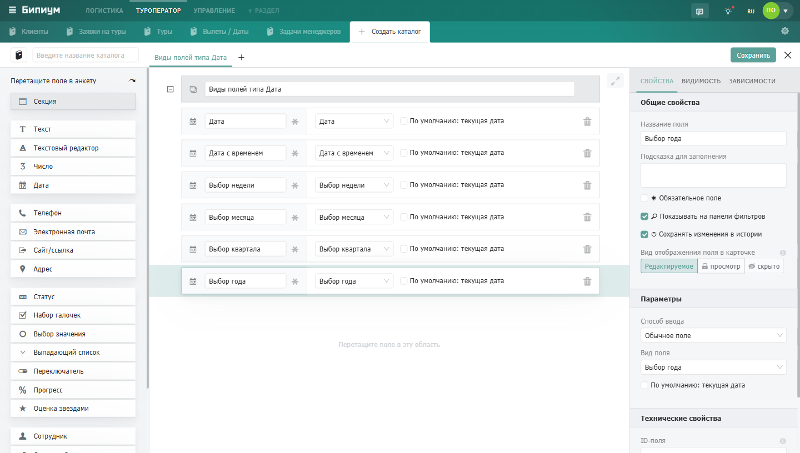

Поле для хранения даты или даты со временем. Поддерживает шесть форматов -- от конкретного дня до целого года.

## Когда использовать

Используйте поле Дата, когда нужно зафиксировать момент времени, привязать запись к календарю или считать сроки. Типичные примеры:

-  Дата создания заявки, подписания договора, последнего контакта

-  Дедлайн задачи или этапа проекта

-  Дата рождения контакта

-  Плановый и фактический месяц отгрузки

-  Квартал планирования бюджета

## Настройки

### Текущая дата по умолчанию

Опция «**По умолчанию: текущая дата**» автоматически подставляет сегодняшнюю дату при создании новой записи. Удобно для полей «Дата заявки» или «Дата обращения» -- сотруднику не нужно вводить дату вручную.

## Форматы поля

Формат задается в настройках поля и определяет, с какой точностью сотрудник вводит дату.

| Формат          | Пример            | Когда использовать                                     |
|-----------------|-------------------|--------------------------------------------------------|
| Дата            | 15\.03.2025       | Конкретный день: дедлайн, дата встречи, дата рождения  |
| Дата с временем | 15\.03.2025 14:30 | Событие с точным временем: совещание, звонок, доставка |
| Выбор недели    | Неделя 11, 2025   | Планирование по неделям: спринты, отчетные периоды     |
| Выбор месяца    | Март 2025         | Плановые отгрузки, бюджетные периоды                   |
| Выбор квартала  | Q1 2025           | Квартальное планирование и отчётность                  |
| Выбор года      | 2025              | Год выпуска, год основания, годовые планы              |

:::info 

Дата с временем учитывает часовой пояс сотрудника. Если команда работает в разных городах, время совещания каждый увидит в своём часовом поясе.

:::

{width=1440px height=816px}

## Использование в формулах

Поле Дата можно использовать в формулах для автоматических вычислений. Например:

-  Рассчитать количество дней до дедлайна: *DATEDIFF(\{Дедлайн}, NOW(), "d")*

-  Добавить 7 дней к дате начала: *DATEADD(\{Дата начала}, 7, "d")*

-  Отформатировать дату в текст\*: DATEFORMAT(\{Дата}, "*DD.MM*.YYYY")\*

Подробнее о работе с датами в формулах читайте в разделе [Формулы в полях](./../../formuly-v-polyakh).