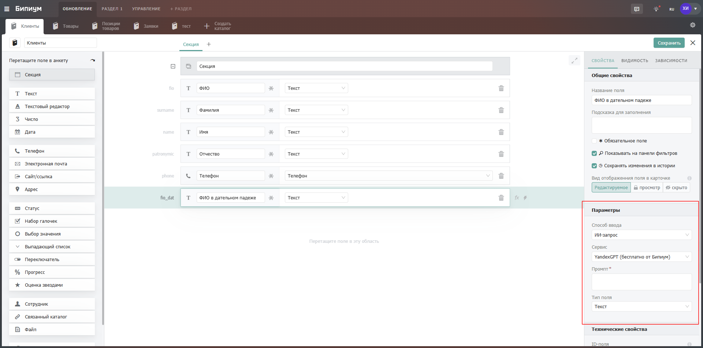
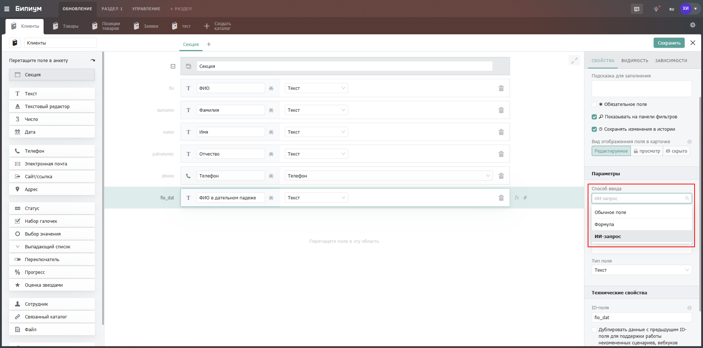
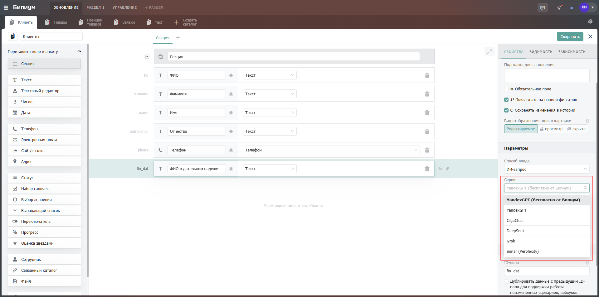
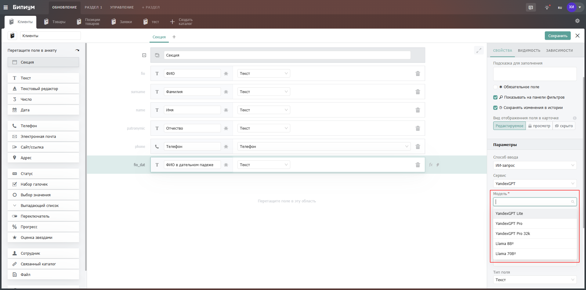
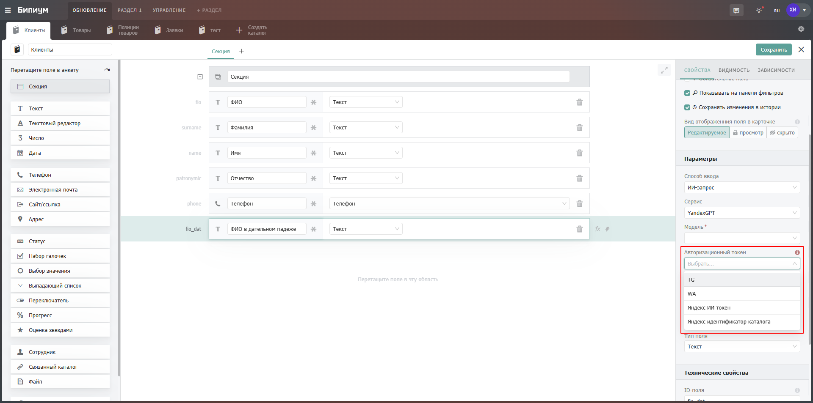
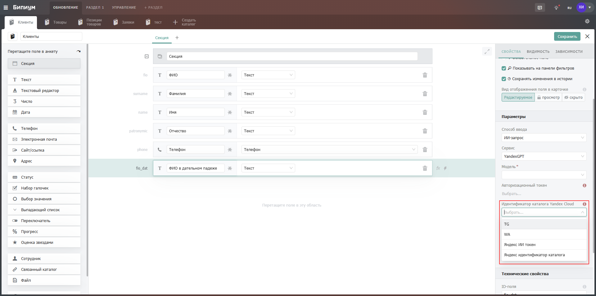
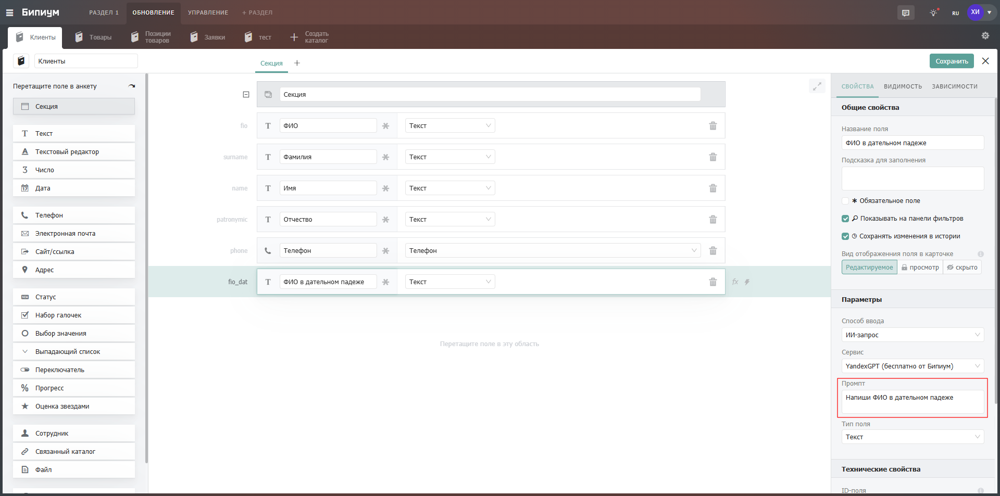
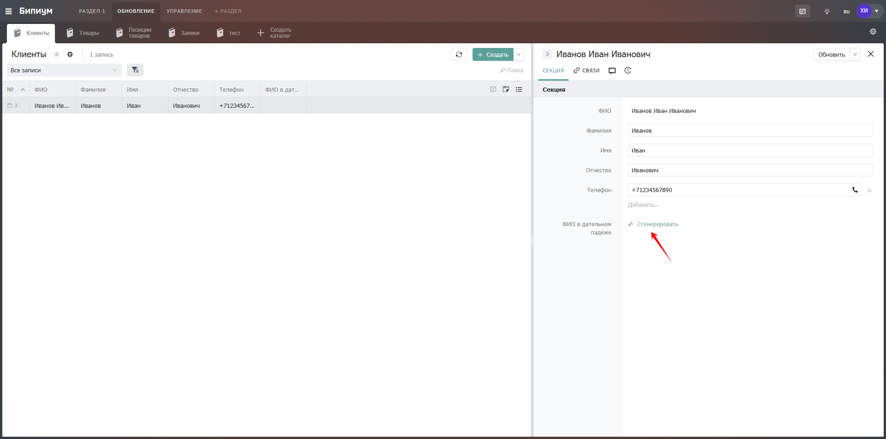
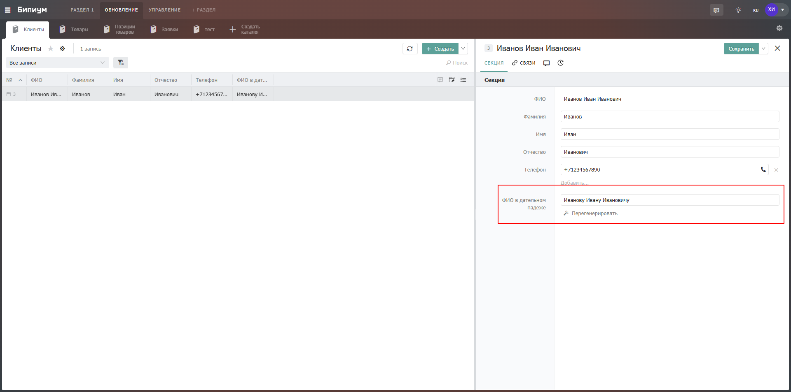

# ИИ-поле

## Параметры

В параметрах отображаются элементы поля, которые необходимо настроить.

<figure><figcaption></figcaption></figure>

**Способ ввода.** Выбор варианта заполнения текстового поля. В данном случае необходимо выбрать "ИИ-запрос".

<figure><figcaption></figcaption></figure>

**Сервис.** Выбор  языковой модели для обращения. Подключиться можно к одной из следующих моделей: `YandexGpt(Бесплатно от Бипиум), YandexGpt, GigaChat, Deepseek, Grok, Sonar(Perplexity)`.

<figure><figcaption></figcaption></figure>

**Модель.** Позволяет указать модель для подключения, выбрав её из списка или через переменную.

<figure><figcaption></figcaption></figure>

**Авторизационный токен.** Позволяет указать авторизационный токен для подключения через переменную или выбрать его из списка уже добавленных в каталог Доступы к сервисам.

<figure><figcaption></figcaption></figure>

**Идентификатор каталога Yandex Cloud (для Сервиса YandexGPT).** Позволяет указать идентификатор каталога Yandex Cloud через переменную или выбрать из списка уже добавленных в каталог Доступы к сервисам.

<figure><figcaption></figcaption></figure>

**Промпт.** Основной текстовый запрос(инструкция) для языковой модели. Подробно опишите задачу, которую должен выполнить ИИ.

<figure><figcaption></figcaption></figure>

## Пример работы

После настройки в карточке в нужном поле появится кнопка "Сгенерировать"

<figure><figcaption></figcaption></figure>

При нажатии произойдёт генерация ФИО в дательном падеже.

<figure><figcaption></figcaption></figure>

**Обратите внимание** ИИ-поле передаёт весь контекст карточки в запрос. В примере выше сервис YandexGPT получит весь набор полей с их названиями и сам поймёт, что из переданного является ФИО.
