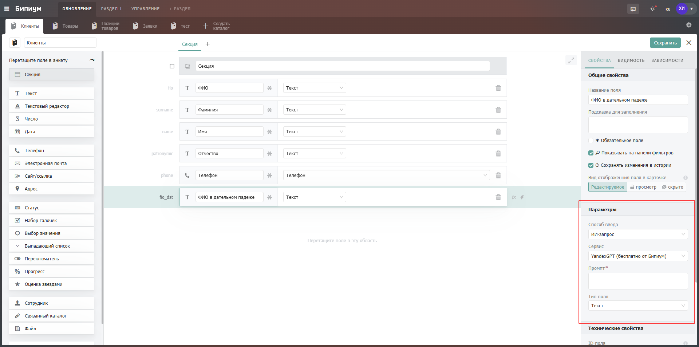
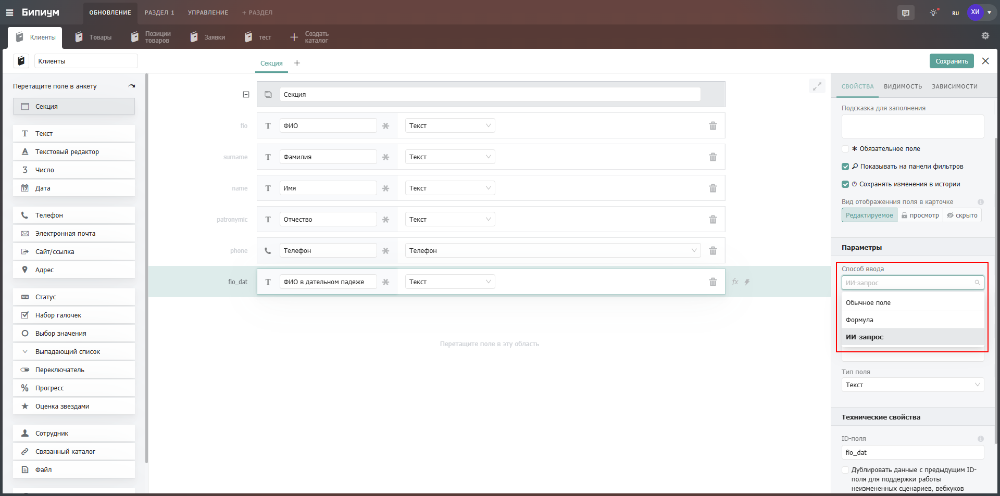
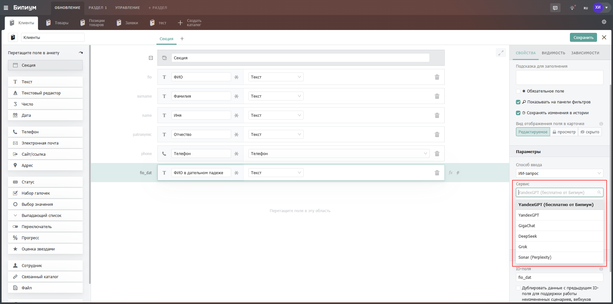
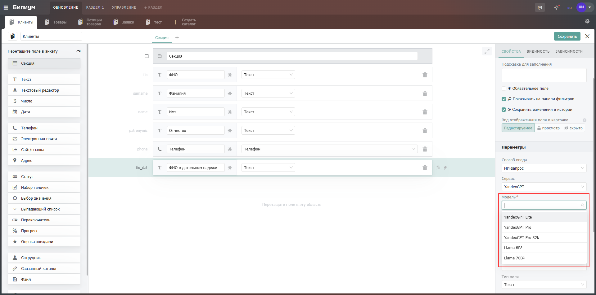
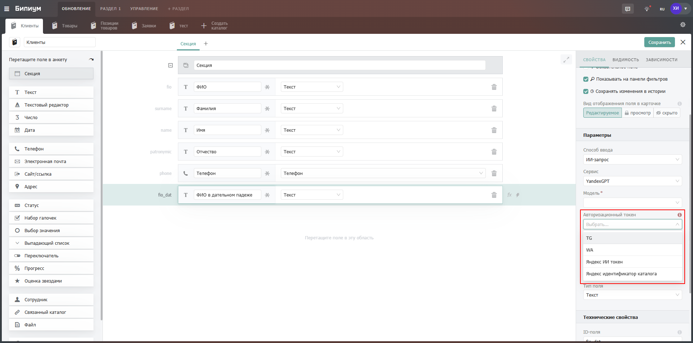
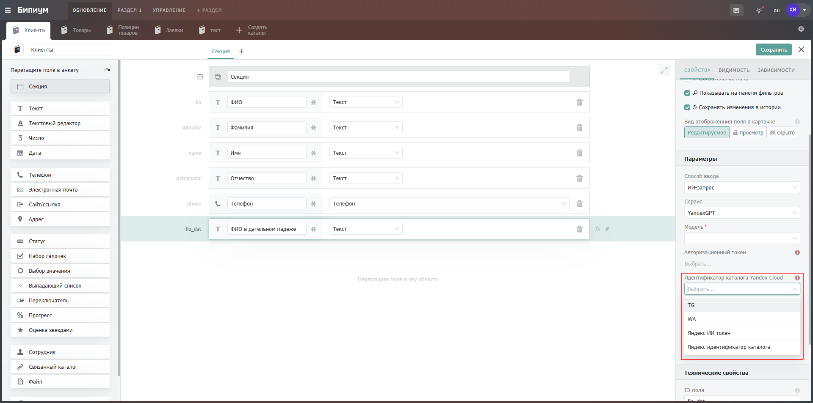
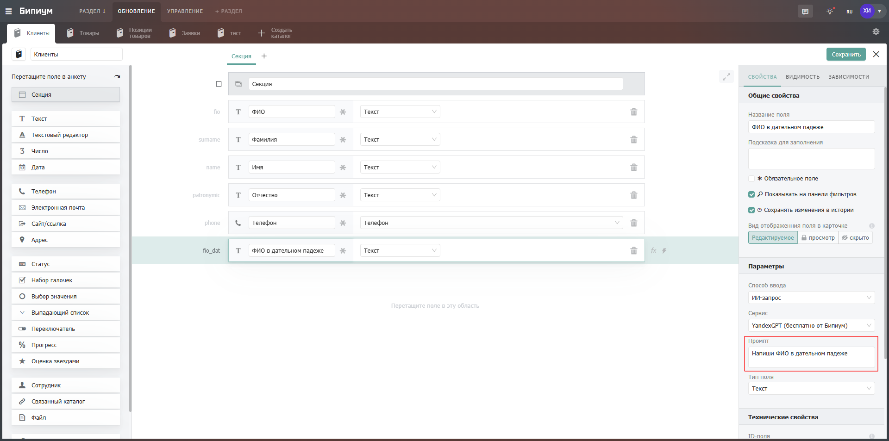
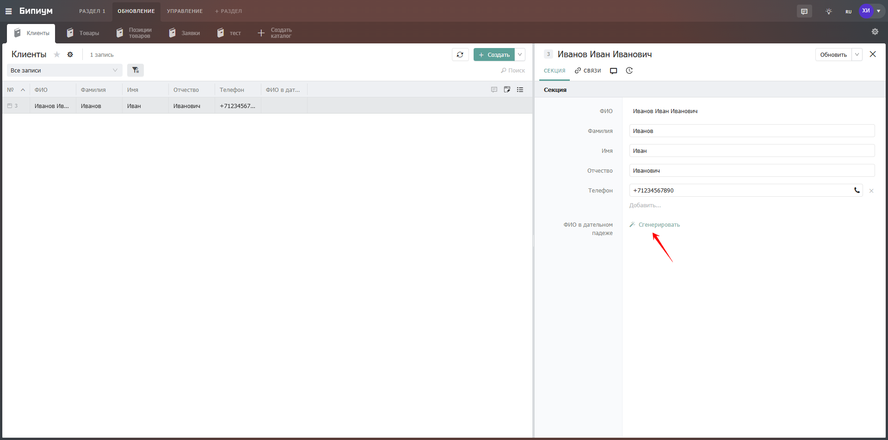
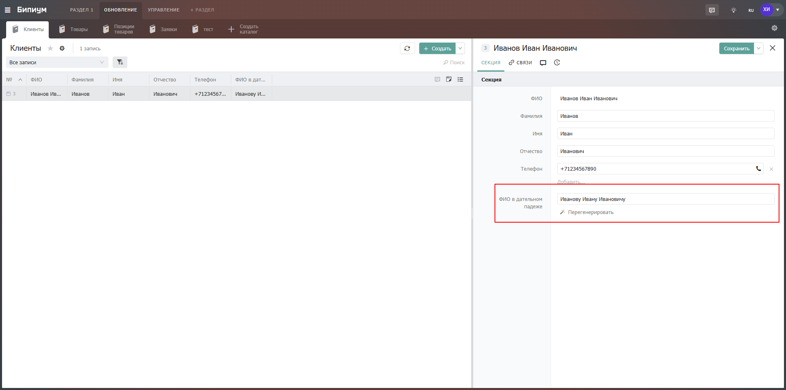

# ИИ-поле

## Когда использовать

ИИ-поле подходит для задач, где нужно автоматически сформировать текст на основе данных из других полей записи. Примеры:

* Склонение ФИО по падежам — поле «ФИО в дательном падеже» из поля «ФИО»
* Краткое резюме по заполненным полям клиента или сделки
* Классификация или тегирование — определить тип обращения по тексту комментария
* Перевод текста на другой язык
* Генерация текста письма или предложения по параметрам записи

## Настройка

В параметрах отображаются элементы поля, которые необходимо настроить.

<figure><figcaption></figcaption></figure>

**Способ ввода.** В настройках поля выберите «ИИ-запрос». Именно этот режим активирует все параметры ниже.

<figure><figcaption></figcaption></figure>

**Сервис.** Выберите языковую модель для обращения. Доступные сервисы: `YandexGpt(Бесплатно от Бипиум), YandexGpt, GigaChat, Deepseek, Grok, Sonar(Perplexity)`.

<figure><figcaption></figcaption></figure>

**Модель.** Укажите конкретную модель выбранного сервиса из списка. Недоступно для «YandexGPT (бесплатно от Бипиум)» — там модель фиксирована.

<figure><figcaption></figcaption></figure>

**Авторизационный токен.** Укажите токен для доступа к API сервиса — через переменную или выберите из каталога «Доступы к сервисам». Не требуется для YandexGPT (бесплатно от Бипиум).

<figure><figcaption></figcaption></figure>

**Идентификатор каталога Yandex Cloud (для Сервиса YandexGPT).** Позволяет указать идентификатор каталога Yandex Cloud через переменную или выбрать из списка уже добавленных в каталог Доступы к сервисам.

<figure><figcaption></figcaption></figure>

**Промпт.** Напишите инструкцию для модели — что именно нужно сделать с данными записи. Чем точнее промпт, тем предсказуемее результат.

<figure><figcaption></figcaption></figure>

## Доступные сервисы

<table data-header-hidden><thead><tr><th width="303"></th><th></th></tr></thead><tbody><tr><td>Сервис</td><td>Особенности</td></tr><tr><td>YandexGPT (бесплатно от Бипиум)</td><td>Не требует токена и регистрации в Yandex Cloud. Подходит для старта и несложных задач.</td></tr><tr><td><a href="https://ru.ruwiki.ru/wiki/YandexGPT">YandexGPT</a></td><td>Собственный аккаунт Yandex Cloud. Требует токен и идентификатор каталога.</td></tr><tr><td><a href="https://ru.ruwiki.ru/wiki/GigaChat">GigaChat</a></td><td>Российская модель от Сбера. Требует авторизационный токен.</td></tr><tr><td><a href="https://ru.ruwiki.ru/wiki/DeepSeek">DeepSeek</a></td><td>Китайская модель с высоким качеством рассуждений. Требует токен.</td></tr><tr><td><a href="https://ru.ruwiki.ru/wiki/Grok">Grok</a></td><td>Модель от <a href="https://ru.wikipedia.org/wiki/XAI">xAI</a>. Требует токен.</td></tr><tr><td><a href="https://ru.ruwiki.ru/wiki/Perplexity_AI">Sonar (Perplexity)</a></td><td>Модель с доступом к актуальной информации из интернета. Требует токен.</td></tr></tbody></table>

## Как написать хороший промпт

Промпт — это инструкция для модели. Несколько советов:

* **Опишите задачу конкретно.** «Переведи поле Описание на английский язык» лучше, чем «Переведи».
* **Укажите формат результата.** Например: «Ответь одним предложением», «Верни только список через запятую», «Используй официальный стиль».
* **Не нужно перечислять поля**. Модель получает все данные записи автоматически — просто опишите что нужно сделать.

## Как работает поле для сотрудника

После того как администратор настроил ИИ-поле, в анкете записи появляется кнопка «Сгенерировать». Сотрудник нажимает её — система отправляет данные записи в выбранную модель и записывает результат в поле. Генерация занимает несколько секунд.

Результат можно отредактировать вручную после генерации — поле остаётся обычным текстовым.

<figure><figcaption></figcaption></figure>

При нажатии произойдёт генерация ФИО в дательном падеже.

<figure><figcaption></figcaption></figure>
