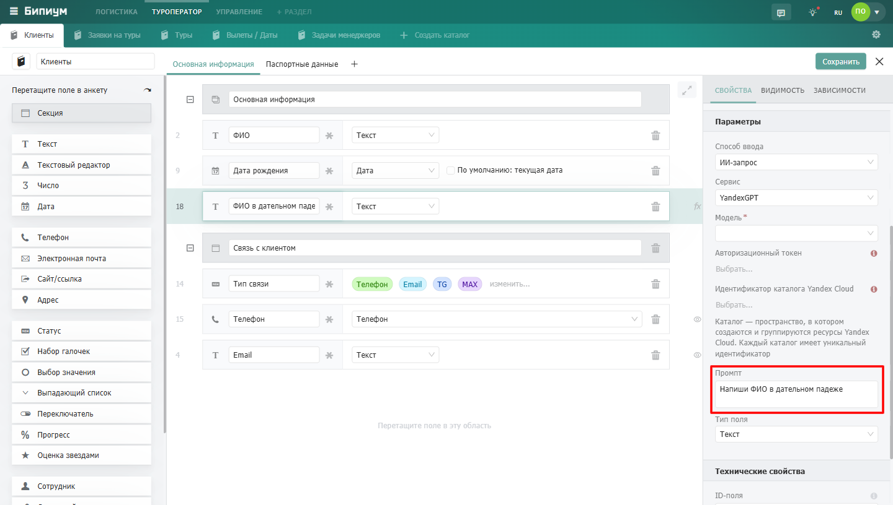
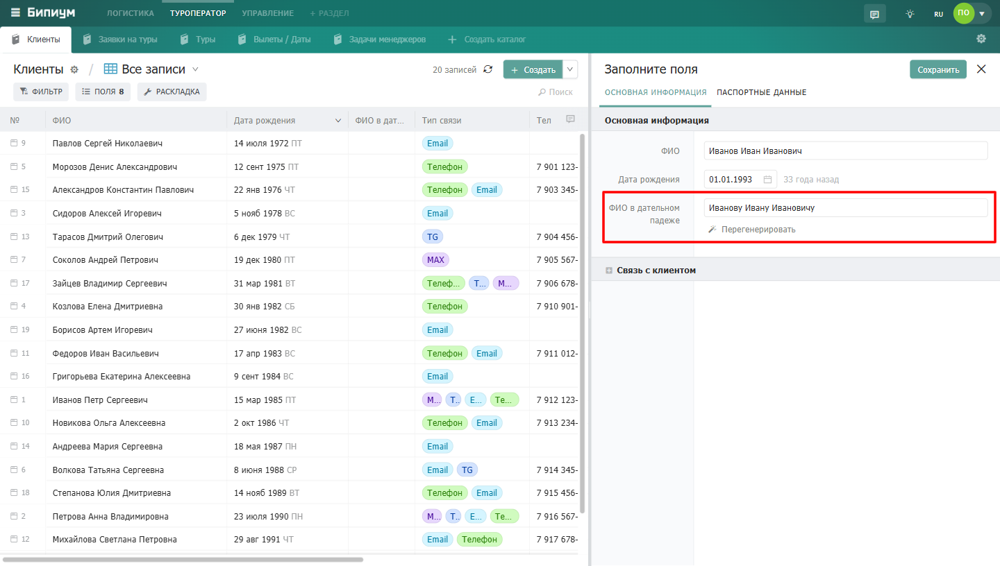

Текстовое поле, которое заполняется с помощью большой языковой модели (LLM). Сотрудник нажимает кнопку «Сгенерировать» -- ИИ анализирует данные записи и возвращает результат в поле.

## Когда использовать

ИИ-поле подходит для задач, где нужно автоматически сформировать текст на основе данных из других полей записи. Примеры:

-  Склонение ФИО по падежам -- поле «ФИО в дательном падеже» из поля «ФИО»

-  Краткое резюме по заполненным полям клиента или сделки

-  Классификация или тегирование -- определить тип обращения по тексту комментария

-  Перевод текста на другой язык

-  Генерация текста письма или предложения по параметрам записи

## Настройка

В параметрах отображаются элементы поля, которые необходимо настроить.

**Способ ввода.** В настройках поля выберите «ИИ-запрос». Именно этот режим активирует все параметры ниже.

**Сервис.** Выберите языковую модель для обращения. Доступные сервисы: `YandexGpt(Бесплатно от Бипиум), YandexGpt, GigaChat, Deepseek, Grok, Sonar(Perplexity)`. 

**Модель.** Укажите конкретную модель выбранного сервиса из списка. Недоступно для «YandexGPT (бесплатно от Бипиум)» -- там модель фиксирована.

**Авторизационный токен.** Каждый сервис использует API ключ (токен) для аутентификации, необходимо его получить на официальном сайте сервиса\*\*.\*\* Укажите API ключ токен для доступа к API сервиса --  выберите из каталога «Доступы к сервисам». Не требуется для YandexGPT (бесплатно от Бипиум).

**Идентификатор каталога Yandex Cloud (для Сервиса YandexGPT).** Позволяет указать идентификатор каталога Yandex Cloud через переменную или выбрать из списка уже добавленных в каталог Доступы к сервисам.

**Промпт.** Напишите инструкцию для модели -- что именно нужно сделать с данными записи. Чем точнее промпт, тем предсказуемее результат.

## Доступные сервисы

| Сервис                                                        | Особенности                                                                            |
|---------------------------------------------------------------|----------------------------------------------------------------------------------------|
| YandexGPT (бесплатно от Бипиум)                               | Не требует токена и регистрации в Yandex Cloud. Подходит для старта и несложных задач. |
| [YandexGPT](https://ru.ruwiki.ru/wiki/YandexGPT)              | Собственный аккаунт Yandex Cloud. Требует токен и идентификатор каталога.              |
| [GigaChat](https://ru.ruwiki.ru/wiki/GigaChat)                | Российская модель от Сбера. Требует авторизационный токен.                             |
| [DeepSeek](https://ru.ruwiki.ru/wiki/DeepSeek)                | Китайская модель с высоким качеством рассуждений. Требует токен.                       |
| [Grok](https://ru.ruwiki.ru/wiki/Grok)                        | Модель от [xAI](https://ru.wikipedia.org/wiki/XAI). Требует токен.                     |
| [Sonar (Perplexity)](https://ru.ruwiki.ru/wiki/Perplexity_AI) | Модель с доступом к актуальной информации из интернета. Требует токен.                 |

## Как написать хороший промпт

Промпт -- это инструкция для модели. Несколько советов:

-  **Опишите задачу конкретно.** «Переведи поле Описание на английский язык» лучше, чем «Переведи».

-  **Укажите формат результата.** Например: «Ответь одним предложением», «Верни только список через запятую», «Используй официальный стиль».

-  **Не нужно перечислять поля**. Модель получает все данные записи автоматически -- просто опишите что нужно сделать.

## Как работает поле для сотрудника

После того как администратор настроил ИИ-поле, в анкете записи появляется кнопка «Сгенерировать». Сотрудник нажимает её -- система отправляет данные записи в выбранную модель и записывает результат в поле. Генерация занимает несколько секунд.

Результат можно отредактировать вручную после генерации -- поле остаётся обычным текстовым.

При нажатии произойдёт генерация ФИО в дательном падеже. 

{width=1440px height=816px}