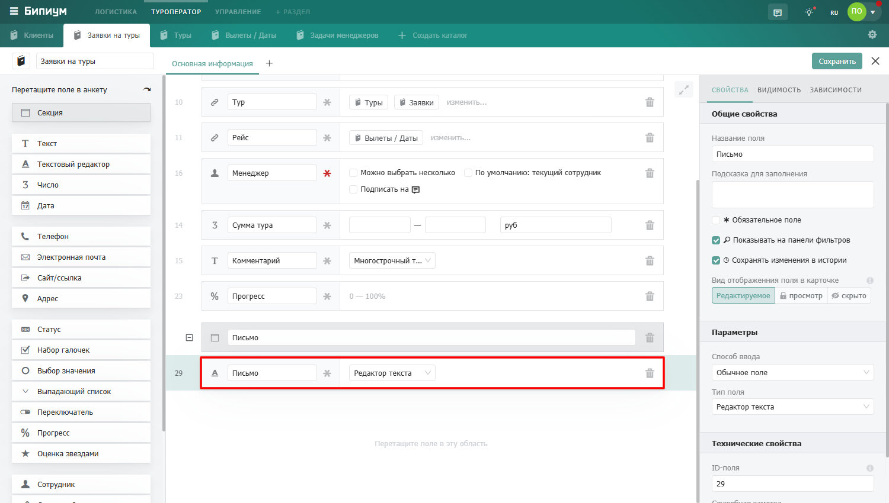

Поле для ввода форматированного текста с заголовками, списками, таблицами, изображениями и видео. В отличие от поля Текст, содержимое здесь можно структурировать и оформлять.

# Текстовый редактор

## Когда использовать

Используйте Текстовый редактор, когда содержимое поля -- это документ, а не просто строка. Типичные примеры:

-  Техническое задание или описание проекта с разделами и подзаголовками

-  Инструкция для сотрудника с нумерованными шагами

-  Коммерческое предложение или шаблон письма с форматированием

-  Внутренняя база знаний: регламенты, скрипты, FAQ

-  Описание товара с фотографиями и таблицей характеристик

Если нужна просто строка или несколько строк без форматирования -- используйте Текст (однострочный или многострочный). Текстовый редактор занимает больше места в анкете и не участвует в формулах.

-  Коммерческое предложение или шаблон письма с форматированием



---

*  

   **Группа**

*  

   **Что доступно**

---

*  

   Текст

*  

   Жирный, курсив, подчеркивание, зачеркивание, цвет текста, цвет фона

---

*  

   Структура

*  

   Заголовки H1–H3, маркированный список, нумерованный список, отступы

---

*  

   Вставка

*  

   Изображения, видео, таблицы, цитаты, блок кода



## Режимы отображения в анкете

Текстовый редактор можно разместить двумя способами -- это задается в конструкторе.

### Стандартный режим

Поле занимает стандартную область в анкете наравне с другими полями. Подходит когда текст -- один из многих атрибутов записи и не является главным содержимым.

### Полнооконный режим

Поле разворачивается на всю ширину секции и занимает максимум пространства. Чтобы включить этот режим, добавьте Текстовый редактор в отдельную секцию без других полей -- система автоматически расширит его на всю область.

Полнооконный режим удобен когда текст -- это основное содержимое записи: статья базы знаний, инструкция, описание. 

{width=1500px height=850px}

