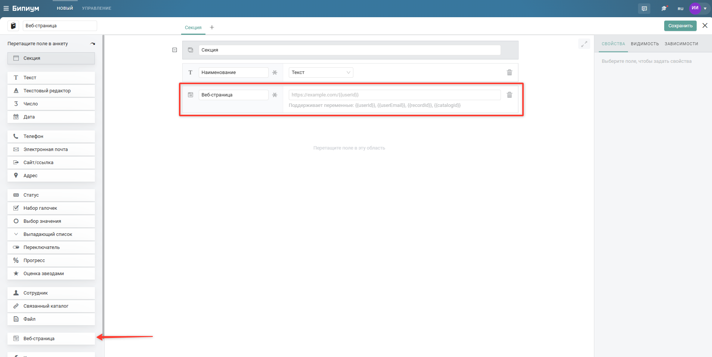
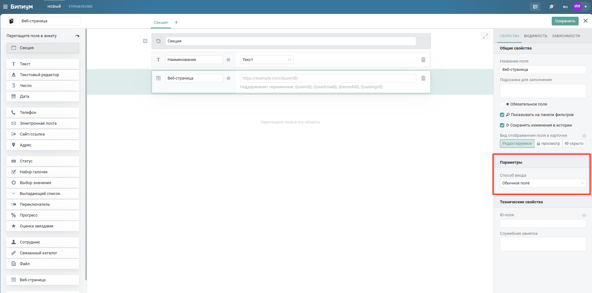
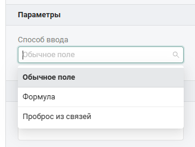
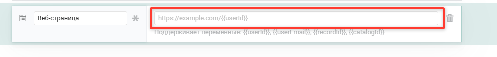
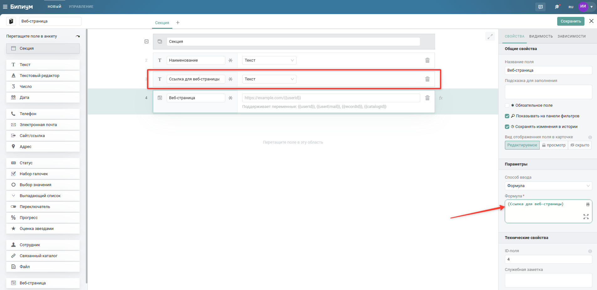
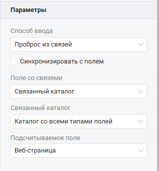
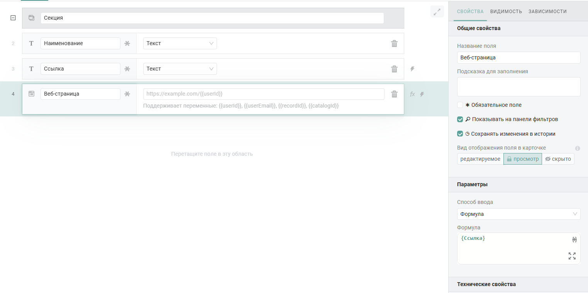
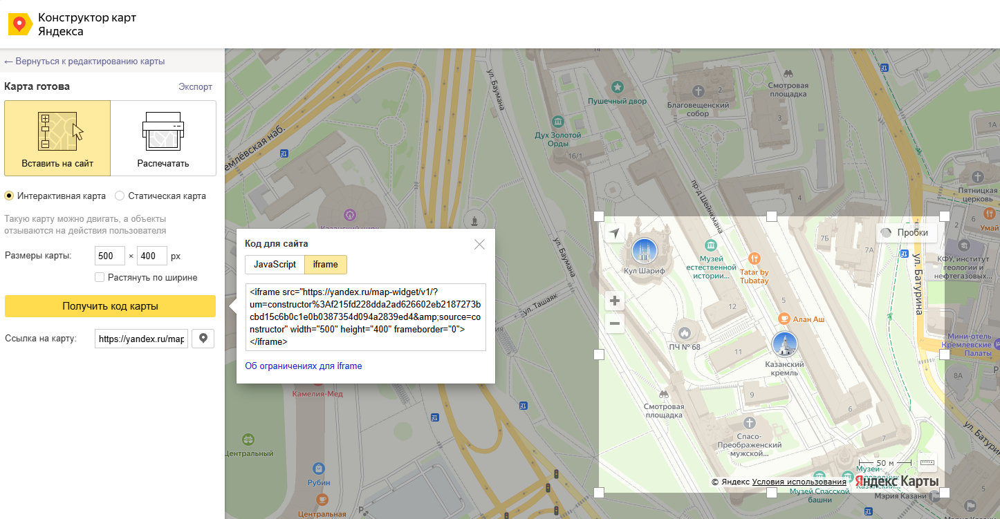
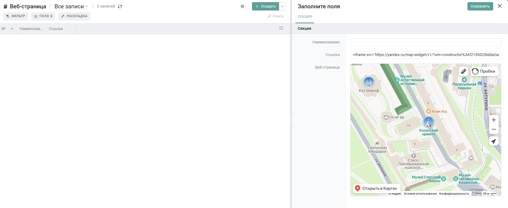

Поле для отображения содержимого внешних веб-сервисов прямо внутри карточки записи в Бипиуме.

{width=1906px height=955px}

:::info 

В поле Веб-страница отображаются только страницы, разрешающие встраивание в iframe (через X-Frame-Options или CSP).

:::

## Когда использовать

Используйте поле Веб-страница когда нужно отобразить какую-то информацию из внешних систем внутри карточки записи Бипиум. Типичные примеры:

-  Отображение адреса на карте;

-  Google документ для совместного редактирования;

-  Отображение отчетов Бипиум;

-  Собственное веб-приложение.

## Настройка

В параметрах отображаются элементы поля, которые необходимо настроить

{width=1909px height=947px}

Поддерживаются следующие варианты способа ввода:

-  обычное поле;

-  формула;

-  проброс из связей.

{width=328px height=247px}

### Способ ввода «Обычное поле»

В параметре способа ввода по умолчанию устанавливается значение «Обычное поле». При таком использовании, ссылка для поля указывается в структуре каталога. Указанный адрес будет использоваться для всех созданных записей каталога, т.к. значение поля Веб-страница будет статичным, указанным в структуре каталога.

{width=993px height=114px}

В поле для ввода ссылки Веб-страницы вы можете использовать следующие переменные:

-  `{{userId}}` - id пользователя, который редактирует запись;

-  `{{userEmail}}` - email пользователя, который редактирует запись;

-  `{{recordId}}` - id записи, в которой проводится редактирование записи;

-  `{{catalogId}}` - id каталога, в котором проводится редактирование записи.

Эти переменные можно использовать для передачи информации в query-параметрах адреса, который вы указали в поле для ссылки. Например: `https://example.com/page?user={{userId}}&record={{recordId}}`

### Способ ввода «Формула»

Способ ввода «Формула» позволяет формировать индивидуальный URL для каждой записи на основе выражения.\
Значение поля рассчитывается динамически при открытии карточки записи.

В формуле можно использовать стандартные функции формул и значения текстовых полей записи, для формирования адреса веб-страницы.

:::info 

При использовании формул, возвращаемым значением формулы должен быть строковый URL.

:::

{width=1905px height=927px}

Также, при использовании формулы в способе ввода, поддерживаются те же параметры, что и в способе ввода «Обычное поле»

### Способ ввода «Проброс из связей»

При использовании способа ввода «Проброс из связей» адрес веб-страницы берется из поля связанной записи. Для связи с Веб-страницей доступны поля следующего типа:

-  текст;

-  текстовый редактор;

-  веб-страница.

{width=319px height=342px}

Поддерживается работа Проброса из связей с синхронизацией. При использовании признака «Синхронизировать с полем» контент веб-страницы в наследуемом каталоге будет изменяться в соответствии с контентом в записи родительского каталога

## Поведение

Формирование URL-адреса, который передается браузеру для загрузки внешнего ресурса инициируется при открытии карточки.

Отображение контента возможно в следующих видах:

-  в карточке записи;

-  во весь экран;

-  в новой вкладке.

## Ограничения

На текущий момент существуют некоторые ограничения по использованию поля Веб-страница:

-  поддерживаются только HTTPS-адреса с действующим SSL-сертификатом. При указании адреса без SSL-сертификата (HTTP-адрес) -- контент не будет отображаться;

-  не поддерживаются RTSP-потоки (потоковые видео). Подобные адреса не поддерживаются в поле Веб-страницы, по политике безопасности самих браузеров;

-  отображение контента возможно только при открытой карточке записи. Отображение контента в табличном виде каталога не предусматривается.

## Вариант использования

### Отображение карты в записи каталога по ссылке

Цель: отображать точку на карте по указанному объекту.

В структуре каталога создайте 2 поля:

-  «Веб-страница»;

-  Текстовое поле «Ссылка».

В параметрах поля укажите «Формула» и передайте в нее текстовое поле «Ссылка»

{width=1523px height=760px}

Далее:

-  необходимо перейти в «Конструктор карт Яндекса»;

-  определить необходимую точку на карте и масштаб отображения;

-  сохранить карту и нажать кнопку «Получить код карты»;

-  выбрать код для сайта - iframe.

{width=1446px height=751px}

После чего, необходимо полученный код вставить в текстовое поле «Ссылка» в записи Бипиум. После вставки кода в текстовое поле, карта начнет отображаться в записи. При настройке такого механизма, для каждой записи, отображаемый контент будет своим, в зависимости от того, что вы укажете в поле, которое используется адресом для поля веб-страницы

{width=1891px height=776px}