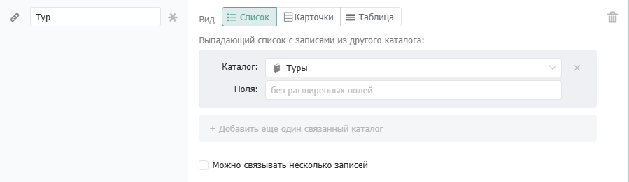
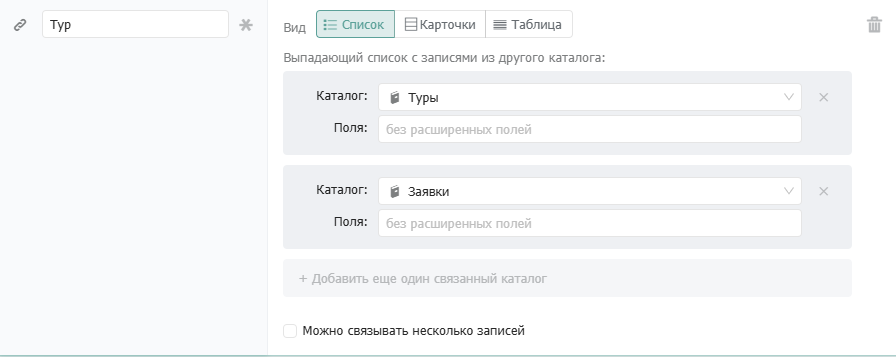
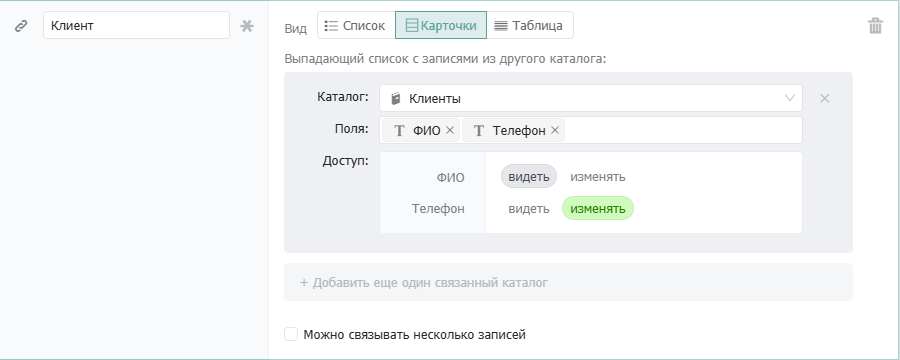
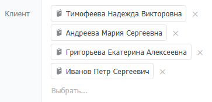
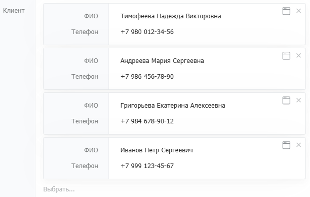
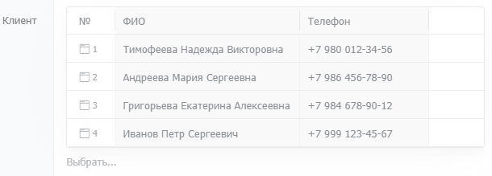

# Связанный каталог

<figure><figcaption></figcaption></figure>

### Когда использовать

Используйте поле Связанный каталог, когда запись в одном каталоге относится к записи в другом. Типичные примеры:

* Заказ → Клиент: каждый заказ принадлежит конкретному клиенту
* Задача → Проект: задача входит в проект
* Обращение → Контактное лицо: обращение пришло от конкретного человека
* Встреча → несколько участников из разных каталогов: клиенты, сотрудники, партнеры

Связанный каталог — это не просто поле с текстом. Оно хранит ссылку на реальную запись: при клике на связанную запись в анкете откроется её карточка.

## Настройки

### Каталог

Указывает из какого каталога выбираются записи для связи. Можно добавить несколько каталогов — тогда сотрудник сможет выбирать записи из любого из них. Вместо каталога можно указать конкретный правовой вид — тогда в поле будут доступны только записи попадающие в этот вид.\
Подробнее о правовых видах в статье «[Правовые виды](../../../prava/views.md)».

<figure><figcaption></figcaption></figure>

### Поля

Выбор полей связанного каталога, которые будут отображаться прямо в анкете родительской записи — без необходимости открывать карточку связанной записи. Например, в поле «Клиент» можно сразу показывать ФИО и Телефон.

### Доступ

Определяет какие права сотрудник имеет на выбранные поля связанной записи прямо из анкеты. Для каждого поля можно выбрать:

* **Видеть** — поле отображается, но не редактируется.
* **Изменять** — поле можно редактировать прямо из анкеты родительской записи.

<figure><figcaption></figcaption></figure>

### Несколько записей

Опция «Можно связывать несколько записей» позволяет привязать запись сразу к нескольким записям из связанного каталога. Например, в поле «Участники встречи» можно выбрать нескольких контактных лиц одновременно.

### Вид отображения связей

Выбирается как будут выглядеть связанные записи в анкете. Три варианта:

<figure><figcaption></figcaption></figure>

#### **Список**

Записи показаны строками. Применяется когда связанных записей несколько и нужен компактный вид.

<figure><figcaption></figcaption></figure>

#### Карточки

Записи показаны в виде карточек с выбранными полями. Используется когда нужно видеть несколько полей каждой связанной записи.

<figure><figcaption></figcaption></figure>

#### Таблица

Записи показаны в табличном формате. Используется когда нужно видеть несколько полей каждой связанной записи.

<figure><figcaption></figcaption></figure>

## Параметры поля

<table><thead><tr><th width="334">Параметр</th><th>Описание</th></tr></thead><tbody><tr><td><strong>Можно связывать несколько записей</strong></td><td>Позволяет привязать несколько записей из связанного каталога. Если выключено — можно выбрать только одну запись.</td></tr><tr><td><strong>Можно выбирать из существующих</strong></td><td>Сотрудник может выбирать уже созданные записи из связанного каталога.</td></tr><tr><td><strong>Выбирать только из доступных</strong></td><td>При выборе показываются только те записи, к которым у сотрудника есть доступ по правовой политике. Если выключено — видны все записи каталога, даже без права открыть их карточку.</td></tr><tr><td><strong>Можно создавать новые записи</strong></td><td>Сотрудник может создать новую запись в связанном каталоге прямо из поля, не переходя в сам каталог.</td></tr><tr><td><strong>Создание без всплывающего окна</strong></td><td>Новая запись создаётся прямо в поле без открытия карточки связанной записи. Подходит для быстрого добавления простых записей — например, тегов или коротких названий.</td></tr></tbody></table>

## Настройка по правовым видам и фильтрам

Когда в каталоге накапливается большое количество записей, стандартный выбор из всего списка становится неудобным. Чтобы сотрудники видели только релевантные варианты, можно ограничить выборку с помощью правовых **видов** и **фильтров**.

### **Выбор по правовому виду**

Вместо всего каталога можно указать конкретный [**правовой вид**](../../../prava/views.md). В этом случае в поле подгрузятся только записи, принадлежащие этому виду.

**Пример:** В каталоге «Клиенты» есть виды «Физические лица» и «Юридические лица». Если в поле «Заявка» выбрать вид «Юридические лица», сотрудник увидит в списке выбора только компании, не отвлекаясь на физлиц.

<figure><figcaption></figcaption></figure>

### **Выбор по фильтру**

Если возможностей вида недостаточно, используйте **Фильтры**. Это динамический фильтр, который позволяет показывать в поле только те записи, которые соответствуют заданным критериям.

Условия работают по принципу: _«Показывать записи из связанного каталога, если у них поле X равно значению Y»_.

**Пример:** В карточке «Заказ» есть поле «Тип контрагента». Настроив фильтр в поле «Контрагент» (связанном с каталогом «Контрагенты») по условию «Тип контрагента = Тип контрагента», сотрудник увидит только тех контрагентов, чей тип совпадает с типом, выбранным в заказе. Если в заказе указан тип «Клиент», в списке выбора покажутся только клиенты.

<figure><figcaption></figcaption></figure>

**Комбинирование**

Вы можете комбинировать Правовой в**ид** и **Фильтр**. В таком случае выборка записей сначала ограничивается заданным видом, а затем фильтруется по условиям.
