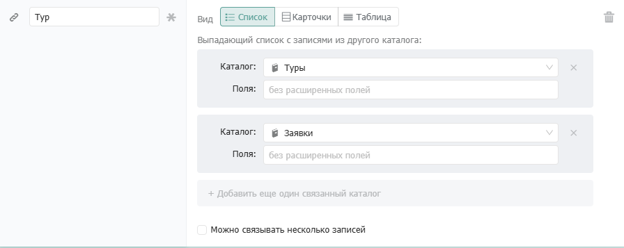
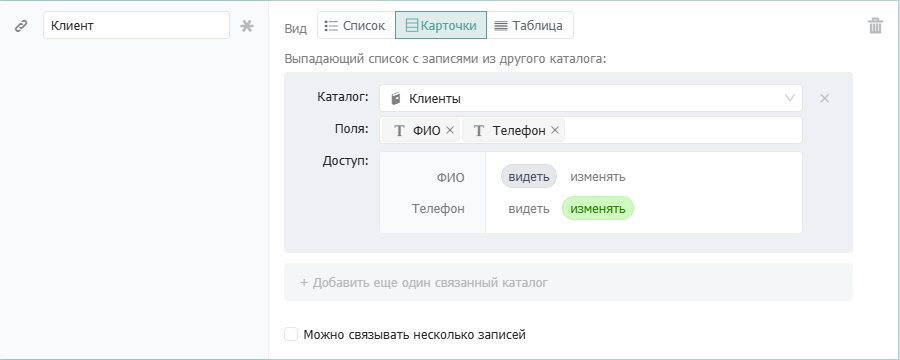
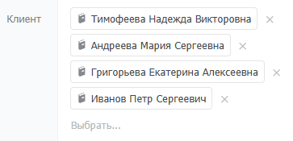

Поле для связи записей разных каталогов между собой. Позволяет привязать к записи одну или несколько записей из другого каталога -- и при необходимости редактировать их поля прямо из анкеты.

### Когда использовать

Используйте поле Связанный каталог, когда запись в одном каталоге относится к записи в другом. Типичные примеры:

-  Заказ -> Клиент: каждый заказ принадлежит конкретному клиенту

-  Задача -> Проект: задача входит в проект

-  Обращение -> Контактное лицо: обращение пришло от конкретного человека

-  Встреча -> несколько участников из разных каталогов: клиенты, сотрудники, партнеры

Связанный каталог -- это не просто поле с текстом. Оно хранит ссылку на реальную запись, а не копию данных. Отображаемые поля -- это представление данных связанной записи. Изменения, внесённые через поле «Связанный каталог», применяются непосредственно к самой записи.

## Настройки

### Каталог

Указывает из какого каталога выбираются записи для связи. Можно добавить несколько каталогов -- тогда сотрудник сможет выбирать записи из любого из них.

### Ограничение выборки

Чтобы сотрудники видели только релевантные варианты, можно ограничить выборку записей двумя способами.



---

*  

   Способ

*  

   Описание

---

*  

   Правовой вид

*  

   Вместо всего каталога можно указать конкретный правовой вид. В поле подгрузятся только записи, принадлежащие этому виду.

---

*  

   Фильтр

*  

   Динамический фильтр, который показывает записи, соответствующие заданным критериям. Условия настраиваются как связь с полем текущей анкеты.



### Поля

Выбор полей связанного каталога, которые будут отображаться прямо в анкете родительской записи -- без необходимости открывать карточку связанной записи. Например, в поле «Клиент» можно сразу показывать ФИО и Телефон.

### Доступ

Определяет какие права сотрудник имеет на выбранные поля связанной записи прямо из анкеты. Для каждого поля можно выбрать:

-  **Видеть** -- поле отображается, но не редактируется.

-  **Изменять** -- поле можно редактировать прямо из анкеты родительской записи.

:::note 

Настройки «Видеть» и «Изменять» относятся к редактированию полей связанной записи непосредственно из анкеты. Итоговое поведение также может ограничиваться правовой политикой доступа к самому связанному каталогу.

:::

### Несколько записей

Опция «Можно связывать несколько записей» позволяет привязать запись сразу к нескольким записям из связанного каталога. Например, в поле «Участники встречи» можно выбрать нескольких контактных лиц одновременно.

### Вид отображения связей

Выбирается как будут выглядеть связанные записи в анкете. Три варианта:

#### **Список**

Записи показаны строками. \
Применяется когда связанных записей несколько и нужен компактный вид.

#### Карточки

Записи показаны в виде карточек с выбранными полями. \
Используется когда нужно видеть несколько полей каждой связанной записи.

#### Таблица

Записи показаны в табличном формате. \
Используется когда нужно сравнивать поля нескольких связанных записей

#### **Как отображается поле «Связанный каталог» в таблице**

В таблице записей текущего каталога, в колонке с типом «Связанный каталог», показывается:

-  **текст** из связанной записи -- если в связанном каталоге есть хотя бы одно поле типа «Текст»;

-  **Номер записи** -- если в связанном каталоге нет ни одного текстового поля.

Выбор, какое именно текстовое поле показывать, не настраивается. Система берёт первое текстовое поле в структуре связанного каталога.

## Параметры поля



---

*  

   Параметр

*  

   Описание

---

*  

   Можно связывать несколько записей

*  

   Позволяет привязать несколько записей из связанного каталога. Если выключено -- поле хранит ровно одну ссылку (связь 1:1). Если включено -- хранит массив ссылок (связь 1:N).

---

*  

   Можно выбирать из существующих

*  

   Сотрудник может выбирать уже созданные записи из связанного каталога.

---

*  

   Выбирать только из доступных

*  

   При выборе показываются только те записи, к которым у сотрудника есть доступ по правовой политике. Если выключено -- видны все записи каталога, даже без права открыть их карточку.

---

*  

   Можно создавать новые записи

*  

   Сотрудник может создать новую запись в связанном каталоге прямо из поля, не переходя в сам каталог.

---

*  

   Создание без всплывающего окна

*  

   Новая запись создаётся прямо в поле без открытия карточки связанной записи. Подходит для быстрого добавления простых записей -- например, тегов или коротких названий.



## Настройка по правовым видам и фильтрам

Когда в каталоге накапливается большое количество записей, стандартный выбор из всего списка становится неудобным. Чтобы сотрудники видели только релевантные варианты, можно ограничить выборку с помощью правовых **видов** и **фильтров**.

### **Выбор по правовому виду**

Вместо всего каталога можно указать конкретный [**правовой вид**](./../../../prava/views). В этом случае в поле подгрузятся только записи, принадлежащие этому виду.

**Пример:** В каталоге «Клиенты» есть виды «Физические лица» и «Юридические лица». Если в поле «Заявка» выбрать вид «Юридические лица», сотрудник увидит в списке выбора только компании, не отвлекаясь на физлиц.

.png>)

### **Выбор по фильтру**

Если возможностей вида недостаточно, используйте **Фильтры**. Это динамический фильтр, который позволяет показывать в поле только те записи, которые соответствуют заданным критериям.

Условия работают по принципу: *«Показывать записи из связанного каталога, если у них поле X равно значению Y»*.

**Пример:** В карточке «Заказ» есть поле «Тип контрагента». Настроив фильтр в поле «Контрагент» (связанном с каталогом «Контрагенты») по условию «Тип контрагента = Тип контрагента», сотрудник увидит только тех контрагентов, чей тип совпадает с типом, выбранным в заказе. Если в заказе указан тип «Клиент», в списке выбора покажутся только клиенты.

.png>)

### **Комбинирование**

Вы можете комбинировать **Правовой** **вид** и **Фильтр**. В таком случае выборка записей сначала ограничивается заданным видом, а затем фильтруется по условиям.