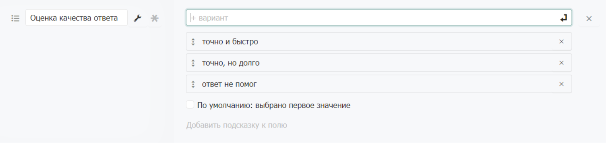

# Выбор значения

### Выбор значения

Поле схожее по смыслу со «статусом». Позволяет выбирать только одно из возможных значений. Подходит для отображения вопросов в анкетах. В режиме просмотра анкеты варианты значений показаны списком в виде группы радио-баттонов.

**Галочка «По умолчанию: выбрано первое значение»** делает выбранным первый элемент при создании новой записи.
