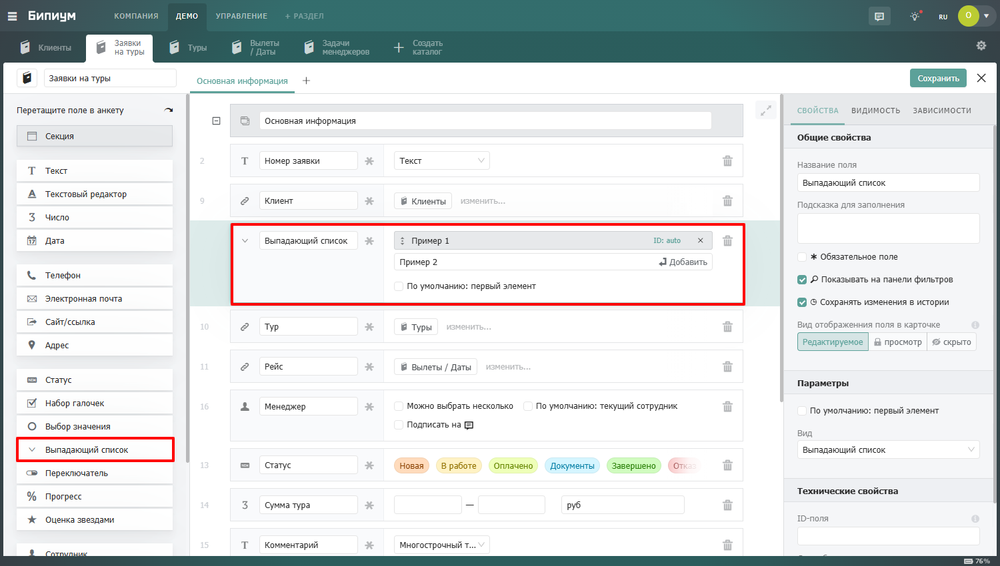

# Выпадающий список

В интерфейсе выглядит как раскрывающийся список. По функциональности похоже на поле «Выбор значения», но занимает меньше места и лучше подходит для длинных списков.

<figure><figcaption></figcaption></figure>

### Когда использовать

Используйте поле **Выпадающий список**, когда пользователь должен выбрать один вариант из списка, и вариантов достаточно много. Типичные примеры:

* Страна, регион или город проживания
* Должность сотрудника: «Менеджер», «Руководитель отдела», «Директор»
* Валюта: «RUB», «USD», «EUR», «CNY»
* Способ доставки: «Курьером», «Почтой», «Самовывоз»
* Источник лида: «Реклама», «Сайт», «Рекомендация», «Звонок»

### Настройка вариантов

В настройках поля вы задаете список значений, которые будут появляться в выпадающем списке. Для каждого варианта можно указать:

* Название — то, что видит пользователь при выборе

Варианты можно сортировать перетаскиванием — в таком порядке они будут показываться в списке. Также доступен поиск по вариантам: если список длинный, пользователь может начать вводить текст, и система предложит подходящие варианты.

### Значение по умолчанию

Опция «По умолчанию: выбрано первое значение» автоматически подставляет первый вариант из списка при создании новой записи. Удобно, если у большинства записей это значение совпадает — например, страна по умолчанию «Россия» или валюта «RUB». 
