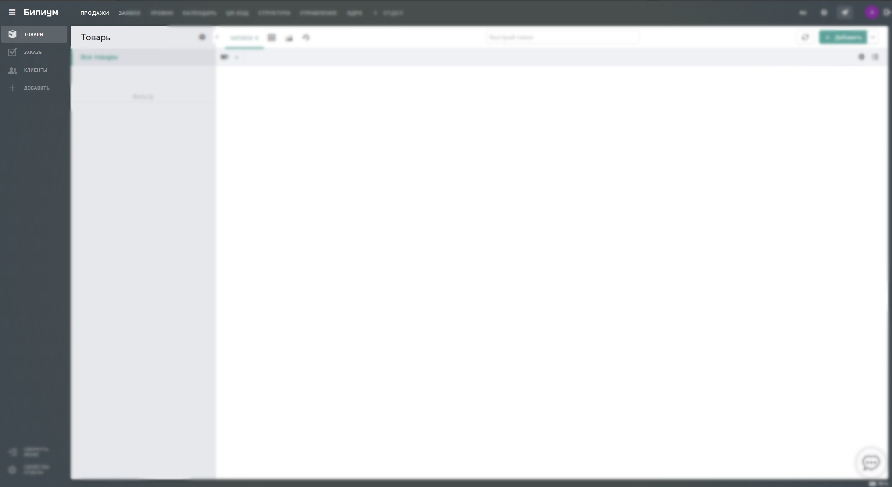

# Формулы в полях

Формулы позволяют автоматически рассчитывать значения полей на основе данных из других полей той же записи. Это исключает ошибки ручного ввода, автоматизирует процессы и поддерживает данные в актуальном состоянии.

Основной принцип: вы задаете выражение (формулу) в настройках поля, и система вычисляет его результат каждый раз при создании или изменении записи. Полученное значение сохраняется в поле и не может быть изменено вручную. Недопустимы формулы, где поля ссылаются друг на друга (A → B → A). Система выдаст ошибку. При возникновении ошибки (деление на 0, некорректная дата и т.д.) формула вернет пустое значение (NULL).


Важно: При изменении формулы в структуре каталога значения будут автоматически пересчитаны для всех существующих записей.


Для получения доступа к данному функционалу вам необходимо перейти в структуру каталога и приступить к настройке полей. В свойствах нужного вам поля указать параметр значения Формула.

### Интерфейс редактора формул 

Редактор помогает быстро и правильно создавать выражения.

<figure><figcaption></figcaption></figure>

1. Панель вставки элементов:
2. Поле: Быстрое добавление системного имени поля из текущего каталога (вставляет {Имя\_Поля}).
3. Функция: Полный список доступных функций по категориям.
4. Операторы: Математические и логические операторы, скобки, константы.
5. Область написания формулы: Основное поле для ввода выражения (например, {Количество} \* {Цена}).
6. Область подсказки: Динамическая справка по синтаксису выбранной функции.

### Синтаксис формул 

Формула — выражение, состоящее из констант, ссылок на поля, операторов и функций. Система учитывает типы данных и автоматически приводит результат вычисления к типу поля, в котором задана формула.

#### Типы данных и константы

| Тип             | Пример                     | Примечание                                        |
| --------------- | -------------------------- | ------------------------------------------------- |
| Число           | 1, -5.75, 3.14             | Десятичный разделитель — точка.                   |
| Строка          | 'Текст', "Текст"           | Можно использовать одинарные или двойные кавычки. |
| Булево значение | true, false                | Логические константы.                             |
| Дата            | DATE(2024, 12, 31)         | Создается с помощью функции DATE.                 |
| Массив          | \[1, 2, 3], \["Да", "Нет"] | Набор значений в квадратных скобках.              |

#### Ссылка на поле

Для использования значения поля в формуле укажите его системное имя в фигурных скобках: {FIELD\_NAME}.

Значения по умолчанию: Если поле, на которое ссылается формула, пустое, оно принимает значение по умолчанию, что может повлиять на результат.

| Тип поля                  | Тип в формуле   | Значение по умолчанию  |
| ------------------------- | --------------- | ---------------------- |
| Текст, Текстовый редактор | Строка          | "" (пустая строка)     |
| Число, Дата               | Число, Дата     | NULL (пустое значение) |
| Прогресс, Оценка звездами | Число           | 0                      |
| Переключатель             | Булево значение | false                  |
| Статус, Набор галочек     | Массив строк    | \[] (пустой массив)    |

Важно: Если в процессе вычисления встречается NULL (пустое значение), результат всей формулы также станет пустым, за исключением функций CONCAT и JOIN, которые преобразуют NULL в пустую строку.

#### Операторы

**Арифметические операторы**

| Оператор | Пример | Результат | Описание                               |
| -------- | ------ | --------- | -------------------------------------- |
| +        | 1 + 2  | 3         | Сложение чисел или конкатенация строк. |
| -        | 5 - 2  | 3         | Вычитание.                             |
| \*       | 3 \* 5 | 15        | Умножение.                             |
| /        | 10 / 2 | 5         | Деление.                               |
| %        | 12 % 7 | 5         | Остаток от деления.                    |
| ^        | 12 ^ 2 | 144       | Возведение в степень.                  |

**Строковый оператор**

| Оператор | Пример  | Результат | Описание                         |
| -------- | ------- | --------- | -------------------------------- |
| &        | 5 & "2" | "52"      | Склеивание (конкатенация) строк. |

**Логические операторы**

<table data-header-hidden data-full-width="false"><thead><tr><th width="112">Оператор</th><th width="184">Пример</th><th width="100">Возвращаемое значение</th><th>Поддерживаемые типы (сравнение)</th></tr></thead><tbody><tr><td>Оператор</td><td>Пример</td><td>Результат</td><td>Описание</td></tr><tr><td><strong>></strong></td><td><code>1 > 2</code></td><td><code>false</code></td><td>Прямое сравнение: Число, Строка, Дата, Булевый тип. Для остальных типов: преобразуются в строку и сравниваются.</td></tr><tr><td><strong>&#x3C;</strong></td><td><code>1 &#x3C; 2</code></td><td><code>true</code></td><td>Прямое сравнение: Число, Строка, Дата, Булевый тип. Для остальных типов: преобразуются в строку и сравниваются.</td></tr><tr><td><strong>>=</strong></td><td><code>1 >= 2</code></td><td><code>false</code></td><td>Прямое сравнение: Число, Строка, Дата, Булевый тип. Для остальных типов: преобразуются в строку и сравниваются.</td></tr><tr><td><strong>&#x3C;=</strong></td><td><code>1 &#x3C;= 2</code></td><td><code>true</code></td><td>Прямое сравнение: Число, Строка, Дата, Булевый тип. Для остальных типов: преобразуются в строку и сравниваются.</td></tr><tr><td><strong>==</strong></td><td><code>1 == 2</code></td><td><code>false</code></td><td>Прямое сравнение: Число, Строка, Дата, Булевый тип. Для остальных типов: преобразуются в строку и сравниваются.</td></tr><tr><td><strong>!=</strong></td><td><code>1 != 2</code></td><td><code>true</code></td><td>Прямое сравнение: Число, Строка, Дата, Булевый тип. Для остальных типов: преобразуются в строку и сравниваются.</td></tr><tr><td><strong>!</strong></td><td><code>!(1 > 2)</code></td><td><code>true</code></td><td>Применяется к: Булевому значению (чаще всего является результатом выражения).</td></tr><tr><td><strong>&#x26;&#x26;</strong></td><td><code>(1 > 2) &#x26;&#x26; (3 > 2)</code></td><td><code>false</code></td><td>Работает с: Булевыми значениями (результатами условий).</td></tr><tr><td><strong>||</strong></td><td><code>(1 > 2) || (3 > 2)</code></td><td><code>true</code></td><td>Работает с<strong>:</strong> Булевыми значениями (результатами условий).</td></tr></tbody></table>

#### Функции

**Строковые**

| Функция                                     | Описание                                                                                     | Пример                                         |
| ------------------------------------------- | -------------------------------------------------------------------------------------------- | ---------------------------------------------- |
| CONCAT(строка1, строка2, ...)               | Склеивает все аргументы в одну строку.                                                       | CONCAT("Итог: ", {Сумма})                      |
| JOIN(\[массив], разделитель)                | Объединяет элементы массива в строку через разделитель.                                      | JOIN({Теги}, ", ")                             |
| LEFT(строка, количество)                    | Возвращает указанное количество символов с начала строки.                                    | LEFT("Привет", 3) → "При"                      |
| LEN(строка)                                 | Возвращает длину строки.                                                                     | LEN("abc") → 3                                 |
| LOWER(строка), UPPER(строка)                | Приводит строку к нижнему/верхнему регистру.                                                 | UPPER("текст") → "ТЕКСТ"                       |
| REGEXMATCH(строка, regex, ?режим)           | Проверяет, соответствует ли строка регулярному выражению. Возвращает true/false.             | REGEXMATCH("test@mail.ru", "@") → true         |
| REGEXREPLACE(строка, regex, замена, ?режим) | Заменяет совпадения по регулярному выражению.                                                | REGEXREPLACE("123-456", "\d", "X") → "XXX-XXX" |
| REPEAT(строка, количество)                  | Повторяет строку указанное количество раз.                                                   | REPEAT("a", 3) → "aaa"                         |
| REPLACE(строка, что\_менять, на\_что)       | Заменяет все вхождения подстроки.                                                            | REPLACE("a-b-c", "-", "/") → "a/b/c"           |
| RIGHT(строка, количество)                   | Возвращает указанное количество символов с конца строки.                                     | RIGHT("Привет", 3) → "вет"                     |
| SEARCH(строка, подстрока)                   | Возвращает позицию первого вхождения подстроки (с 0) или -1.                                 | SEARCH("привет", "иве") → 2                    |
| SUBSTRING(строка, начало, ?конец)           | Возвращает часть строки. Индексы с 0.                                                        | SUBSTRING("abcdef", 1, 4) → "bcd"              |
| TOSTRING(значение)                          | Преобразует любое значение в строку.                                                         | TOSTRING(123) → "123"                          |
| TRIM(направление, символы, строка)          | Удаляет указанные символы с начала/конца строки. Направление: "leading", "trailing", "both". | TRIM("both", " ", " текст ")                   |

**Числовые**

| Функция                                            | Описание                                                                              | Пример                       |
| -------------------------------------------------- | ------------------------------------------------------------------------------------- | ---------------------------- |
| ABS(число)                                         | Модуль числа.                                                                         | ABS(-5) → 5                  |
| ACOS(число), ASIN(число), ATAN(число), ACOT(число) | Обратные тригонометрические функции (арккосинус, арксинус, арктангенс, арккотангенс). | ACOS(0.5) → 1.047            |
| AVERAGE(число1, число2, ...)                       | Среднее арифметическое.                                                               | AVERAGE(1, 2, 3) → 2         |
| CEIL(число, ?знаков)                               | Округление вверх.                                                                     | CEIL(5.1) → 6                |
| COS(число), SIN(число), TAN(число), COT(число)     | Тригонометрические функции (косинус, синус, тангенс, котангенс).                      | COS(0) → 1                   |
| EXP(число)                                         | Экспонента (e в степени число).                                                       | EXP(1) → 2.718               |
| FIXED(число, ?знаков)                              | Форматирует число в строку с разделителями.                                           | FIXED(1000.5, 1) → "1 000,5" |
| FLOOR(число, ?знаков)                              | Округление вниз.                                                                      | FLOOR(5.9) → 5               |
| LN(число)                                          | Натуральный логарифм.                                                                 | LN(2.718) → 1                |
| LOG(число, ?основание)                             | Логарифм по указанному основанию (по умолчанию e).                                    | LOG(100, 10) → 2             |
| LOG10(число)                                       | Десятичный логарифм.                                                                  | LOG10(100) → 2               |
| MAX(число1, число2, ...)                           | Максимальное значение.                                                                | MAX(1, 5, 3) → 5             |
| MIN(число1, число2, ...)                           | Минимальное значение.                                                                 | MIN(1, 5, 3) → 1             |
| MOD(делимое, делитель)                             | Остаток от деления.                                                                   | MOD(10, 3) → 1               |
| PI()                                               | Число π (пи).                                                                         | PI() → 3.142                 |
| POWER(основание, степень)                          | Возведение в степень.                                                                 | POWER(3, 2) → 9              |
| RANDOM()                                           | Случайное число от 0 до 1.                                                            | RANDOM()                     |
| ROUND(число, ?знаков)                              | Округление до ближайшего.                                                             | ROUND(5.67, 1) → 5.7         |
| SQRT(число)                                        | Квадратный корень.                                                                    | SQRT(16) → 4                 |
| SUM(число1, число2, ...)                           | Сумма значений.                                                                       | SUM(1, 2, {Цена})            |
| TONUMBER(значение)                                 | Преобразует значение в число.                                                         | TONUMBER("123") → 123        |

**Даты**

| Функция                                                                     | Описание                                                                                                                                      | Пример                                |
| --------------------------------------------------------------------------- | --------------------------------------------------------------------------------------------------------------------------------------------- | ------------------------------------- |
| DATE(год, месяц, день, ?час, ?мин, ?сек)                                    | Создает дату.                                                                                                                                 | DATE(2024, 12, 31)                    |
| DATEADD(дата, количество, единица)                                          | Добавляет интервал к дате. Единицы: "d" (дни), "mon" (месяцы), "y" (годы) и др.                                                               | DATEADD({ДатаСтарта}, 7, "d")         |
| DATESUB(дата, интервал, единица)                                            | Вычитает интервал из даты. Единицы: "d" (дни), "mon" (месяцы), "y" (годы) и др.                                                               | DATESUB({Дата}, 7, "d")               |
| DATEDIFF(дата1, дата2, единица)                                             | Разница между датами.                                                                                                                         | DATEDIFF({Конец}, {Начало}, "d")      |
| DATEFORMAT(дата, формат)                                                    | Форматирует дату в строку.[ Список форматов](https://docs.google.com/spreadsheets/d/1u006NkjUTW3bQZDU_usQZyf6uXZexLQkUiaf-8CJ6iQ/edit#gid=0). | DATEFORMAT(NOW(), 'DD.MM.YYYY')       |
| DATEPARSE(текст, формат)                                                    | Парсит строку в дату по указанному формату.                                                                                                   | DATEPARSE("31.12.2024", "DD.MM.YYYY") |
| DAY(дата), MONTH(дата), YEAR(дата)                                          | Извлекает компонент даты (день, месяц, год).                                                                                                  | MONTH({Дата})                         |
| HOUR(дата), MINUTE(дата), SECOND(дата)                                      | Извлекает компонент времени (час, минута, секунда).                                                                                           | HOUR({Дата})                          |
| QUARTER(дата)                                                               | Извлекает квартал года (1-4).                                                                                                                 | QUARTER({Дата})                       |
| WEEKDAY(дата)                                                               | День недели (1-понедельник).                                                                                                                  | WEEKDAY({Дата})                       |
| WEEKNUM(дата)                                                               | Номер недели в году.                                                                                                                          | WEEKNUM({Дата})                       |
| STARTOF(дата, единица), ENDOF(дата, единица)                                | Сдвиг к началу/концу периода (дня, месяца, года).                                                                                             | STARTOF({Дата}, "mon")                |
| SETYEAR(дата, год), SETMONTH(дата, месяц), SETDAY(дата, день)               | Устанавливает компонент даты (год, месяц, день).                                                                                              | SETYEAR({Дата}, 2025)                 |
| SETQUARTER(дата, квартал), SETWEEKDAY(дата, день), SETWEEKNUM(дата, неделя) | Устанавливает квартал, день недели, номер недели.                                                                                             | SETQUARTER({Дата}, 2)                 |
| SETHOUR(дата, час), SETMINUTE(дата, минута), SETSECOND(дата, секунда)       | Устанавливает компонент времени (час, минута, секунда).                                                                                       | SETHOUR({Дата}, 12)                   |
| SETTIME(дата, время)                                                        | Устанавливает время (в миллисекундах с начала дня).                                                                                           | SETTIME({Дата}, 43200000)             |
| TIMESTAMP(дата)                                                             | Преобразует дату в числовой timestamp (миллисекунды с 1 января 1970).                                                                         | TIMESTAMP({Дата})                     |

**Логические**

| Функция                                       | Описание                                                   | Пример                                  |
| --------------------------------------------- | ---------------------------------------------------------- | --------------------------------------- |
| IF(условие, значение\_истина, значение\_ложь) | Возвращает одно из двух значений в зависимости от условия. | IF({Сумма} > 1000, "Крупный", "Мелкий") |
| ISEMPTY(значение)                             | Проверяет, пустое ли значение (или является ошибкой).      | ISEMPTY({Цена})                         |

**Массивы**

(Для полей Статус и Набор галочек часто требуется параметр attr для указания, что использовать: "id" или "name").

| Функция                              | Описание                                | Пример                             |
| ------------------------------------ | --------------------------------------- | ---------------------------------- |
| COUNT(массив)                        | Количество элементов в массиве.         | COUNT({Статус})                    |
| FILTER(массив, элемент, ?attr)       | Фильтрует массив по условию.            | FILTER({Статус}, "Готово", "name") |
| FIND(массив, элемент, ?attr)         | Ищет элемент в массиве, возвращает его. | FIND({Статус}, "Готово", "name")   |
| ID(массив), NAME(массив)             | Массив из ID или названий элементов.    | NAME({Статус})                     |
| INDEX(массив, индекс, ?attr)         | Элемент массива по индексу (с 0).       | INDEX({Чекбоксы}, 0, "name")       |
| SLICE(массив, начало, ?конец, ?attr) | Возвращает часть массива.               | SLICE({Статус}, 0, 2)              |
| SORT(массив, ?режим, ?attr)          | Сортирует массив.                       | SORT({Статус}, 1)                  |
| UNIQUE(массив, ?attr)                | Возвращает массив уникальных элементов. | UNIQUE({Статус}, "name")           |

**Контекстные**

| Функция     | Описание                                        |
| ----------- | ----------------------------------------------- |
| RECORDID()  | Возвращает внутренний ID (dbid) текущей записи. |
| CATALOGID() | Возвращает ID текущего каталога.                |

### Пример использования формул

Автоматизируйте расчет стоимости для клиентов с помощью формул даже на nocode-решении. Система будет автоматически вычислять итоговые суммы, учитывая скидки и налоги.

Создайте каталог "Калькулятор коммерческих предложений" с рекомендуемыми полями:

<table><thead><tr><th width="158.8828125">Название поля</th><th width="182.43359375">Тип поля</th><th>Формула</th></tr></thead><tbody><tr><td>Количество</td><td>Число</td><td>—</td></tr><tr><td>Цена за единицу</td><td>Число</td><td>—</td></tr><tr><td>Скидка %</td><td>Число</td><td>—</td></tr><tr><td>НДС</td><td>Число</td><td>—</td></tr><tr><td>Стоимость без скидки</td><td>Число</td><td>{Количество} * {Цена за единицу}</td></tr><tr><td>Сумма скидки</td><td>Число</td><td>{Стоимость без скидки} * {Скидка %} / 100</td></tr><tr><td>Стоимость со скидкой</td><td>Число</td><td>{Стоимость без скидки} - {Сумма скидки}</td></tr><tr><td>Сумма НДС</td><td>Число</td><td>{Стоимость со скидкой} * {НДС} / 100</td></tr><tr><td>Итоговая сумма</td><td>Число</td><td>{Стоимость со скидкой} + {Сумма НДС}</td></tr></tbody></table>

Добавьте формулы в поля, которые будут рассчитываться. В нашем примере будут рассчитываться следующие поля: Стоимость без скидки, Сумма скидки, Стоимость со скидкой, Сумма НДС, Итоговая сумма.

Теперь при создании нового коммерческого предложения после заполнения полей система будет рассчитывать итоговые значения по заданным формулам в режиме реального времени.

<figure><figcaption></figcaption></figure>
