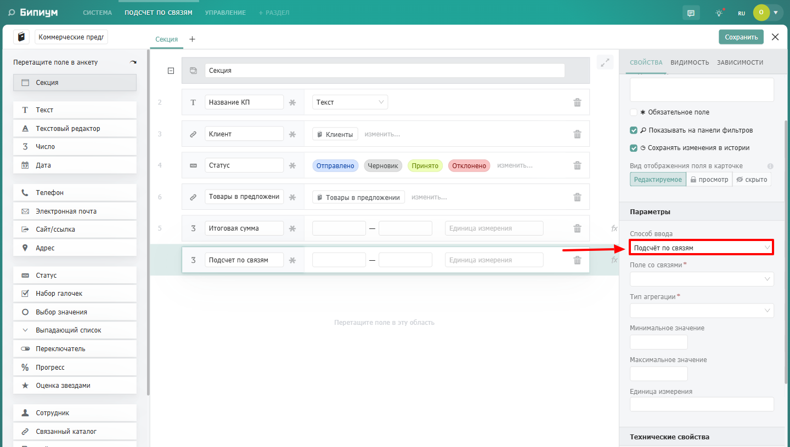
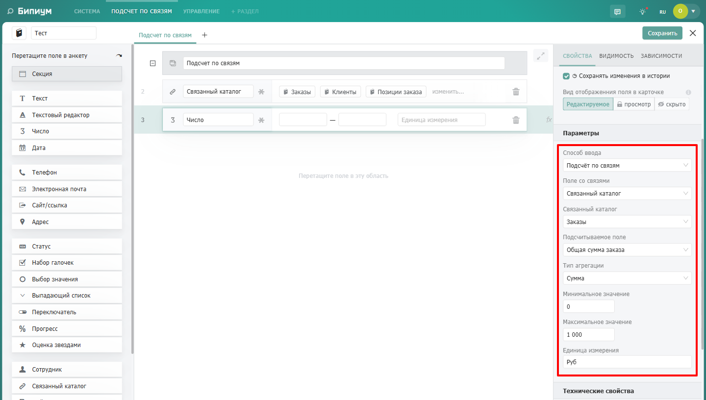
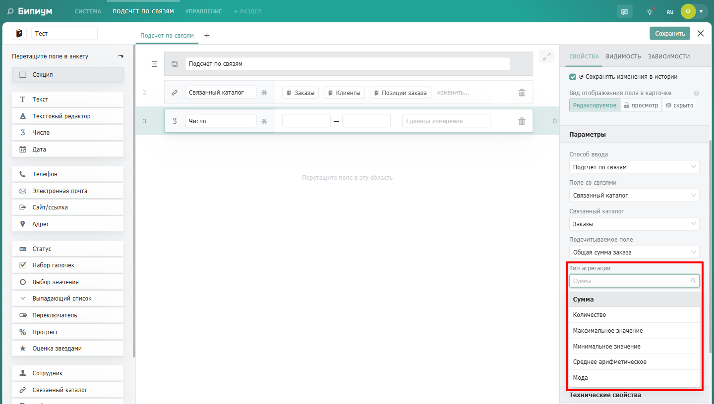
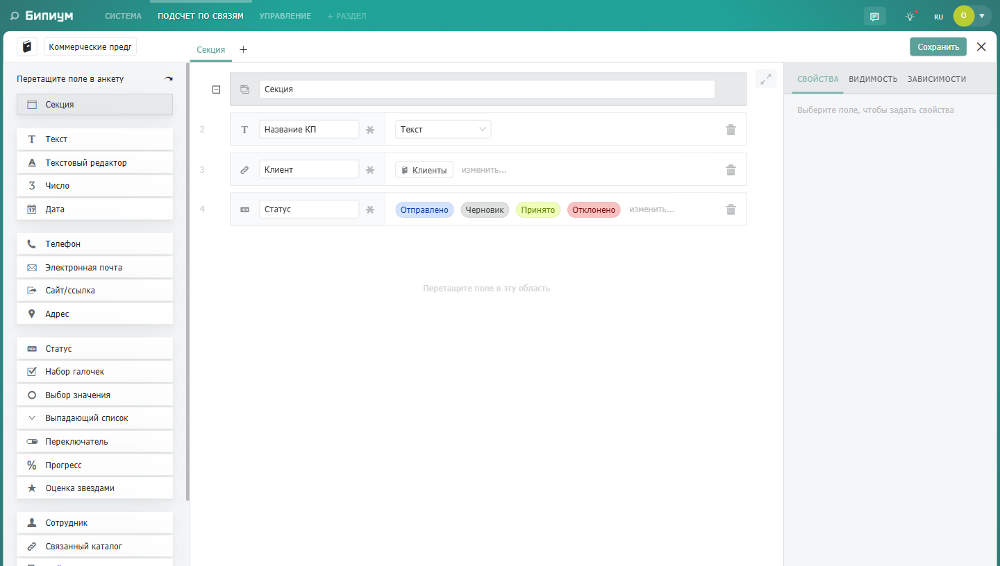
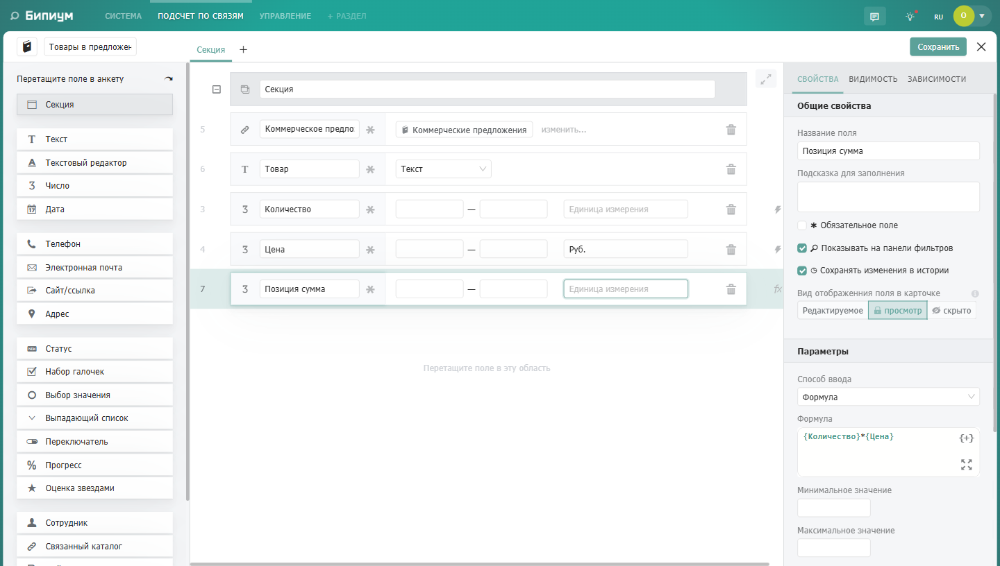
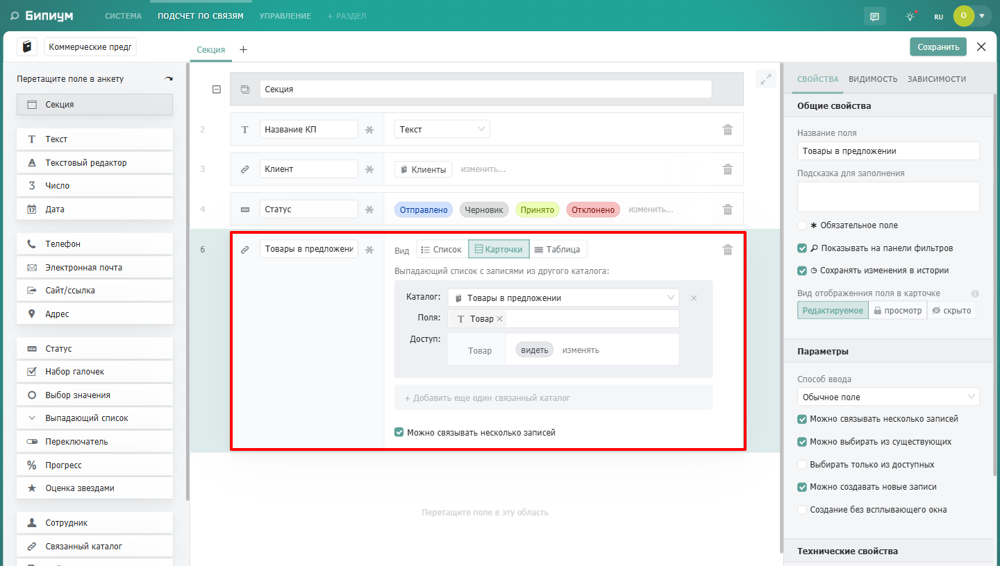
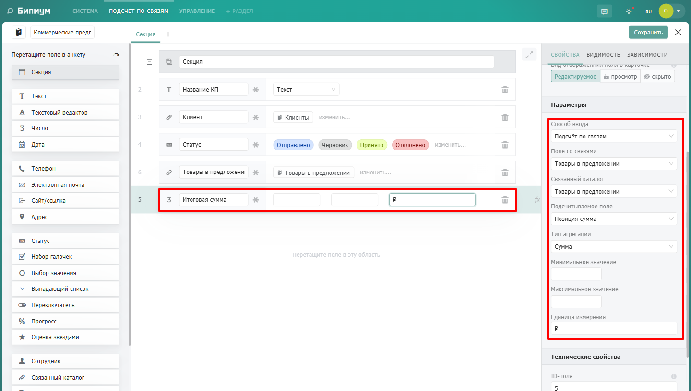
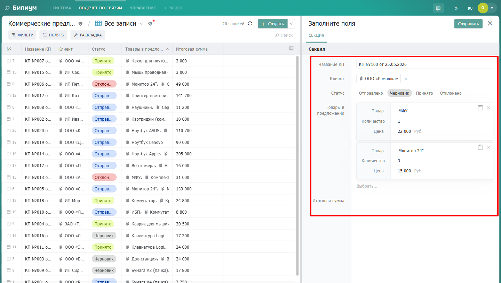
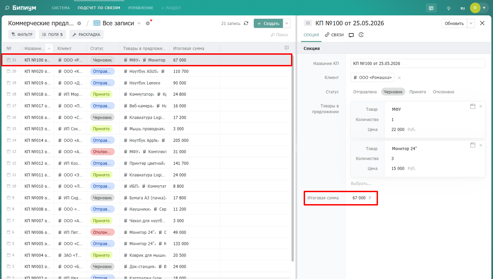

{width=1440px height=816px}

Подсчёт  позволяет автоматически вычислять значения поля на основе данных из **связанных записей другого каталога**. Это мощный инструмент для агрегации: сумма заказов клиента, средний рейтинг товара, количество активных задач, список имён связанных контрагентов и так далее.

**Основной принцип:** вы задаете правила агрегации в настройках поля, и система автоматически пересчитывает результат при каждом изменении связанных записей. Полученное значение сохраняется в поле и не может быть изменено вручную.

:::note 

Поле, в котором вы выбираете «Подсчёт по связям», должно быть создано в **текущем каталоге**, а данные оно будет получать из **связанного каталога** (поля типа «Связанный каталог»).

При изменении настроек подсчёта в структуре каталога значения будут автоматически пересчитаны для всех существующих записей.

:::

## **Интерфейс настройки**

После выбора способа ввода «Подсчёт по связям» в нижней части настроек поля появляются дополнительные параметры.

{width=1440px height=816px}



---

*  

   **Параметр**

*  

   **Описание**

---

*  

   **Способ ввода**

*  

   Выберите «Подсчёт по связям» из выпадающего списка

---

*  

   **Поле со связями**

*  

   Выберите **поле типа «Связанный каталог»** из текущего каталога. Если у вас несколько таких полей -- все они появятся в выпадающем списке. Система будет искать связанные записи именно через это поле

---

*  

   **Связанный каталог**

*  

   Отображается **автоматически** после выбора поля со связями. Показывает, на какой каталог ссылается выбранное поле

---

*  

   **Подсчитываемое поле**

*  

   Выберите поле из **связанного каталога**, значения которого будут участвовать в агрегации. Выпадающий список формируется на основе полей того каталога, который указан в поле «Связанный каталог»

---

*  

   **Тип агрегации**

*  

   Выберите операцию из списка: Сумма, Количество, Максимальное значение, Минимальное значение, Среднее арифметическое, Мода

---

*  

   **Минимальное значение**

*  

   Ограничение снизу для числовых полей

---

*  

   **Максимальное значение**

*  

   Ограничение сверху для числовых полей

---

*  

   **Единица измерения**

*  

   Текстовая метка, отображаемая после значения



## Типы агрегации

{width=1440px height=816px}



---

*  

   **Тип**

*  

   **Описание**

*  

   **Пример использования**

---

*  

   **Сумма**

*  

   Складывает значения указанного числового поля из всех связанных записей

*  

   Общая сумма заказов клиента

---

*  

   **Количество**

*  

   Подсчитывает количество связанных записей

*  

   Число активных задач по проекту

---

*  

   **Максимальное значение**

*  

   Находит наибольшее значение среди связанных записей

*  

   Самая высокая оценка в отзывах

---

*  

   **Минимальное значение**

*  

   Находит наименьшее значение среди связанных записей

*  

   Самая низкая цена у поставщика

---

*  

   **Среднее арифметическое**

*  

   Вычисляет среднее значение по всем связанным записям

*  

   Средний рейтинг товара

---

*  

   **Мода**

*  

   Находит наиболее часто встречающееся значение

*  

   Самый популярный размер одежды



## **Какие поля можно агрегировать**

Тип агрегации определяет, какие поля из связанного каталога доступны для вычислений:



---

*  

   **Тип агрегации**

*  

   **С какими полями работает**

---

*  

   **Сумма**

*  

   Число

---

*  

   **Количество**

*  

   Любые (просто подсчёт записей, без привязки к конкретному полю)

---

*  

   **Максимальное значение**

*  

   Число, Дата

---

*  

   **Минимальное значение**

*  

   Число, Дата

---

*  

   **Среднее арифметическое**

*  

   Число

---

*  

   **Мода**

*  

   Статус, Набор галочек, Выбор значения, Выпадающий список, Переключатель, Текст, Связанный каталог



## **Пример использования**

### **Сценарий: Коммерческое предложение и список товаров**

Представьте, что у вас есть два каталога:

1. **«Коммерческие предложения»** -- главный каталог

   {width=1440px height=816px}

2. **«Товары в предложении»** -- подчинённый каталог, где каждая запись -- это одна товарная позиция

   {width=1440px height=816px}

**Что нужно сделать:** автоматически считать общую сумму всех товаров в каждом коммерческом предложении.

### **Шаг 1. Создаём поле-связь в каталоге «Коммерческие предложения»**

В каталоге **«Коммерческие предложения»** создаём поле типа **«Связанный каталог»**, которое ссылается на каталог **«Товары в предложении»**. Назовём его **«Товары в предложении»**. Ставим галочку перед **Можно выбрать несколько записей**, так как у одного КП может быть много товаров.

{width=1440px height=816px}

### **Шаг 2. Создаём поле для подсчёта в каталоге «Коммерческие предложения»**

В каталоге **«Коммерческие предложения»** создаём поле **«Итоговая сумма»** с типом «Число».

В настройках этого поля выбираем **«Способ ввода -> Подсчёт по связям»**.

Заполняем параметры:



---

*  

   **Параметр**

*  

   **Значение**

---

*  

   **Поле со связями**

*  

   Товары в предложении (выбираем из выпадающего списка)

---

*  

   **Связанный каталог**

*  

   Товары в предложении

---

*  

   **Подсчитываемое поле**

*  

   Позиция сумма

---

*  

   **Тип агрегации**

*  

   Сумма

---

*  

   **Единица измерения**

*  

   ₽



{width=1440px height=816px}

### **Шаг 3. Заполняем данные**

1. Создаём запись в каталоге **«Коммерческие предложения»**

2. Создаём несколько записей в каталоге **«Товары в предложении»**:

{width=1440px height=816px}

### **Результат**

После сохранения новой записи Система подсчитает значение в поле Итоговая сумма

{width=1440px height=816px}