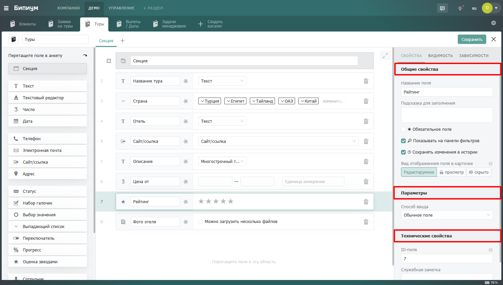

# Свойства

Свойства делятся на три группы: общие, параметры и технические.

<figure><figcaption></figcaption></figure>

## Общие свойства

Общие свойства доступны у каждого поля независимо от его типа.

#### **Название поля**

Отображается в анкете записи рядом с полем ввода. Используется также как заголовок столбца в таблице каталога. Название должно быть коротким и понятным сотруднику — он видит его каждый раз при заполнении записи.

#### **Подсказка**

Вспомогательный текст, который появляется при заполнении поля в анкете. Помогает сотруднику понять что именно нужно ввести — особенно полезно для полей с неочевидными требованиями к формату или содержанию.

Например, для поля «ИНН» можно написать подсказку: «Введите 10 цифр для организации или 12 цифр для ИП».

<figure><figcaption>
Подсказка для заполнения.
</figcaption></figure>

#### Обязательное поле

Если включено — система не позволит сохранить запись, пока поле не заполнено. В анкете рядом с названием поля отображается маркер обязательности.

Используйте для ключевых полей, без которых запись теряет смысл: название, статус, ответственный сотрудник.

<figure><figcaption>
Признак обязательного поля.
</figcaption></figure>

#### **Показывать на панели фильтров**

Если включено — поле появится в панели фильтров каталога. Сотрудник сможет фильтровать записи по значению этого поля.

Включайте только для полей, по которым реально фильтруют: статус, ответственный, дата, тип клиента. Слишком длинная панель фильтров неудобна — выводите только нужное.

<figure><figcaption>
Настройка отображения поля в фильтрах.
</figcaption></figure>

#### **Сохранить изменения в истории**

Если включено — каждое изменение значения поля фиксируется в истории записи с указанием времени и автора изменения. Сотрудник или администратор может открыть вкладку «История» и увидеть когда и кем менялось это поле.

Включайте для значимых полей, изменения которых важно отслеживать: статус сделки, ответственный, сумма. Не стоит включать для вспомогательных полей — история захламится незначительными правками

<figure><figcaption>
Сохранение изменений поля в истории.
</figcaption></figure>

#### **Виды отображения**

Определяет как поле ведет себя в анкете записи для сотрудника. Три варианта:

<table data-header-hidden><thead><tr><th width="158"></th><th width="183"></th><th width="132"></th><th></th></tr></thead><tbody><tr><td>Вид</td><td>Что видит сотрудник</td><td>Может ли редактировать</td><td>Когда использовать</td></tr><tr><td>Редактируемое</td><td>Поле отображается в анкете</td><td>Да — вручную из анкеты</td><td>Стандартный режим для большинства полей</td></tr><tr><td>Просмотр</td><td>Поле отображается в анкете</td><td>Нет — только чтение. Автоматизации и API могут менять</td><td>Вычисляемые или служебные поля, которые видеть нужно, но менять вручную — нельзя</td></tr><tr><td>Скрыто</td><td>Поле не отображается в анкете</td><td>Нет. Автоматизации и API могут менять</td><td>Технические поля для автоматизаций; данные из связанных каталогов, которые нужны в формулах, но не нужны сотруднику</td></tr></tbody></table>

<figure><figcaption>
Настройка вида отображения поля
</figcaption></figure>

## Параметры

Параметры — это индивидуальные настройки конкретного типа поля: список значений для Статуса, формат для Даты, маска для Текста и так далее. Набор параметров у каждого поля свой — подробнее в статье нужного [Поля.](edit/)

<figure><figcaption>
Параметры поля в панели свойств.
</figcaption></figure>

## Технические свойства

Технические свойства используются при разработке автоматизаций и интеграций.

#### ID-поля

Уникальный идентификатор поля внутри каталога. Используется при обращении к полю через API и в автоматизациях. По умолчанию присваивается автоматически, но администратор может задать его вручную — например, чтобы задать читаемое название: <mark style="color:$primary;">status</mark>, <mark style="color:$primary;">phone</mark>, <mark style="color:$primary;">created\_at</mark>.&#x20;


Если изменить ID уже используемого поля — все автоматизации и API-запросы, которые обращаются к старому ID, перестанут работать. Меняйте ID только на этапе проектирования.


#### Служебная заметка

Внутренний комментарий к полю, который видят только администраторы в конструкторе. Сотрудники в анкете его не видят. Удобно оставлять пояснения для коллег-администраторов: зачем поле, как оно используется в автоматизациях, что нельзя менять

<figure><figcaption>
Технические свойства в панели свойств.
</figcaption></figure>

