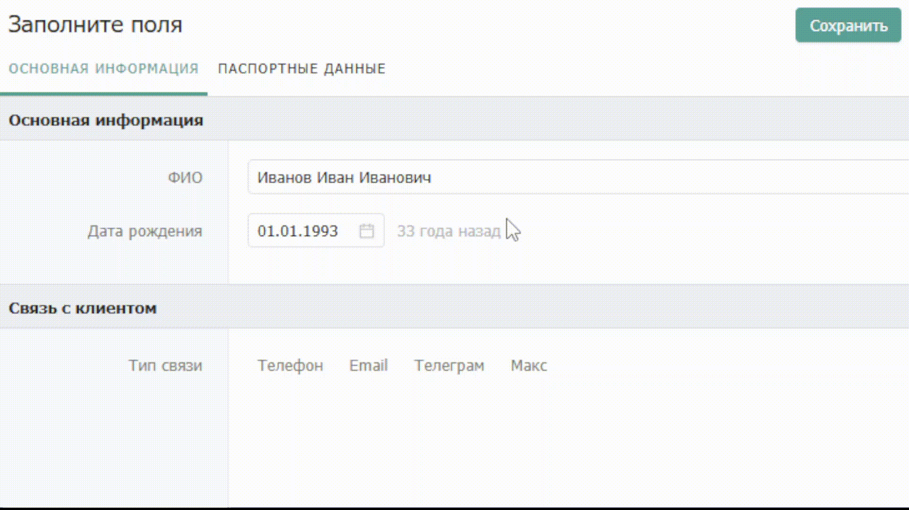

# Видимость

## Настройка видимости поля 

Для настройки параметров видимости необходимо нажать на поле, после чего справа откроется панель свойств.


Обратите внимание, что условиями видимости могут быть настроены только на ранее сохраненные поля. Например, если добавили новое поле, то нужно сначала сохранить каталог, чтобы настроить параметры видимости поля.



Не все поля можно использовать в условной видимости как правила.

Поля, которые можно применять: Статус, Набор галочек, Выбор значения, Выпадающий список, Переключатель, Сотрудник, Связанный каталог, Файл.


В панели свойств откройте вкладку Видимость и выберите значения других полей, при которых открытое на редактирование поле должно быть видимым.&#x20;

Настроим поле «Телефон» таким образом, чтобы при выборе пользователем в поле «Тип связи» статусов Телефон, Макс или Телеграм, будет отображаться дополнительное поле для ввода номера телефона.

<figure><figcaption>
Настройки видимости поля
</figcaption></figure>


Задать правило видимости также можно на целую секцию (или даже вкладку). При этом все поля, которые содержатся в секции скроются, но введенные в них значения сохранятся.

Например, изначально у Клиента было заполнено поле ИНН, которое отображается при статусе клиента «Действующий». Даже если поменять статус Клиента на «Нецелевой», при восстановлении статуса  «Действующий» поле ИНН вновь отобразится с заполненным ранее значением.


### Пример настроенного поля

<figure><figcaption></figcaption></figure>

