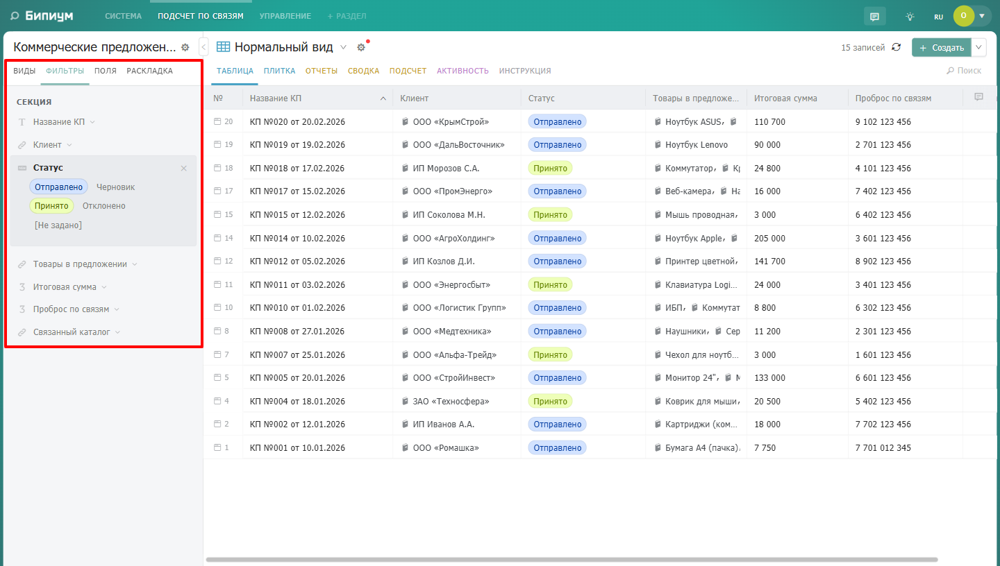
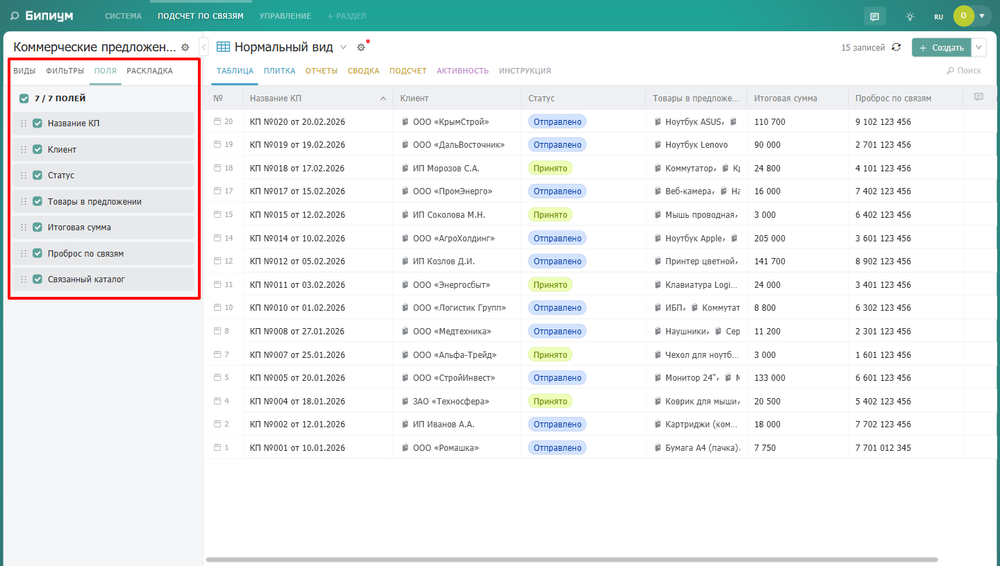
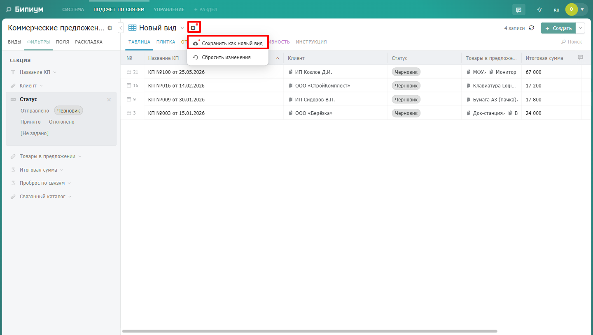
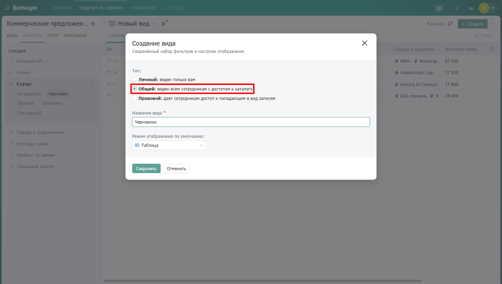
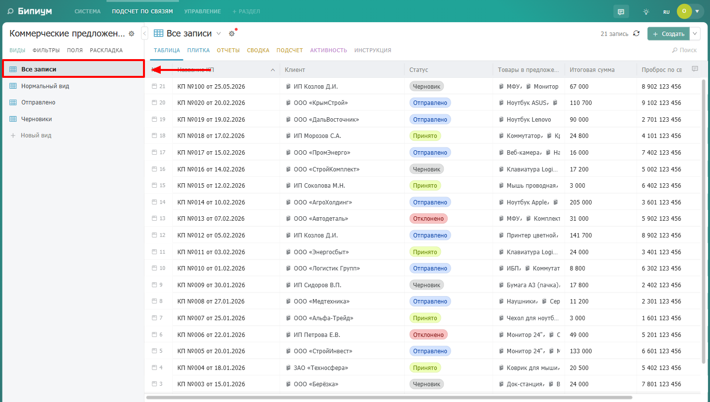
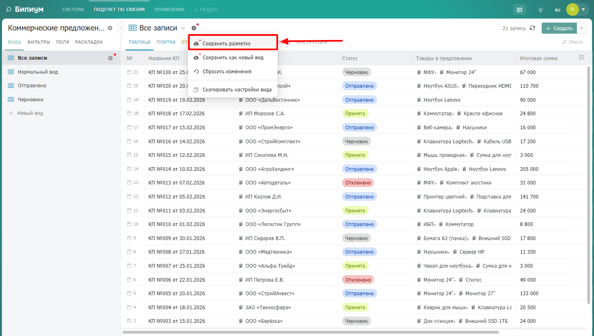

В Бипиуме администратор может настраивать общие и правовые виды каталогов.

Они решают разные задачи:

-  общие виды отвечают за удобное отображение данных для всех сотрудников с доступом к каталогу;

-  правовые виды отвечают за доступ к данным.

## Общие виды

Общие виды -- это преднастроенные виды каталога, которые отображаются у всех пользователей с доступом к каталогу.

С помощью общих видов администратор может:

-  настроить фильтры

   {width=1440px height=816px}

-  выбрать отображаемые поля

-  задать порядок колонок

   {width=1440px height=816px}

-  настроить ширину полей

-  выбрать режим отображения

Например:

-  «Новые заявки»

-  «Просроченные задачи»

-  «Активные клиенты»

-  «Документы на согласовании»

Общие виды помогают сотрудникам быстрее начать работу без самостоятельной настройки каталога.

### Создание общего вида

1. Откройте каталог.

2. Настройте фильтры и отображение.

3. Нажмите на шестерёнку рядом с названием вида.

4. Выберите «Сохранить как новый вид».

   {width=1440px height=816px}

5. Укажите тип «Общий».

   {width=1440px height=816px}

6. Сохраните вид.

После сохранения общий вид появится у всех сотрудников, имеющих доступ к каталогу.

## Вид «Все записи»

В каждом каталоге присутствует системный вид «Все записи».

{width=1440px height=816px}

Он показывает все записи, доступные сотруднику согласно его правам.

Отдельные права на вид «Все записи» не назначаются.

Администратор может настроить разметку вида «Все записи»:

-  выбрать отображаемые поля;

-  настроить порядок колонок;

-  задать ширину полей;

-  выбрать режим отображения.

{width=1440px height=816px}

Сохранённая разметка будет использоваться как базовое отображение для всех пользователей каталога.

## Пользовательские настройки отображения

Даже если администратор настроил общий вид или вид «Все записи», пользователи могут дополнительно изменить отображение под себя.

Пользователь может:

-  изменить ширину колонок;

-  переставить поля;

-  скрыть отдельные поля;

-  изменить настройки отображения таблицы.

Такие изменения сохраняются только для конкретного пользователя и не влияют на других сотрудников.

При этом:

-  исходная разметка общего вида не изменяется;

-  настройки администратора сохраняются;

-  другие пользователи продолжают видеть собственные настройки отображения.

Если пользователь изменил отображение вида, он может вернуть исходную разметку, настроенную администратором, с помощью кнопки «Сбросить изменения».

## Правовые виды

Правовые виды используются для настройки доступа к данным в каталоге.

С их помощью администратор может определить:

-  какие записи доступны сотруднику;

-  какие записи можно изменять;

-  какие данные будут скрыты от пользователя.

Правовые виды участвуют в правовой модели Бипиума и влияют на доступ сотрудников к данным каталога.

Подробнее о настройке правовых видов -- в статье «[Правовые виды](./../prava/views)».

## Отличие общих видов от правовых

### Общий вид

Используется для удобства работы:

-  не ограничивает доступ;

-  не выдаёт права;

-  показывает уже доступные сотруднику записи;

-  отображается у всех сотрудников каталога.

### Правовой вид

Используется для настройки доступа:

-  определяет, какие записи доступны сотруднику;

-  участвует в правовой модели;

-  может выдавать права на просмотр и изменение записей.