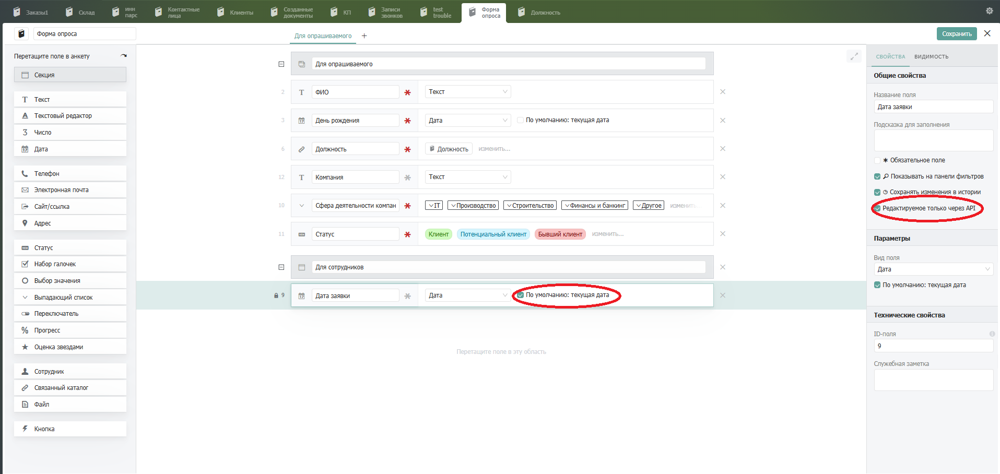

# Веб-формы

Бипиум позволяет редактировать и создавать записи не только в своем интерфейсе, но и в виде отдельной формы.&#x20;

Веб-формы - это отдельно отображаемая запись или каталог с настраиваемыми правилами доступа.

## Виды веб-форм

Всего в Бипиум есть 2 вида веб-форм.

### Веб-форма добавления/изменения записей

<figure><figcaption></figcaption></figure>

Можно настроить отображение на весь экран, передав параметр `&screen=full` в конце адреса.

Пример:\
`http://test.bpium.ru/?action=record-new&catalog=7&screen=full`

<figure><figcaption></figcaption></figure>


### Веб-форма просмотра каталога

Веб-форма отображающая определенный каталог

<figure><figcaption></figcaption></figure>

## Создание веб-форм

Для создания веб-формы, в первую очередь необходимо создать каталог.

<figure><figcaption></figcaption></figure>

Далее, внутри каталога нужно задать название каталога добавить поля, которые будут отображаться для заполняющего.

<figure><figcaption></figcaption></figure>

После сохранения ссылку на веб-форму можно получить перейдя в "Доступ к каталогу" в левом верхнем углу, и в открывшемся окне нажав на один из двух видов.

<figure><figcaption></figcaption></figure>

<figure><figcaption></figcaption></figure>

## Настройка аккаунта

Бипиум принимает запросы только от авторизованных пользователей и перед отображением веб-формы проверяет права доступа к данным. Соответственно, для открытия веб-формы, необходимо иметь аккаунт в системе, для которого будут выставлены нужные привилегии. \
Если необходима публичная веб-форма, то мы рекомендуем создать один общий аккаунт, через который можно будет просматривать/редактировать данные, отображаемые в веб-форме. Ниже рассмотрим пример создания и настройки такого аккаунта.

### Создание аккаунта

Для создания аккаунта через который будет осуществляться пользователями доступ к форме, необходимо перейти в каталог "Сотрудники" и там создать нового сотрудника введя любое имя для него и почту, к которой вы имеете доступ. На данную почту придет приглашение, после перехода по которому нужно будет придумать пароль для общего аккаунта.

<figure><figcaption></figcaption></figure>

### Автоматическая авторизация

Так как форма предоставляет доступ к записям внутри системы, для взаимодействия нужно быть авторизованным в систему. Если мы просто отправим ссылку на веб-форму, то мы попадем на страницу авторизации с формой для ввода логина и пароля. Однако куда проще сделать автоматическую авторизацию через передачу логина и пароля в запросе. Для этого есть 2 варианта.

#### Авторизация через URL

Формат:\
`http://ВАШДОМЕН.bpium.ru/?login=ЛОГИН&password=ПАРОЛЬ`

Параметры:

* _ЛОГИН_ — адрес электронной почты для входа в Бипиум
* _ПАРОЛЬ_ — пароль для входа в Бипиум
* _ВАШДОМЕН_ — адрес вашего Бипиума


~~**HTTP**~~\
Многие браузеры блокируют запросы с авторизацией через URL на протоколе HTTP. Указывайте протокол HTTPS в URL.


В данном случае логин/пароль указываются в ссылке, соответственно для общего аккаунта они становятся публичными.

#### Авторизация через сценарий

Если вы не хотите показывать логин и пароль от аккаунта, то можно авторизоваться через передачу cookie. Необходимо создать сценарий следующего вида:

<figure><figcaption></figcaption></figure>

Через компонент Веб-запрос нужно сделать любой валидный запрос в вашу систему включив базовую авторизацию и передав в логин и пароль данные от созданного аккаунта.&#x20;

<figure><figcaption></figcaption></figure>

Далее в компоненте "Назначение переменных" нужно в переменную $headers передать ссылку на работу с записью или каталогом и cookie, а в переменную $status - 302.

<figure><figcaption></figcaption></figure>

После необходимо создать [внешний запрос ](../systemcatalogs/upravlenie/weblisteners.md)задав ему URL-идентификатор и прикрепив созданный нами сценарий.\
После этого при переходе по ссылке созданного нами внешнего запроса будет открываться нужная форма.&#x20;

## Доступ к веб-формам&#x20;

Для настройки отображения только нужных данных необходимо настроить правовой вид. Для этого нужно. чтобы в вашем каталоге было поле, по которому будут фильтроваться записи. Его нужно сделать неизменяемым вручную и заполненными какими-то данными  В нашем примере таким полем будет поле "Дата заявки" со значением "По умолчанию: текущая дата" и сделаем его редактируемым только через API.

<figure><figcaption></figcaption></figure>

В первую очередь необходимо настроить привилегии доступа к разделу. Для этого нужно открыть "Доступ к разделу" и явно указать привилегию "Доступ к разрешенным".&#x20;

<figure><figcaption></figcaption></figure>

Далее необходимо выставить в "Доступ к каталогу" привилегию для общего аккаунта "Доступ к разрешенным". Если в каталоге есть поля, которые не должны быть видимыми для общего аккаунта,  скрываем его в "Право редактировать поле", в нашем случае скрываем поле "Дата заявки".

<figure><figcaption></figcaption></figure>


**Важно: у вас должны быть настроены права доступа для сотрудников. Если в привилегиях будет стоять "Все сотрудники - "Администрировать", то эта привилегия перебьет выставленную привилегию для нашего общего аккаунта.**&#x20;



Подробнее о настройке правовой политики в статье «[Права](/broken/pages/-LACZqPqgLOsVO4CqZAV)».


### Доступ для просмотра/редактирования

Если вы хотите позволить видеть или изменять любые записи в каталоге, достаточно поменять в "Доступ к каталогу" привилегию общего аккаунта на "Видеть записи" или "Изменять записи" и следующие пункты можно пропустить.

Для настройки доступа к просмотру определенных записей нужно задать в фильтрах вида значение по которому будет видно записи.&#x20;

<figure><figcaption></figcaption></figure>

Далее нужно сохранить выбранный вид, выбрав тип "Правовой" и задать название для администратора.<br>

<figure><figcaption></figcaption></figure>

В открывшемся окне "Общий доступ к виду" выбираем наш общий аккаунт и задаем привилегию "Видеть записи" и  сохраняем.

<figure><figcaption></figcaption></figure>

Таким образом, при передаче ссылки на веб-форму для просмотра записи или каталога человек увидит ее, если она попадает под выбранный нами фильтр.\
Если же вам нужно, чтобы человек мог еще и изменять записи, то нужно выставить в  "Общий доступ к виду" вместо "Видеть записи" "Изменять записи".&#x20;

То же самое с созданием записей, достаточно поменять привилегию на "Создание записей".


**Важно: Если вы хотите чтобы была возможность изменять или видеть одну единственную запись, учтите, что открывший ссылку будет иметь доступ ко всем записям попадающих под фильтр вида, если откроет каталог вручную.**<br>


### **Создание записей без возможности просмотра предыдущих записей.**

Для того, чтобы дать возможность создавать записи, но ограничить видимость до этого созданных записей, нужно задать фильтр, по которому не будет попадать ни одна запись. В нашем случае это будет фильтр по полю "Дата заявки", выставим "Не задана". Из-за автоматического формирования даты создания при создании записи, ни одна запись не будет отображаться по такому фильтру.&#x20;

<figure><figcaption></figcaption></figure>

Сохраняем все как в предыдущих пунктах,  в "Общий доступ к виду" выбираем наш общий аккаунт и задаем привилегию "Создавать записи" и  сохраняем.\
Теперь перешедший по ссылке сможет вносить данные и сохранять данные, однако при переходе в каталог он не увидит никакой информации. <br>

<figure><figcaption></figcaption></figure>

<figure><figcaption></figcaption></figure>

## Интеграция веб-формы на сайт

Для размещения формы на сайте вставьте этот код в то место страницы, в котором вы хотите показать форму.

```
<iframe src='http://ВАШДОМЕН.bpium.ru/?action=record-open&catalog=КАТАЛОГ&screen=full&login=ЛОГИН&password=ПАРОЛЬ' width='800' height='600'>
</iframe>
```

Укажите домен, каталог и авторизационные данные. Не забудьте, что код веб-страниц открытый и любой посетитель сможет увидеть ваши авторизационные данные. Поэтому для размещения используйте данные специального пользователя и настройте его права.\
Пример подобной интеграции реализован у нас на сайте по ссылке [https://bpium.ru/demo](https://bpium.ru/demo).
