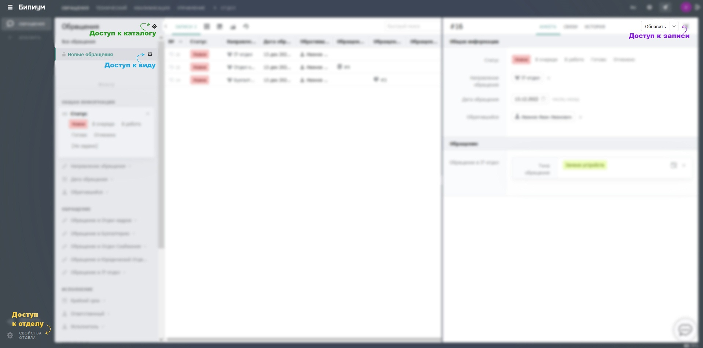

# Права

## Объекты правовой политики

Права доступа имеют отделы, каталоги, виды и записи. Отделы объединяют каталоги в смысловые группы, а каталоги состоят из записей. Каждый объект имеет набор правил доступа. Если для сотрудника нет подходящих правил, то объект ему не доступен.

<figure><figcaption></figcaption></figure>

Для назначения прав на объекты в интерфейсе используется кнопка «Доступ». Она есть у отдела (внизу списка каталогов отдела), каталога, вида и записи. Найти кнопку «Доступ» для разных сущностей в системе можно согласно скриншоту ниже:

<figure><figcaption></figcaption></figure>

Кнопка «Доступ» открывает окно назначения прав. Даже если у сотрудника нет права изменять права, он увидит кнопку и сможет посмотреть у каких сотрудников есть права на этот объект.

### Наследование прав

Цель правовой политики ограничить видимость записей для сотрудников. Чтобы не назначать права на каждую запись, Бипиум поддерживает групповое назначение прав: на каталоги и на отделы. Используется принцип наследования. Это как в операционной системе: если у вас есть права на папку, у вас есть права и на все файлы в ней. Так и в Бипиуме: дав право на отдел, сотрудник видит все каталоги этого отдела и их записи.

Если дать право на одну запись каталога, то сотрудник увидит отдел, но лишь с одним каталогом, в котором увидит лишь одну эту запись.
