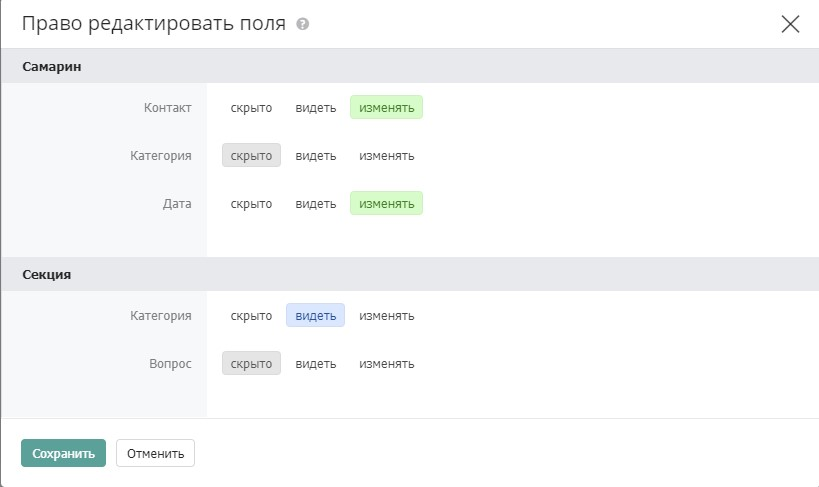

# Права на поля

Права на поля назначаются в рамках правил доступа к каталогу, виду или записи — отдельно для каждого сотрудника или правовой группы.

_Пример: Сотрудник может изменить данные Клиентов, но не может изменить ответственного Менеджера. Или сотрудник не может изменить первичную информацию Клиентов, но может изменять статус работы и дату следующего контакта._

## Назначение прав на поля

Права на поля назначаются в рамках правил в форме доступа. То есть ограничение действует на сотрудника или правовую группу:

Права на поля можно задать на все привилегии кроме «Доступ к разрешенным» и «Запретить доступ». Права на поля также нельзя назначить на наследуемые правила.

### Типы прав на поля

#### Расширяющие

Дают сотруднику возможность редактировать поле в записях, которые он может только видеть. Назначаются на привилегию «Видеть все записи».

#### Ограничивающие

Запрещают сотруднику редактировать или видеть поле в записях, которые он может изменять. Назначаются на привилегии: изменять все записи, создавать записи, удалять записи, экспортировать, назначать права и администрировать.


Важно! Если скрытые или запрещенные к редактированию для пользователя поля будут помечены как обязательные к заполнению, то этот пользователь не сможет создать или изменить запись.


### Скрытие полей

Чтобы скрыть поле от конкретного сотрудника или группы, в настройках прав на поля установите для этого поля маркер «Скрыто». Сотрудник не увидит поле в анкете.


Если поле скрыто или запрещено к редактированию, но при этом помечено как обязательное — сотрудник не сможет создать или сохранить запись. Проверяйте совместимость обязательных полей и прав на поля.


### Выбор полей

.jpg>)

Справа от поля выбора привилегии расположена кнопка назначения прав на поля&#x20;

Иконка серая, если права не заданы, и черная, если заданы. Клик по кнопке открывает форму выбора полей:

Форма показывает все поля анкеты и позволяет установить какое поле должно быть редактируемым.

### Видимость полей

#### Настройка

Для ограничения видимости определенных полей выбранными сотрудниками необходимо воспользоваться настройками доступа к Каталогу, выбрать пользователя и в настройках полей поставить маркер "Скрыто". Таким образом пользователь не сможет видеть эти поля.&#x20;

## Конкуренция правил

Если на сотрудника одновременно действует несколько правил с разными правами на одно и то же поле — применяется принцип: право редактировать поле старше права только видеть поле.

Проще говоря: если хотя бы одно из действующих правил разрешает редактировать поле — сотрудник сможет его редактировать, даже если другое правило это запрещает.

Исключение — приоритет иерархии. Правило на вид перекрывает правило на каталог для записей, попадающих в этот вид. Поэтому если право на каталог запрещает редактировать поле, а право на вид разрешает — сотрудник сможет менять поле в записях этого вида.

| Ситуация                                                                                                    | Результат                                                                                 |
| ----------------------------------------------------------------------------------------------------------- | ----------------------------------------------------------------------------------------- |
| Правило А разрешает редактировать поле, правило Б — запрещает                                               | Сотрудник может редактировать поле                                                        |
| Правило на каталог запрещает редактировать поле, правило на вид — разрешает                                 | Сотрудник может редактировать поле в записях этого вида                                   |
| Наследуемое правило от раздела разрешает изменять записи, правило на каталог запрещает редактировать поле X | Сотрудник может редактировать поле X — наследуемое правило без ограничений на поля старше |
