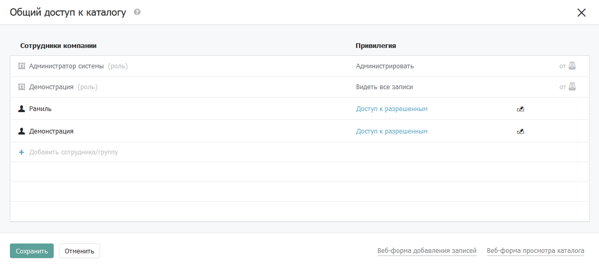

# Правила и привилегии

## Правила

### Форма доступа

Доступ к объекту — разделу, каталогу, виду или записи — задаётся через форму доступа. Каждое правило состоит из двух частей: субъект (сотрудник или [правовая группа](groups.md)) и [привилегия](rules.md#privilegii) (что этому субъекту разрешено делать).

<figure><figcaption></figcaption></figure>

### Наследуемые правила

Правила, выделенные серым цветом — наследуемые. Они приходят от родительского объекта: раздела или каталога. Наследуемые правила нельзя удалить — только просмотреть. Иконка справа от правила подсказывает от какого объекта оно унаследовано.

### Комбинация правил для сотрудника

Когда сотрудник обращается к записи, Бипиум собирает все подходящие для него правила — от раздела, каталога, всех видов и самой записи. Если подходит несколько правил — применяется правило с наивысшей привилегией. Подходящими считаются правила, назначенные на этого сотрудника или на правовую группу, в которую он входит. Каждый сотрудник автоматически входит в группу «Все сотрудники».

Подробнее об алгоритме объединения правил читайте в статье [Комбинация прав](policy.md).

## Привилегии

Привилегия определяет что сотрудник может делать с данными объекта. Привилегии выстроены по приоритету — каждая следующая включает возможности всех предыдущих.

<table data-header-hidden><thead><tr><th></th><th width="310"></th><th></th></tr></thead><tbody><tr><td>Привилегия</td><td>Что разрешает</td><td>Назначается на</td></tr><tr><td>Видеть раздел / каталог в меню</td><td>Видеть раздел или каталог в боковой панели навигации</td><td>Раздел, каталог</td></tr><tr><td>Видеть все записи</td><td>Открывать и читать все записи каталога</td><td>Раздел, каталог, вид</td></tr><tr><td>Изменять все записи</td><td>Редактировать все записи каталога</td><td>Раздел, каталог, вид</td></tr><tr><td>Создавать записи</td><td>Добавлять новые записи в каталог</td><td>Раздел, каталог, вид</td></tr><tr><td>Экспортировать записи</td><td>Выгружать доступные записи в Excel</td><td>Раздел, каталог, вид</td></tr><tr><td>Удалять записи</td><td>Удалять записи в каталоге</td><td>Раздел, каталог, вид</td></tr><tr><td>Назначать права</td><td>Изменять права доступа на объект и все вложенные в него. Создавать, изменять и удалять правовые виды</td><td>Раздел, каталог, вид, запись</td></tr><tr><td>Администрировать</td><td>Переименовывать раздел и каталоги, менять их порядок, создавать новые каталоги, изменять структуру каталогов</td><td>Раздел, каталог</td></tr></tbody></table>

### Приоритеты привилегий

Привилегии выстроены в цепочку по старшинству:

`Видеть все записи` < `Изменять все записи` < `Создавать записи` < `Экспортировать` < `Удалять записи` < `Назначать права` < `Администрировать`

Каждая последующая привилегия включает возможности всех предыдущих. Например, привилегия «Удалять записи» автоматически даёт право видеть, изменять, создавать и экспортировать. Это значит что не нужно назначать несколько привилегий — достаточно назначить одну наивысшую.

### Принадлежность привилегий

Привилегии «Видеть», «Изменять», «Удалять», «Назначать права», «Экспортировать», назначенные на раздел, каталог или вид, действуют не на сам объект, а на все записи внутри него. Назначенные на запись — действуют на эту конкретную запись.

Создавать. Назначается на раздел, каталог или вид. Если назначена на вид — сотрудник сможет создавать записи в каталоге, даже если созданная запись не попадёт в этот вид.

Назначать права. Назначенная на каталог даёт право менять права на каталог, все виды и все записи внутри него. Также позволяет создавать, изменять и удалять правовые виды. Но не позволяет изменять правила с привилегией «Администрировать» для других сотрудников — Бипиум это заблокирует.

Администрировать. Назначается только на раздел или каталог. Дает право переименовывать, сортировать, создавать каталоги и менять их структуру. При наследовании на записи передаётся как «Назначать права».

### Наследование привилегий

Привилегии наследуются сверху вниз по иерархии: раздел → каталог → записи. Также на записи наследуются привилегии от всех правовых видов, в которые эта запись попадает.

Например, если на раздел назначено «Видеть все записи» — сотрудник увидит все записи во всех каталогах этого раздела. Если на раздел назначено «Администрировать» — на каталоги и записи это наследуется как «Назначать права» (наивысшая разрешающая привилегия для записей).

В форме доступа наследуемые правила выделены серым цветом — их нельзя удалить.

### Комбинация правил для сотрудника

Если на сотрудника одновременно действует несколько правил — Бипиум выбирает наивысшую привилегию из всех подходящих. Правила могут прийти от разных источников: напрямую на сотрудника, через правовые группы, через наследование от раздела или каталога.

| Ситуация                                                                                                    | Результат                                                                       |
| ----------------------------------------------------------------------------------------------------------- | ------------------------------------------------------------------------------- |
| Группе «Все сотрудники» назначено «Изменять все записи», конкретному сотруднику — «Видеть все записи»       | Сотрудник может изменять записи — применяется наивысшая привилегия              |
| На разделе назначено «Изменять все записи», на каталоге — «Видеть все записи» для одного и того же субъекта | Сотрудник только видит записи — правило на каталоге перекрывает правило раздела |
| Сотрудник входит в две правовые группы с разными привилегиями на один каталог                               | Применяется наивысшая из привилегий двух групп                                  |

### Привилегия «доступ к разрешенным»

Специальная служебная привилегия, которую Бипиум показывает автоматически на каталоге или разделе. Она означает что у части записей этого каталога есть отдельные правила — на видах или самих записях. Бипиум отображает её чтобы показать полный список сотрудников, которые смогут увидеть каталог в меню.

Правила с этой привилегией можно повысить, но нельзя удалить. Чтобы убрать доступ сотрудника к разрешенным записям — удалите правила на конкретных видах или записях.

 

<figure><figcaption>
Форма доступа к каталогу — правила с привилегией «Доступ к разрешенным»
</figcaption></figure>
