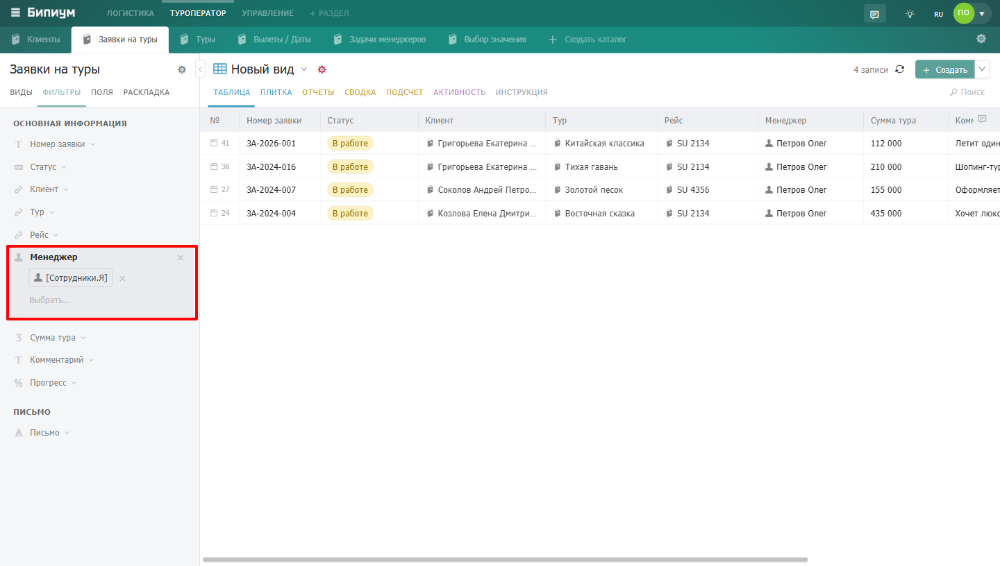

Правовой вид -- это фильтр с привязанными правами доступа. Сотрудник видит только те записи, которые попадают под условия фильтра и на которые ему назначена привилегия.

## Чем отличается от личного вида



---

*  

   

*  

   Личный вид

*  

   Правовой вид

---

*  

   Кто создает

*  

   Сотрудник -- для себя

*  

   Администратор -- для сотрудников или групп

---

*  

   Что делает

*  

   Фильтрует отображение записей -- сотрудник видит меньше, но права не меняются

*  

   Ограничивает доступ -- сотрудник физически не видит записи вне фильтра

---

*  

   Влияет на права

*  

   Нет

*  

   Да -- определяет какие записи доступны сотруднику

---

*  

   Виден в меню

*  

   Только создавшему его сотруднику

*  

   Тем сотрудникам, которым назначен доступ (можно скрыть)



## Для чего используются

Правовые виды реализуют атрибутную модель прав доступа (ABAC) -- доступ к записям на основе их свойств. Это позволяет гибко разграничить доступ без создания отдельных каталогов для каждой группы сотрудников.

Примеры:

-  Менеджер видит только клиентов, где он указан как ответственный

-  Агент риэлторской компании видит объекты только из своего района

-  Младший консультант не видит сделки с суммой выше 100 000 рублей

-  Врач видит карточки пациентов только по своей специализации

#### Относительные значения в фильтрах

В условиях фильтра можно использовать не только фиксированные значения, но и относительные -- например, «Я / Сотрудник». Это значит «текущий сотрудник, открывший запись». Один и тот же вид с условием «Менеджер = Я» будет показывать каждому сотруднику только его записи.

## Создание правового вида

Создать правовой вид может сотрудник с привилегией «Назначать права» или «Администрировать» на каталог или раздел.

1. Откройте каталог и настройте нужные фильтры.

   {width=1440px height=816px}

2. Справа от названия Вида нажмите на шестерёнку, далее нажмите на кнопку «Сохранить  как новый вид»

   .png> "Кнопка Сохранить как новый вид"){width=1440px height=816px}

3. Укажите название для администраторов и, при необходимости, отдельное название для сотрудников. Также вы можете выбрать режим отображения по умолчанию для данного вида.

4. После ввода названий и выбора режима отображения нажмите на кнопку «Создать и задать права».

   .png> "Создание правового вида"){width=1440px height=816px}

5. После сохранения откроется форма доступа -- назначьте привилегию для нужных сотрудников или групп.

   

#### Два названия вида

Правовой вид имеет два названия: **для** **сотрудников** (отображается в меню) и **для** **администраторов** (помогает ориентироваться среди похожих видов). Если название для сотрудников не задано -- используется одно общее название.

## Скрытие правового вида

Если не задать название для сотрудников -- вид не будет отображаться в меню, но продолжит работать. Сотрудник получит доступ к записям этого вида, но не увидит его как отдельный пункт навигации. Это удобно когда вид нужен только для ограничения доступа, а не для навигации.