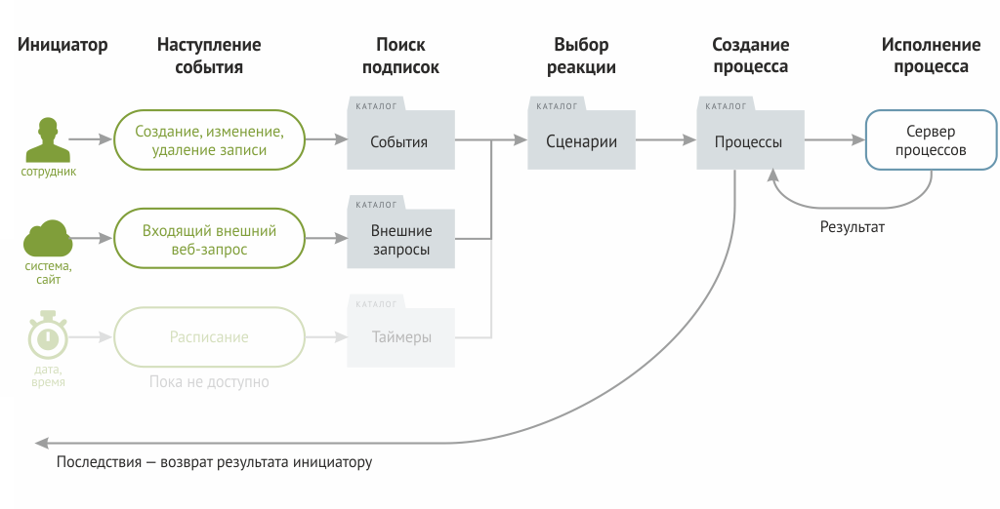

# Автоматизации

### Когда нужны автоматизации

Автоматизации решают три класса задач:

* **Бизнес-логика** — двигать заявку по этапам, менять статусы, назначать ответственных
* **Рутинные операции** — автоматически отправлять уведомления, генерировать документы, заполнять поля
* **Интеграция с внешними системами** — принимать данные от сторонних сервисов или отправлять их туда

### Как это работает

Автоматизация в Бипиуме — это реакция на событие. Когда происходит событие (изменение записи, внешний запрос), Бипиум ищет подписки на это событие и запускает связанные сценарии.

1. **Событие.** Сотрудник изменяет запись, создаёт или удаляет её — или поступает внешний веб-запрос.
2. **Реакция.** Бипиум ищет подписки на это событие в каталоге «События».
3. **Запуск процесса.** Для каждой подходящей подписки Бипиум запускает сценарий — создаёт запись в каталоге «Процессы» и начинает исполнение.
4. **Исполнение.** Процесс последовательно выполняет компоненты сценария: изменяет данные, делает запросы, манипулирует переменными.
5. **Результат.** После завершения результат сохраняется в каталоге «Процессы». Для синхронных событий результат возвращается инициатору — например, как сообщение об ошибке или новые значения полей.
6. **Последствия**. Для некоторых событий выходные параметры процесса передаются инициатору события:
   * **Запросы «перед изменением / созданием / удалением»** — результат используется чтобы разрешить или заблокировать операцию и показать сотруднику сообщение.
   * **Действие «во время редактирования»** — результат применяется как новые значения полей прямо в открытой карточке, до сохранения записи.
   * **Внешний веб-запрос** — результат возвращается как HTTP-ответ инициирующей системе.

### Терминология

<table><thead><tr><th width="208">Термин</th><th>Что означает</th></tr></thead><tbody><tr><td>Сценарий</td><td>Блок-схема в нотации <a href="https://ru.wikipedia.org/wiki/BPMN">BPMN 2.0</a> — описывает алгоритм автоматизации из компонентов.</td></tr><tr><td>Процесс</td><td>Копия сценария, запущенная на исполнение с конкретными входными данными.</td></tr><tr><td>Событие</td><td>Ситуация в системе, которая может запустить процесс: изменение записи, внешний запрос.</td></tr><tr><td>Подписка</td><td>Связь между событием и сценарием — «при этом событии запускать этот сценарий».</td></tr></tbody></table>

### Как настроить

#### 1. Создайте сценарий

В разделе «Управление» в каталоге «Сценарии» добавьте новую запись. В поле «Сценарий» нажмите «Создать» — откроется графический редактор. Из панели компонентов выберите нужные, расставьте в правильной последовательности и задайте их свойства.

Подробнее читайте в статье [Сценарии](scripts/).

#### 2. Подпишитесь на событие

В разделе «Управление» в каталоге «События» добавьте новую запись. Укажите каталог, типы событий и выберите сценарий который нужно запускать.

Подробнее читайте в статье [События](events/).

## **Ограничения**

#### **В облаке**

Максимальное число одновременно запущенных процессов: 10.\
Максимальная длительность выполнения процесса: 7 дней.\
Максимальный размер пользовательских данных процесса: 5 мб.

#### **На своем сервере**

В серверной версии параметры ограничения настраиваются индивидуально.\
Подробнее читайте в статье «[Ограничения](limits.md)».
