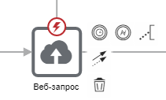

# Компоненты

Bpium для описания сценариев использует нотацию BPMN 2.0. Сценарии состоят из связанных между собой компонентов: событий, шлюзов и действий. Компоненты обмениваются данными между собой через переменные.

<figure><figcaption></figcaption></figure>

## Компоненты

### События (Events)

События – это то, что происходит в течение процесса. События оказывают влияние на ход процесса. Изображаются в виде круга с изображением типа события. Согласно влиянию событий на ход процесса, выделяют три типа: стартовое событие (Start), промежуточное событие (Intermediate) и конечное событие (End). Промежуточные события могут быть прикреплены к другим компонентам. Например, к действию может быть прикреплено событие ошибка.

* [Начало процесса](/broken/pages/-LACZqQ2Qn946ceho_h5)
* [Конец процесса](/broken/pages/-LACZqQ3_bWQ0G_AE4gx)
* [Таймер](/broken/pages/-LACZqQ5XWz1j2ayMjRo)

### Действия (Activities)

Действия – общий термин, обозначающий некую работу, выполнение некой задачи. Изображаются в виде прямоугольников с изображением типа операции. В Бипиуме среди действий отдельно выделены компоненты для работы с данными Bpium.

#### Действия с данными Bpium

* [Получить запись](deistviya-s-dannymi/getrecord.md)
* [Найти записи](deistviya-s-dannymi/findrecords.md)
* [Изменить запись](deistviya-s-dannymi/editrecord.md)
* [Создать запись](deistviya-s-dannymi/createrecord.md)
* [Удалить запись](deistviya-s-dannymi/deleterecord.md)
* [Структура каталога](deistviya-s-dannymi/poluchenie-struktury-kataloga.md)
* [Загрузить файл](deistviya-s-dannymi/zagruzit-fail.md)
* [Сгенерировать документ](deistviya-s-dannymi/generaciya-dokumenta.md)

#### Действия

* [Назначение переменных](deistviya/setvariables.md)
* [Код (JavaScript)](deistviya/code.md)
* [Веб-запрос](deistviya/webrequest.md)
* [SQL-запрос](deistviya/sql.md)
* [Парсер](deistviya/parse.md)
* [Запуск процесса](deistviya/zapusk-processa.md)
* [Отправка почты](kommunikacii/email.md)

### Пограничные события (Boundary events)

Пограничные события — альтернативные варианты завершения компонентов-действий. Эти события «вешаются» на сам компонент-действие и активируют альтернативные выходы из компонента при определенных событиях.

Сценарии Бипиум поддерживают 2 типа пограничных событий:

* [Ошибка](/broken/pages/-LACZqQ4osXizp90sPPd) — выход из компонента, если произошла какая-либо ошибка
* Таймаут — выход из компонента, спустя заданное ограничение по времи

Если компонент завершился с ошибкой, но на нем не было пограничного события, то процесс завершается. Сообщение ошибки возвращается в результатах процесса.

### Шлюзы (Gateways)

Шлюзы используются для контроля расхождений и схождений потока исполнения в процессе: ветвление, распараллеливание, слияние и соединение маршрутов. Изображаются в виде ромба с изображением типа развития процесса.

* [Шлюз «ИЛИ» (условное ветвление)](/broken/pages/-LACZqQ68lpD2dV45U1-)

### **Соединяющие линии**

Компоненты процесса связаны друг с другом соединяющими линиями. Из компонента могут выходить несколько линий — процесс пойдет одновременно по всем из них. На соединяющие линии можно задать условия, в этом случае процесс перейдет к следующему компоненту только при выполнении условия.

Линии используются для соединения компонентов процесса и задания условий перехода.

Условия могут быть заданы только на соединяющие линии, выходящие из компонента «[Шлюз ИЛИ](/broken/pages/-LACZqQ68lpD2dV45U1-)».

## Свойства

**Условие**  \
Логическое выражение, которое возвращает true/false. Логические выражения задаются в формате [выражений](../scripts/expression.md).

Если условие вернет true, то процесс перейдет к следующему компоненту. Если false, то нет.

## Свойства компонентов

Компоненты имеют свойства, задающие параметры работы компонента. Все свойства можно разделить на два типа: входные параметры и выходные параметры.

### Входные параметры

Входные параметры поступают на вход компонента. Значения входных параметров можно задавать явными значениями (числа и "строки"), указывать [переменные](../scripts/variables.md) или [выражения](../scripts/expression.md).

Переменные могут быть числами, текстом, датой, массивами и объектами. Подробнее о переменных в соответствующем разделе.

### Выходные параметры

Компоненты передают результаты работы в сценарий через выходные параметры. В качестве значения свойства выходного параметра нужно указывать имя переменной, в которую должен быть сохранен результат. Например, сохранить количество записей в переменную `count`.


Вместо имени переменной можно указать свойство существующей переменной. Например, `data.count`. При этом результат компонента будет записан в переменную `data` в свойство `count`. Если переменная `data` не существует, она будет создана.

