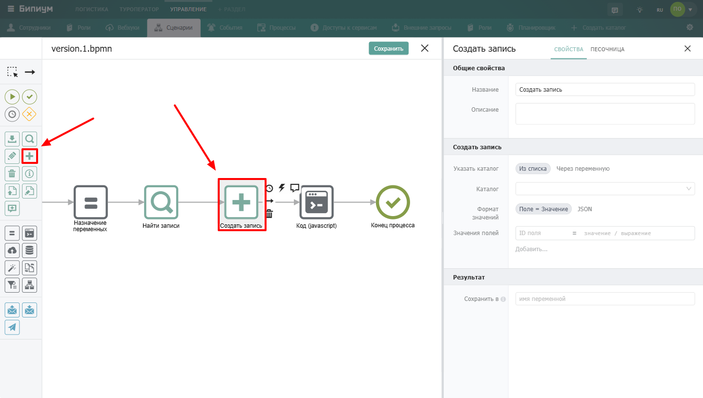

Компонент для создания новой записи в указанном каталоге Бипиума.

{width=1440px height=816px}

## Когда использовать

Используйте **Создать запись**, когда сценарию нужно добавить новую запись в каталог. Типичные примеры:

-  Зарегистрировать новую заявку от клиента

-  Создать задачу для сотрудника

-  Добавить запись в журнал событий

-  Сформировать новый договор на основе шаблона

:::note 

**Важно:** Процессы создают записи **минуя правовую политику**. Сценарий может создать запись в любом каталоге, даже если у сотрудника, запустившего сценарий, нет на это прав

:::

## Настройка компонента

### Секция «Общие свойства»



---

*  

   Поле

*  

   Описание

---

*  

   Название

*  

   По умолчанию «Создать запись». Можно изменить на своё -- например, «Создать заявку»

---

*  

   Описание

*  

   Необязательное поле. Можно добавить комментарий для себя или коллег



### Секция «Создать запись»

 (1).png> "Секция Создать запись"){width=656px height=268px}



---

*  

   Поле

*  

   Описание

---

*  

   **Указать каталог**

*  

   Способ выбора каталога:\
   • **Из списка** -- выбрать каталог из выпадающего списка\
   • **Через переменную** -- указать ID каталога через переменную

---

*  

   **Каталог**

*  

   Доступно при выборе «Из списка». Выбор каталога, в котором будет создана запись

---

*  

   **ID каталога**

*  

   Доступно при выборе «Через переменную». Идентификатор каталога. Формат: значение или выражение

---

*  

   **Формат значений**

*  

   Способ передачи значений полей:\
   • **Поле = Значение** -- указывать пары «ID поля = значение»\
   • **JSON** -- передать JSON-объект со значениями

---

*  

   **Значения полей**

*  

   Набор пар «ID поля = значение / выражение». Каждая новая пара добавляется кнопкой **«Добавить...»**



Формат указания значения полей при типе «JSON»

```javascript
{
    id_поля_1: значение,
    id_поля_2: значение
}
```

Пример:

```javascript
{
    2: "Новый текст",
    7: new Date(),
    11: [{catalogId: 4, recordId: 15}]
}
```

:::info 

При формате «идентификатор поля = значение» идентификатор поля можно задать с помощью вложенных шаблонов

**Пример**

«\$\{выражение} = значение»

:::

### Секция «Результат»

 (1).png> "Секция Результат"){width=649px height=115px}

**Сохранить в**  \
Выходной параметр. В случае успеха, запишет идентификатор новой записи в указанную переменную. Формат значения: имя переменной.

:::info 

В поле «**Сохранить в**» можно указать ключ объекта и идентификатор новой записи сохранится как значения этого ключа.

:::

## Синтаксис указания значения полей

#### Синтаксис указания значений полей

| Тип поля                               | Формат                                            | Пример                                                                                    |
|----------------------------------------|---------------------------------------------------|-------------------------------------------------------------------------------------------|
| **Однострочный текст**                 | Строка в двойных кавычках                         | `"Иванов Иван"`                                                                           |
| **Многострочный текст**                | Строка в обратных кавычках, перенос строк -- `\n` | `` `Первая строка\nВторая строка` ``                                                      |
| **Дата**                               | ISO-строка или `(new Date()).toISOString()`       | `"2024-03-19T12:00:00.000Z"`                                                              |
| **Число**                              | Число с точкой                                    | `3.14`                                                                                    |
| **Прогресс**                           | Число от 0 до 100                                 | `75`                                                                                      |
| **Оценка звёздами**                    | Число от 0 до 5                                   | `4`                                                                                       |
| **Статус / Набор галочек**             | Массив строк с ID значений                        | `["2"]` или `["2", "3", "4"]`                                                             |
| **Выбор значения / Выпадающий список** | Строка с ID значения                              | `"2"`                                                                                     |
| **Сотрудник**                          | Массив объектов `{id}`                            | `[{id: "3"}]` или `[{id: "3"}, {id: "5"}]`                                                |
| **Связанная запись**                   | Массив объектов `{catalogId, recordId}`           | `[{catalogId: "11", recordId: "91"}]`                                                     |
| **Контакт**                            | Массив объектов `{contact, comment}`              | `[{contact: "8-901-234-56-78", comment: "Секретарь"}]`                                    |
| **Файл** (из хранилища)                | Массив объектов `{id}`                            | `[{id: "1001"}]`                                                                          |
| **Файл** (внешний)                     | Массив объектов `{title, src, size?, mimeType?}`  | `[{title: "договор.pdf", src: "https://...", size: 245760, mimeType: "application/pdf"}]` |
| **Адрес**                              | Объект `{value, provider, data}`                  | см. пример ниже                                                                           |


**Пример для поля «Адрес»:**

```json
{
  "value": "г Москва, Кремлевская наб",
  "provider": "dadata",
  "data": {
    "region_with_type": "г Москва",
    "city_with_type": "г Москва",
    "street_with_type": "Кремлевская наб",
    "geo_lat": "55.748711",
    "geo_lon": "37.61697"
  }
}
```

**Примечания:**

-  `size` и `mimeType` для внешних файлов -- необязательные, но желательные.

-  Для полей «Статус» и «Набор галочек» ID значений можно посмотреть в настройках поля (вкладка «Параметры»).

-  Для полей «Связанная запись», если поле может ссылаться на несколько каталогов, в `catalogId` указывается ID нужного каталога-источника.

## Пограничные события


Компонент поддерживает 2 типа пограничных событий:

-  Ошибка -- выход из компонента, если произошла какая-либо ошибка

-  Таймаут -- выход из компонента, спустя заданное ограничение по времени

Если компонент завершился с ошибкой, но на нем не было пограничного события, то процесс завершается. Сообщение ошибки возвращается в результатах процесса.