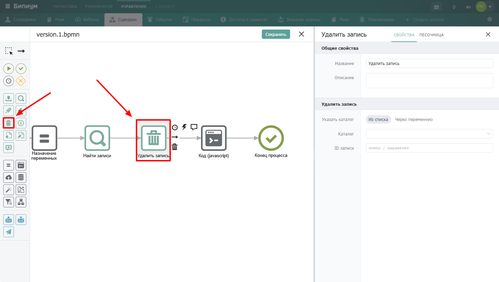

Компонент для удаления записи из указанного каталога Бипиума.

{width=1440px height=816px}

## Когда использовать

Используйте **Удалить запись**, когда запись больше не нужна и должна быть удалена из системы. Типичные примеры:

-  Удалить временную или тестовую запись после обработки

-  Очистить каталог от устаревших данных

-  Удалить связанные записи при удалении основного объекта

:::note 

**Важно:** Процессы удаляют записи **минуя правовую политику**. Сценарий может удалить любую запись в любом каталоге, даже если у сотрудника, запустившего сценарий, нет на это прав. Будьте осторожны -- удалённые записи можно восстановить только через обращение в поддержку.

:::

## Настройки компонента

### Секция «Общие свойства»



---

*  

   Поле

*  

   Описание

---

*  

   Название

*  

   По умолчанию «Удалить запись». Можно изменить на своё -- например, «Удалить временную заявку»

---

*  

   Описание

*  

   Необязательное поле. Можно добавить комментарий для себя или коллег



### Секция «Удалить запись»

.png> "Секция Удалить запись"){width=654px height=173px}



---

*  

   Поле

*  

   Описание

---

*  

   Указать каталог

*  

   Способ выбора каталога:

   • **Из списка** -- выбрать каталог из выпадающего списка

   • **Через переменную** -- указать ID каталога через переменную

---

*  

   Каталог

*  

   Доступно при выборе «Из списка». Выбор каталога, из которого нужно удалить запись

---

*  

   ID каталога

*  

   Доступно при выборе «Через переменную». Идентификатор каталога. Формат: значение или выражение

---

*  

   ID записи

*  

   Идентификатор записи, которую нужно удалить. Формат: значение или выражение



## Пограничные события

Компонент поддерживает 2 типа пограничных событий:

-  Ошибка -- выход из компонента, если произошла какая-либо ошибка

-  Таймаут -- выход из компонента, спустя заданное ограничение по времени

Если компонент завершился с ошибкой, но на нем не было пограничного события, то процесс завершается. Сообщение ошибки возвращается в результатах процесса.