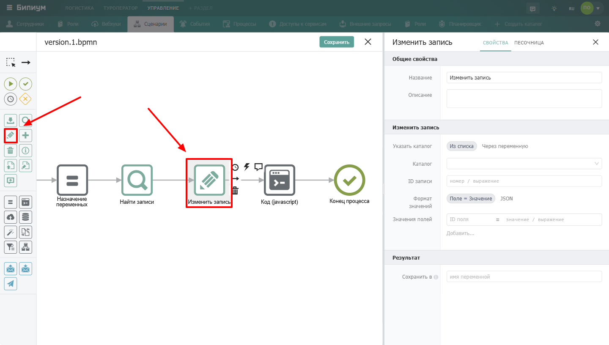

Компонент для изменения полей существующей записи в Бипиуме.

{width=1440px height=816px}

## Когда использовать

Используйте **Изменить запись**, когда сценарию нужно обновить данные в уже существующей записи. Типичные примеры:

-  Обновить статус заявки после обработки

-  Изменить ответственного сотрудника при перераспределении задач

-  Записать результат расчётов в поле записи

-  Обновить дату последнего контакта с клиентом

:::note 

**Важно:** Процессы изменяют записи **минуя правовую политику**. Сценарий может изменить любую запись в любом каталоге, даже если у сотрудника, запустившего сценарий, нет на это прав.

:::

## Настройка компонента

### Секция «Общие свойства»



---

*  

   Поле

*  

   Описание

---

*  

   **Название**

*  

   По умолчанию «Изменить запись». Можно изменить на своё -- например, «Обновить статус заявки»

---

*  

   **Описание**

*  

   Необязательное поле. Можно добавить комментарий для себя или коллег



### Секция «Изменить запись»

 (1).png> "Секция Изменить запись"){width=649px height=313px}



---

*  

   Поле

*  

   Описание

---

*  

   **Указать каталог**

*  

   Способ выбора каталога:\
   • **Из списка** -- выбрать каталог из выпадающего списка\
   • **Через переменную** -- указать ID каталога через переменную

---

*  

   **Каталог**

*  

   Доступно при выборе «Из списка». Выбор каталога, в котором находится запись

---

*  

   **ID каталога**

*  

   Доступно при выборе «Через переменную». Идентификатор каталога. Формат: значение или выражение

---

*  

   **ID записи**

*  

   Идентификатор записи, которую нужно изменить. Формат: значение или выражение

---

*  

   **Формат значений**

*  

   Способ передачи значений полей:\
   • **Поле = Значение** -- указывать пары «ID поля = значение»\
   • **JSON** -- передать JSON-объект со значениями

---

*  

   **Значения полей**

*  

   Набор пар «ID поля = значение / выражение». Каждая новая пара добавляется кнопкой **«Добавить...»**



### Секция «Результат»

 (1).png> "Секция Результат"){width=651px height=88px}

**Сохранить в**  \
Выходной параметр. Сохранит результат выполнения операции в указанную переменную (в случае успешного изменения записи ничего не вернется). Формат значения: имя переменной.

## Синтаксис указания значений полей

Значения полей указываются в формате:

```json
{
    "id_поля_1": значение,
    "id_поля_2": значение
}
```

| Тип поля                               | Формат                                      | Пример                                                 |
|----------------------------------------|---------------------------------------------|--------------------------------------------------------|
| **Однострочный текст**                 | Строка в двойных кавычках                   | `"Иванов Иван"`                                        |
| **Многострочный текст**                | Строка с переносами `\n`                    | `Первая строка\nВторая строка`                         |
| **Дата**                               | ISO-строка или `(new Date()).toISOString()` | `"2024-03-19T12:00:00.000Z"`                           |
| **Число**                              | Число                                       | `3.14`                                                 |
| **Прогресс**                           | Число от 0 до 100                           | `75`                                                   |
| **Оценка звёздами**                    | Число от 0 до 5                             | `4`                                                    |
| **Статус / Набор галочек**             | Массив строк с ID значений                  | `["2"]`, `["2", "3", "4"]`                             |
| **Выбор значения / Выпадающий список** | Строка с ID значения                        | `"2"`                                                  |
| **Сотрудник**                          | Массив объектов `{id}`                      | `[{id: "3"}]`, `[{id: "3"}, {id: "5"}]`                |
| **Связанная запись**                   | Массив объектов `{catalogId, recordId}`     | `[{catalogId: "11", recordId: "91"}]`                  |
| **Контакт**                            | `{contact, comment}`                        | `[{contact: "8-901-234-56-78", comment: "Секретарь"}]` |
| **Файл (из хранилища)**                | `{id}`                                      | `[{id: "1001"}]`                                       |
| **Файл (внешний)**                     | `{title, src, size?, mimeType?}`            | `[{title: "договор.pdf", src: "https://..."}]`         |
| **Адрес**                              | `{value, provider, data}`                   | см. пример ниже                                        |

**Пример для поля «Адрес»:**

```json
{
    "value": "г Москва, Кремлевская наб",
    "provider": "dadata",
    "data": {
        "postal_code": null,
        "region_with_type": "г Москва",
        "city_with_type": "г Москва",
        "street_with_type": "Кремлевская наб",
        "geo_lat": "55.748711",
        "geo_lon": "37.61697"
    }
}
```

**Примечания:**

-  `size` и `mimeType` для внешних файлов -- необязательные, но желательные.

-  Для полей «Статус» и «Набор галочек» ID значений можно посмотреть в настройках поля (вкладка «Параметры»).

-  Для полей «Связанная запись», если поле может ссылаться на несколько каталогов, в `catalogId` указывается ID нужного каталога-источника.

## Пограничные события


Компонент поддерживает 2 типа пограничных событий:

-  Ошибка -- выход из компонента, если произошла какая-либо ошибка

-  Таймаут -- выход из компонента, спустя заданное ограничение по времени

Если компонент завершился с ошибкой, но на нем не было пограничного события, то процесс завершается. Сообщение ошибки возвращается в результатах процесса.