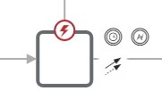

# Изменить запись

4Используется для изменения записей в Бипиуме. Процессы изменяют записи минуя правовую политику и могут изменить любую запись в любом каталоге.

## Свойства

### Секция «Изменить запись»

**Указать каталог**\
Способ выбора каталога для изменения записи. Доступные варианты: `из списка` и `через переменную`. Вариант «из списка» подойдет, когда вы знаете в каком каталоге хотите изменить запись. Вариант «через переменную» используется, если нужно изменить запись в разных каталогах в зависимости от логики в сценарии.\
\
**Каталог**  \
Свойство доступно при выбранном значении `Указать каталог = Из списка`. Выбор каталога из числа доступных в системе для изменения записи. Формат: выбор из списка каталогов.

**ID каталога**\
Свойство доступно при выбранном значении `Указать каталог = Через переменную`. Идентификатор (ID) каталога, из которого нужно получить запись. Формат: значение/выражение.

**ID записи**  \
Идентификатор записи, которую надо изменить. Формат: значение/выражение.

**Формат значений**  \
Позволяет выбрать формат редактирования записи. `«Поле = значение»` — позволит поменять только значение в конкретном поле. `«JSON»` — позволит передать все поля записи как JS-объект.

**Значения полей**  \
В зависимости от выбранного формата принимает значения в виде пары «идентификатор поля = значение» или JS-объект. Синтаксис указания полей для разных типов данных соответствует синтаксису передачи значения полей в API. Он также приведен ниже в этой статье.

Формат указания значения полей при типе «JSON»

```javascript
{
    id_поля_1: значение,
    id_поля_2: значение
}
```

Пример:

```javascript
{
    2: "Новый текст",
    7: new Date(),
    11: [{catalogId: 4, recordId: 15}]
}
```


При формате «идентификатор поля = значение» идентификатор поля можно задать с помощью вложенных шаблонов&#x20;

**Пример**&#x20;

«${выражение} = значение»


### Секция «Результат»

**Сохранить в**  \
Выходной параметр. Сохранит результат выполнения операции в указанную переменную (в случае успешного изменения записи ничего не вернется). Формат значения: имя переменной.

## Синтаксис указания значения полей

* **Однострочный текст** = `"Однострочный текст"`
* **Многострочный текст** = \
  `` `Многострочный ``\
  `` текст` ``
* **Дата** = `"2015-11-06T21:00:00.000Z"` , пример даты из объекта: `(new Date()).toISOString()`
* **Статус / Набор галочек** = `["2"]` или несколько значений `["2", "3", "4"]`
* **Выбор значения** = `"2"`
* **Число** = `3.2`
* **Прогресс** = `28`(допустимо от 0 до 100)
* **Звезды** = `5` (допустимо от 0 до 5)
* **Контакт** = `[{contact: "8-901-234-56-78", comment: "Секретарь"}, {еще один контакт}]`
* **Адрес** = объект предоставляемый из DaData

```json
{
            "value": "г Москва, Кремлевская наб",
            "provider": "dadata",
            "data": {
                "flat_type": null,
                "house": null,
                "city_kladr_id": "7700000000000",
                "postal_code": null,
                "area_with_type": null,
                "settlement_kladr_id": null,
                "street": "Кремлевская",
                "fias_id": "ede88e7f-8788-4851-a4d8-ff6d748f9bfe",
                "house_fias_id": null,
                "street_kladr_id": "77000000000160300",
                "region_with_type": "г Москва",
                "street_fias_id": "ede88e7f-8788-4851-a4d8-ff6d748f9bfe",
                "city": "Москва",
                "house_kladr_id": null,
                "kladr_id": "77000000000160300",
                "block_type": null,
                "block": null,
                "settlement_fias_id": null,
                "city_fias_id": "0c5b2444-70a0-4932-980c-b4dc0d3f02b5",
                "geo_lat": "55.748711",
                "area_fias_id": null,
                "country": "Россия",
                "region_kladr_id": "7700000000000",
                "street_with_type": "Кремлевская наб",
                "house_type": null,
                "flat": null,
                "region_fias_id": "0c5b2444-70a0-4932-980c-b4dc0d3f02b5",
                "geo_lon": "37.61697",
                "settlement_with_type": null,
                "area_kladr_id": null,
                "city_with_type": "г Москва"
            }
        }
```

* **Связанная запись** = `[{catalogId: "11", recordId: "91"}, {еще одна связанная запись}]`
* **Сотрудник** = `[{id: "3"}]`  или несколько значений `[{id: "3"}, {id: "5"}]`
* **Файл** =&#x20;
  * Если прикрепляется внешний файл (лежит на стороннем сервере):`[{title: "имя", src: "http://путь", size: 45654, mimeType: "image/png"}, {еще один файл}]`, где `mimeType`— необязательный параметр ([допустимые значения](https://www.wikiwand.com/ru/%D0%A1%D0%BF%D0%B8%D1%81%D0%BE%D0%BA_MIME-%D1%82%D0%B8%D0%BF%D0%BE%D0%B2))
  * Если прикрепляется файл, загруженный в файловое хранилище Bpium:\
    `[{id: "1001"}, {еще один файл}]`

## Пограничные события



Компонент поддерживает 2 типа пограничных событий:

* Ошибка — выход из компонента, если произошла какая-либо ошибка
* Таймаут — выход из компонента, спустя заданное ограничение по времени

Если компонент завершился с ошибкой, но на нем не было пограничного события, то процесс завершается. Сообщение ошибки возвращается в результатах процесса.
