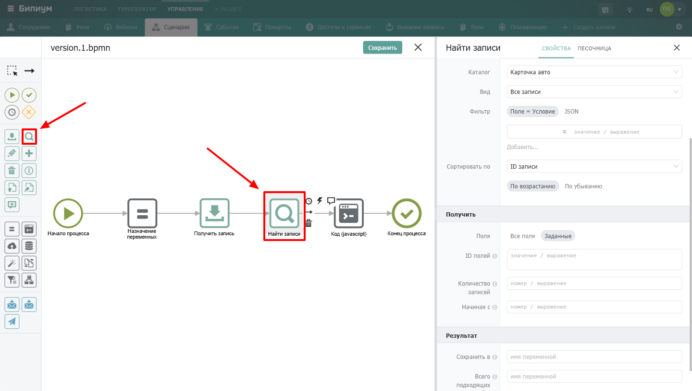
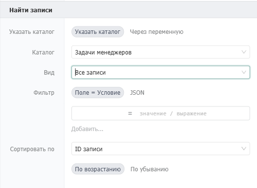
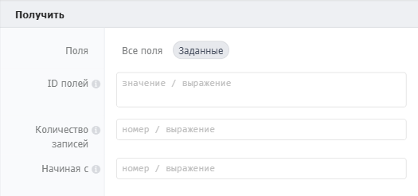
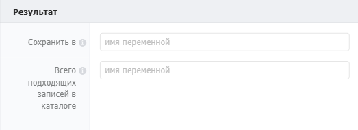

Используется, чтобы найти записи в Бипиуме, установив ограничения на выборку в качестве видов или фильтров.

{width=1440px height=816px}

## Когда использовать

Используйте **Найти записи**, когда нужно получить несколько записей, соответствующих определённым критериям. Типичные примеры:

-  Найти все заявки клиента за последний месяц

-  Получить список активных сотрудников отдела

-  Выбрать записи, где статус «Ожидает» и сумма больше 10 000

:::note 

**Важно:** Процессы имеют доступ к записям **минуя правовую политику**. Сценарий может найти любые записи в любом каталоге, даже если у сотрудника, запустившего сценарий, нет на это прав.

:::

## Настройка компонента

### Секция «Общие свойства»



---

*  

   Поле

*  

   Описание

---

*  

   Название

*  

   По умолчанию «Найти записи». Можно изменить на своё -- например, «Найти активные заявки»

---

*  

   Описание

*  

   Необязательное поле. Можно добавить комментарий для себя или коллег



### Секция «Найти записи»

{width=525px height=383px}



---

*  Поле

*  Описание

---

*  Указать каталог

*  Способ выбора каталога:\
   • **Из списка** -- выбрать каталог из выпадающего списка\
   • **Через переменную** -- указать ID каталога через переменную

---

*  Каталог

*  Доступно при выборе «Из списка». Выбор каталога для поиска

---

*  ID каталога

*  Доступно при выборе «Через переменную». Идентификатор каталога. Формат: значение или выражение

---

*  Фильтр

*  Условия для выборки записей. Формат: `ID поля = "значение"` или `ID поля = {выражение}`. Для разных типов полей используются разные форматы значений

---

*  Вид

*  Правовой вид каталога. Можно выбрать из списка, чтобы ограничить поиск записями, попадающими в этот вид

---

*  Сортировать по

*  Поле, по которому сортировать результаты. Формат: выбор из списка полей каталога



#### Формат фильтра для разных типов полей

| Тип поля                                  | Формат значения                                                      | Пример                                           |
|-------------------------------------------|----------------------------------------------------------------------|--------------------------------------------------|
| Текст                                     | `"текст"` -- поиск по вхождению (не точное совпадение)               | `2 = "Иван"`                                     |
| Дата, Число, Прогресс                     | Диапазон: `{ "at": "значение", "to": "значение" }`                   | `3 = { "at": "2024-01-01", "to": "2024-12-31" }` |
| Пустая дата                               | `"NULL_DATE"`                                                        | `4 = "NULL_DATE"`                                |
| Категория, Набор галочек, Оценка звёздами | Массив значений                                                      | `5 = [1, 2, 3]`                                  |
| Контакт                                   | `"текст"` -- поиск по вхождению (телефоны очищаются от спецсимволов) | `6 = "7926"`                                     |
| Связанный каталог                         | Массив объектов: `[ {"catalogId": ID, "recordId": ID}, ... ]`        | `7 = [ {"catalogId": 18, "recordId": 9} ]`       |
| Сотрудник                                 | Массив идентификаторов сотрудников                                   | `8 = [21, 22]`                                   |

**Использование переменных в фильтре:**

В поле «ID поля» можно передать переменные с помощью синтаксиса \
`${выражение} =`значение.

### Секция «Получить»

{width=525px height=246px}



---

*  

   Поле

*  

   Описание

---

*  

   Поля

*  

   Какие поля записей вернуть:\
   • **Все поля** -- возвращает все поля каталога, включая расширенные поля связанных записей\
   • **Заданные** -- позволяет указать конкретные поля (уменьшает объём данных, ускоряет работу)

---

*  

   ID полей

*  

   Доступно при выборе «Заданные». Список идентификаторов (API ID) полей через запятую

---

*  

   Количество записей

*  

   Максимальное количество возвращаемых записей. Максимум -- 1000, по умолчанию -- 100

---

*  

   Начиная с

*  

   Используется вместе с «Количество записей» для постраничной навигации. Указывает порядковый номер записи (не ID), с которого начинать выборку. По умолчанию 0. Пример: если указано 200, а количество записей = 100, будут возвращены записи с 201 по 300



#### Получение полей связанных записей

Если в каталоге есть поле типа «Связанный каталог», можно получить не только ссылку на запись, но и значения её полей. Для этого в **ID полей** нужно указать не просто идентификатор поля, а объект с дополнительными параметрами.

**Формат:**

```json
[
  ID_поля1,
  {
    fieldId: ID_поля2,
    fields: {
      ID_каталога_источника1: [ ID_поля_связанной_записи1, ID_поля_связанной_записи2, ... ],
      ID_каталога_источника2: [ ID_поля_связанной_записи3, ... ]
    }
  },
  ID_поля3
]
```

| Параметр                    | Описание                                                                                                                                                              |
|-----------------------------|-----------------------------------------------------------------------------------------------------------------------------------------------------------------------|
| ID\_поля                    | Идентификатор поля в текущем каталоге                                                                                                                                 |
| ID\_каталога\_источника     | Идентификатор каталога, на который ссылается поле. Поле типа «Связанный каталог» может ссылаться на несколько каталогов -- для каждого можно указать свой набор полей |
| ID\_поля\_связанной\_записи | Какие поля вернуть из связанной записи                                                                                                                                |

**Пример:**

```json
[4, {fieldId: 5, fields: { 27: [2, 6] } }, 8, {fieldId: 9, fields: { 19: [3, 4] } }]
```

**Что получим:** поля 4, 5, 8 и 9. Для поля 5 дополнительно вернутся поля 2 и 6 из связанного каталога 27. Для поля 9 -- поля 3 и 4 из связанного каталога 19.

### Результат

{width=523px height=190px}



---

*  

   Поле

*  

   Описание

---

*  

   Сохранить в

*  

   Имя переменной, в которую сохраняется результат. Компонент возвращает **массив записей** в формате:\
   `[ { id, catalogId, values: { ... } }, ... ]`

---

*  

   Всего подходящих записей в каталоге

*  

   Имя переменной, в которую сохраняется общее количество записей, удовлетворяющих фильтру (без учёта ограничения «Количество записей»)



:::note 

**Важно:** Найденные записи ≠ возвращённые записи. Общее количество записей может быть больше, чем возвращено из-за параметра «Количество записей».

:::

#### Число возвращённых записей

Чтобы получить количество записей в возвращённом массиве, используйте метод `length`. Допустим, вы сохранили результат в переменную `records`:

```
{records.length}
```

## Формат значений полей (values)

Переменная с результатом содержит объект `values`, где ключи -- идентификаторы полей.

| Тип поля                  | Формат значения                                     |
|---------------------------|-----------------------------------------------------|
| Однострочный текст        | `"Однострочный текст"`                              |
| Многострочный текст       | `"Многострочный текст"`                             |
| Дата                      | `"2015-11-06T21:00:00.000Z"`                        |
| Категория / Набор галочек | `[2]` или `[2,3,4]`, если ничего не выбрано -- `[]` |

### Как работать с найденными записями

Допустим, вы сохранили результат в переменную `records`.

Получить конкретную запись из массива

Чтобы взять первую запись (индекс 0):

```
{records[0]}
```

Получить значение поля в записи

Чтобы получить значение поля с ID `4` в первой записи:

```
{records[0].values['4']}
```

#### Работа со сложными полями

Для сложных типов полей (категория, связанный объект, контакт, сотрудник, файл) значение поля будет **массивом**.

| Что нужно                                | Выражение                          |
|------------------------------------------|------------------------------------|
| Количество элементов в массиве           | `{record.values['4'].length}`      |
| Первый элемент массива                   | `{record.values['4'][0]}`          |
| Свойство элемента (например, `recordId`) | `{record.values['4'][0].recordId}` |

:::note 

**Важно:** Если поле не заполнено, массив будет пустым. Обращение к несуществующему элементу прервёт сценарий с ошибкой. Всегда проверяйте, что массив не пустой:

:::

```
{record.values['4'].length && record.values['4'][0].recordId}
```

Это выражение возвращает `recordId` первого элемента, если массив не пуст. Если массив пуст -- возвращает `0`.

## Пограничные события


Компонент поддерживает 2 типа пограничных событий:

-  Ошибка -- выход из компонента, если произошла какая-либо ошибка

-  Таймаут -- выход из компонента, спустя заданное ограничение по времени

Если компонент завершился с ошибкой, но на нем не было пограничного события, то процесс завершается. Сообщение ошибки возвращается в результатах процесса.