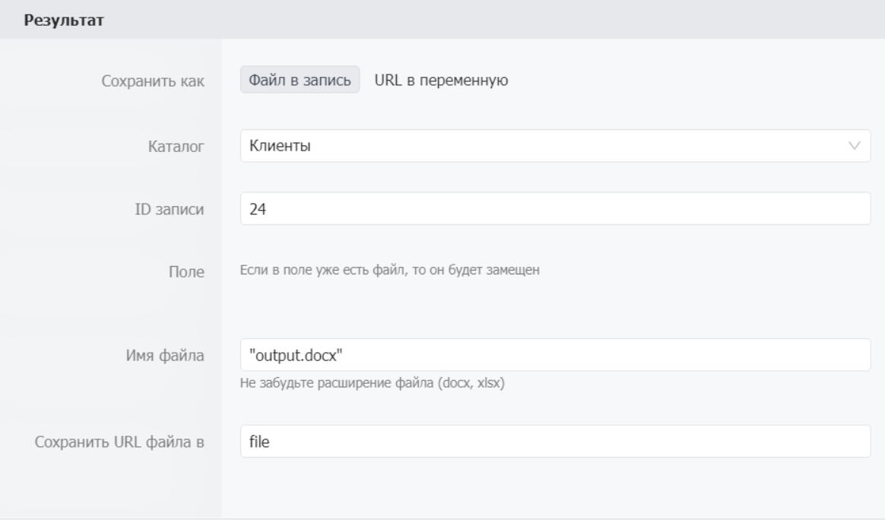
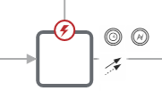

# Сгенерировать документ

Используется для создания документа из заранее загруженного шаблона. Поддерживаются форматы .xslx и .docx. Для его использования необходимо создать файл шаблона размеченного тегами, загрузить файл в Bpium и подготовить JSON с тегами. &#x20;

<figure><figcaption></figcaption></figure>

## Когда использовать

Используйте **Сгенерировать документ**, когда нужно автоматически заполнить шаблон документа данными из Бипиума. Типичные примеры:

* Сформировать договор с подстановкой данных клиента
* Создать акт выполненных работ
* Сгенерировать коммерческое предложение с таблицей товаров
* Заполнить отчёт в Excel из данных каталога

## Настройка компонента

### Секция «Общие свойства»

<table data-header-hidden><thead><tr><th width="140.3636474609375"></th><th></th></tr></thead><tbody><tr><td>Поле</td><td>Описание</td></tr><tr><td><strong>Название</strong></td><td>По умолчанию «Сгенерировать документ». Можно изменить на своё</td></tr><tr><td><strong>Описание</strong></td><td>Необязательное поле</td></tr></tbody></table>

### Секция «Шаблон»

<table data-header-hidden><thead><tr><th width="163.09088134765625"></th><th></th></tr></thead><tbody><tr><td><strong>Путь к шаблону</strong></td><td>Способ указания шаблона:<br>• <strong>Файл из каталога</strong> — выбрать файл шаблона, загруженный в запись Бипиума<br>• <strong>URL к файлу</strong> — указать ссылку на файл шаблона, доступный серверу</td></tr></tbody></table>

**При выборе «Файл из каталога»**

 (1).png>)

<table data-header-hidden><thead><tr><th width="138.5455322265625"></th><th></th></tr></thead><tbody><tr><td>Поле</td><td>Описание</td></tr><tr><td><strong>Каталог</strong></td><td>Каталог, в котором находится запись с шаблоном</td></tr><tr><td><strong>ID записи</strong></td><td>Идентификатор записи, содержащей файл шаблона. Формат: значение или выражение</td></tr><tr><td><strong>Поле</strong></td><td>Идентификатор поля типа «Файл», в котором хранится шаблон</td></tr></tbody></table>


**Важно:** Если в поле типа «Файл» несколько файлов, будет взят первый.


**При выборе «URL к файлу»**

 (1).png>)

<table data-header-hidden><thead><tr><th width="157.6363525390625"></th><th></th></tr></thead><tbody><tr><td><strong>URL шаблона</strong></td><td>Ссылка на файл шаблона в формате <code>.docx</code> или <code>.xlsx</code>, доступная серверу Бипиума. Формат: значение или выражение</td></tr></tbody></table>

**Пример:** `"https://my-portal.org/files/template.docx"`

### Секция «Данные»

Ожидает данные которые будут переданы в шаблон, для вставки. Данные можно вводить как в формате «Ключ = значение», так и в виде «JSON» строки.

<table data-header-hidden><thead><tr><th width="170.36370849609375"></th><th></th></tr></thead><tbody><tr><td>Поле</td><td>Описание</td></tr><tr><td><strong>Формат значений</strong></td><td>Способ передачи данных в шаблон:<br>• <strong>Ключ = Значение</strong> — задать ключи статически<br>• <strong>JSON-объект</strong> — передать JSON-строку, где ключи и значения могут быть результатом вычислений</td></tr><tr><td><strong>Данные</strong></td><td>Значения, которые будут подставлены в шаблон. Кнопка <strong>«+ Добавить»</strong> позволяет добавить несколько пар</td></tr></tbody></table>

**Формат значений: «Формат ключ = значение»**

 (1).png>)

В данном формате вы задаете ключи которые можно использовать дальше в шаблоне. В отличии от типа JSON поле ключ не считаемое, это означает, что наименование ключа статично.

```javascript
    key1: value1,      // Ключ = значение
    key2: {            // Ключ с вложенным ключом
        key3: value3    
        }

```

**Формат значений: Формат «JSON - объект»**

 (1) (1) (1).png>)

Позволяет записывать строку в формате JSON и в отличие от предыдущего формата поле ввода считаемое, поэтому в качестве любой части, в том числе и ключа, может быть использован результат вычисления.

```javascript
{
    key1: value1,      // Ключ = значение
    key2: {            // Ключ с вложенным ключом
        key3: value3    
    },
    [key4]: value4     // Переменная в качестве ключа.
}
```

### Секция «Результат»

Формат возврата готового файла.

<table data-header-hidden><thead><tr><th width="151.272705078125"></th><th></th></tr></thead><tbody><tr><td><strong>Сохранить как</strong></td><td>Способ сохранения сгенерированного документа:<br>• <strong>Файл в запись</strong> — сохранить документ в поле типа «Файл» указанной записи<br>• <strong>URL в переменную</strong> — вернуть ссылку на сгенерированный документ</td></tr></tbody></table>

**Сохранить как: Файл в запись**



Сохраняет результат в поле типа Файл в указанной записи.

<table data-header-hidden><thead><tr><th width="140.36358642578125"></th><th></th></tr></thead><tbody><tr><td>Поле</td><td>Описание</td></tr><tr><td><strong>Каталог</strong></td><td>Каталог, в котором находится запись для сохранения</td></tr><tr><td><strong>ID записи</strong></td><td>Идентификатор записи. Формат: значение или выражение</td></tr><tr><td><strong>Поле</strong></td><td>Идентификатор поля типа «Файл», в которое сохраняется документ</td></tr></tbody></table>

**Сохранить как: URL в переменную**

 (1).png>)

<table data-header-hidden><thead><tr><th width="230.3636474609375"></th><th></th></tr></thead><tbody><tr><td>Поле</td><td>Описание</td></tr><tr><td><strong>Имя файла</strong></td><td>Название сгенерированного файла с расширением (<code>.docx</code> или <code>.xlsx</code>). Формат: значение или выражение</td></tr><tr><td><strong>Сохранить URL файла в</strong></td><td>Переменная, в которую сохраняется ссылка на файл</td></tr></tbody></table>

## Использование

**Подготовка шаблона**\
Первым делом вам необходимо определиться с тем, какие данные будут использованы в документе.&#x20;

 (1).png>)

Для разметки шаблоны применяются теги, которые повторяют структуру передаваемых в компонент данных. Теги обрамляются двойными фигурными скобками - **\{{ \}}.**

#### **Пример**

У нас есть данные которые мы отправляем в компонент:

```
// Для формата "Ключ = значение"
executor= {
    "name": "Роговский и партнеры",
    "inn": 34834529585,
    "kpp": 2384384,
    "address": "г. Северодвинск, ул. Непонятная, д. 12, оф. 404",
    "table":[{"number":"one", "price":"12"}, {"number":"two", "price":"42"}]
customer = {
   	"name": "Продаван",
    "inn": 12334546564,
   	"kpp": 9785545,
   	"address": "г. Альметьевск, ул. Героя, д. 3, оф. 504"
    }

// Для формата "JSON"
{"executor": {
    "name": "Роговский и партнеры",
    "inn": 34834529585,
    "kpp": 2384384,
    "address": "г. Северодвинск, ул. Непонятная, д. 12, оф. 404",
    "table":[{"number":"one", "price":"12"}, {"number":"two", "price":"42"}], 
"customer": {
    "name": "Продаван",
    "inn": 12334546564,
    "kpp": 9785545,
    "address": "г. Альметьевск, ул. Героя, д. 3, оф. 504"
    }
    }
}
 
```

Для того что бы вставить в текст наименование компании-заказчика мы будем использовать тэг \{{executor.name\}}, что соответствует иерархической структуре переданных данных. Для формирования списков и строк таблиц (множимые данные) нужно присвоить массив объектов с одинаковой структурой.&#x20;


Использование множимых данных в шаблоне возможно только в соответствующей структуре. К примеру: вы можете использовать их только создав первый элемент списка или первую строку таблицы




 (1) (1).png>)

```
...
"table":[{"number":"one", "price":"12"}, {"number":"two", "price":"42"}],
...
```

Тегирование происходит по тому же принципу, что и с другими данными:\
\{{table.number\}}, \{{table.price\}} размножат строки по количеству элементов массива и заполнят соответствующими свойствами объектов массива.

## Пограничные события



Компонент поддерживает 2 типа пограничных событий:

* Ошибка — выход из компонента, если произошла какая-либо ошибка
* Таймаут — выход из компонента, спустя заданное ограничение по времени

Если компонент завершился с ошибкой, но на нем не было пограничного события, то процесс завершается. Сообщение ошибки возвращается в результатах процесса.
