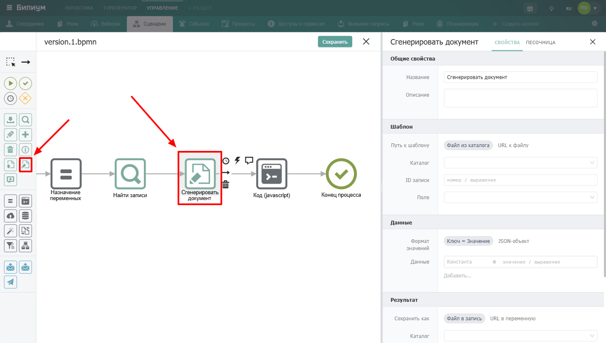
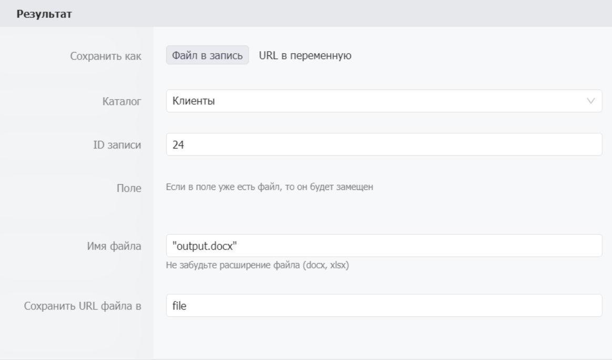

Используется для создания документа из заранее загруженного шаблона. Поддерживаются форматы .xslx и .docx. Для его использования необходимо создать файл шаблона размеченного тегами, загрузить файл в Bpium и подготовить JSON с тегами.

{width=1440px height=816px}

## Когда использовать

Используйте **Сгенерировать документ**, когда нужно автоматически заполнить шаблон документа данными из Бипиума. Типичные примеры:

-  Сформировать договор с подстановкой данных клиента

-  Создать акт выполненных работ

-  Сгенерировать коммерческое предложение с таблицей товаров

-  Заполнить отчёт в Excel из данных каталога

## Настройка компонента

### Секция «Общие свойства»



---

*  

   Поле

*  

   Описание

---

*  

   Название

*  

   По умолчанию «Сгенерировать документ». Можно изменить на своё

---

*  

   Описание

*  

   Необязательное поле



### Секция «Шаблон»



---

*  

   Поле

*  

   Описание

---

*  

   Путь к шаблону

*  

   Способ указания шаблона:\
   • **Файл из каталога** -- выбрать файл шаблона, загруженный в запись Бипиума\
   • **URL к файлу** -- указать ссылку на файл шаблона, доступный серверу



**При выборе «Файл из каталога»**

 (1).png> "Секция Шаблон"){width=923px height=286px}



---

*  

   Поле

*  

   Описание

---

*  

   Каталог

*  

   Каталог, в котором находится запись с шаблоном

---

*  

   ID записи

*  

   Идентификатор записи, содержащей файл шаблона. Формат: значение или выражение

---

*  

   Поле

*  

   Идентификатор поля типа «Файл», в котором хранится шаблон



:::note 

**Важно:** Если в поле типа «Файл» несколько файлов, будет взят первый.

:::

**При выборе «URL к файлу»**

 (1).png> "Секция Шаблон"){width=926px height=175px}



---

*  

   Поле

*  

   Описание

---

*  

   URL шаблона

*  

   Ссылка на файл шаблона в формате `.docx` или `.xlsx`, доступная серверу Бипиума. Формат: значение или выражение



**Пример:** `"https://my-portal.org/files/template.docx"`

### Секция «Данные»

Ожидает данные которые будут переданы в шаблон, для вставки. Данные можно вводить как в формате «Ключ = значение», так и в виде «JSON» строки.



---

*  

   Поле

*  

   Описание

---

*  

   Формат значений

*  

   Способ передачи данных в шаблон:\
   • **Ключ = Значение** -- задать ключи статически\
   • **JSON-объект** -- передать JSON-строку, где ключи и значения могут быть результатом вычислений

---

*  

   Данные

*  

   Значения, которые будут подставлены в шаблон. Кнопка **«+ Добавить»** позволяет добавить несколько пар



**Формат значений: «Формат ключ = значение»**

 (1).png>)

В данном формате вы задаете ключи которые можно использовать дальше в шаблоне. В отличии от типа JSON поле ключ не считаемое, это означает, что наименование ключа статично.

```javascript
    key1: value1,      // Ключ = значение
    key2: {            // Ключ с вложенным ключом
        key3: value3    
        }
```

**Формат значений: Формат «JSON - объект»**

 (1) (1) (1).png>)

Позволяет записывать строку в формате JSON и в отличие от предыдущего формата поле ввода считаемое, поэтому в качестве любой части, в том числе и ключа, может быть использован результат вычисления.

```javascript
{
    key1: value1,      // Ключ = значение
    key2: {            // Ключ с вложенным ключом
        key3: value3    
    },
    [key4]: value4     // Переменная в качестве ключа.
}
```

### Секция «Результат»

Формат возврата готового файла.



---

*  

   Поле

*  

   Описание

---

*  

   Сохранить как

*  

   Способ сохранения сгенерированного документа:\
   • **Файл в запись** -- сохранить документ в поле типа «Файл» указанной записи\
   • **URL в переменную** -- вернуть ссылку на сгенерированный документ



**Сохранить как: Файл в запись**

{width=1164px height=684px}

Сохраняет результат в поле типа Файл в указанной записи.

**Сохранить как: URL в переменную**

 (1).png> "Секция Результат"){width=1168px height=407px}



---

*  

   Поле

*  

   Описание

---

*  

   Каталог

*  

   Каталог, в котором находится запись для сохранения

---

*  

   ID записи

*  

   Идентификатор записи. Формат: значение или выражение

---

*  

   Поле

*  

   Идентификатор поля типа «Файл», в которое сохраняется документ



## Использование

**Подготовка шаблона**\
Первым делом вам необходимо определиться с тем, какие данные будут использованы в документе.

 (1).png>)

Для разметки шаблоны применяются теги, которые повторяют структуру передаваемых в компонент данных. Теги обрамляются двойными фигурными скобками - **\{\{ }}.**

#### **Пример**

У нас есть данные которые мы отправляем в компонент:

```
// Для формата "Ключ = значение"
executor= {
    "name": "Роговский и партнеры",
    "inn": 34834529585,
    "kpp": 2384384,
    "address": "г. Северодвинск, ул. Непонятная, д. 12, оф. 404",
    "table":[{"number":"one", "price":"12"}, {"number":"two", "price":"42"}]
customer = {
   	"name": "Продаван",
    "inn": 12334546564,
   	"kpp": 9785545,
   	"address": "г. Альметьевск, ул. Героя, д. 3, оф. 504"
    }

// Для формата "JSON"
{"executor": {
    "name": "Роговский и партнеры",
    "inn": 34834529585,
    "kpp": 2384384,
    "address": "г. Северодвинск, ул. Непонятная, д. 12, оф. 404",
    "table":[{"number":"one", "price":"12"}, {"number":"two", "price":"42"}], 
"customer": {
    "name": "Продаван",
    "inn": 12334546564,
    "kpp": 9785545,
    "address": "г. Альметьевск, ул. Героя, д. 3, оф. 504"
    }
    }
}
 
```

Для того что бы вставить в текст наименование компании-заказчика мы будем использовать тэг \{\{executor.name}}, что соответствует иерархической структуре переданных данных. Для формирования списков и строк таблиц (множимые данные) нужно присвоить массив объектов с одинаковой структурой.

:::note 

Использование множимых данных в шаблоне возможно только в соответствующей структуре. К примеру: вы можете использовать их только создав первый элемент списка или первую строку таблицы

:::

 (1) (1).png>)

```
...
"table":[{"number":"one", "price":"12"}, {"number":"two", "price":"42"}],
...
```

Тегирование происходит по тому же принципу, что и с другими данными:\
\{\{table.number}}, \{\{table.price}} размножат строки по количеству элементов массива и заполнят соответствующими свойствами объектов массива.

## Пограничные события


Компонент поддерживает 2 типа пограничных событий:

-  Ошибка -- выход из компонента, если произошла какая-либо ошибка

-  Таймаут -- выход из компонента, спустя заданное ограничение по времени

Если компонент завершился с ошибкой, но на нем не было пограничного события, то процесс завершается. Сообщение ошибки возвращается в результатах процесса.