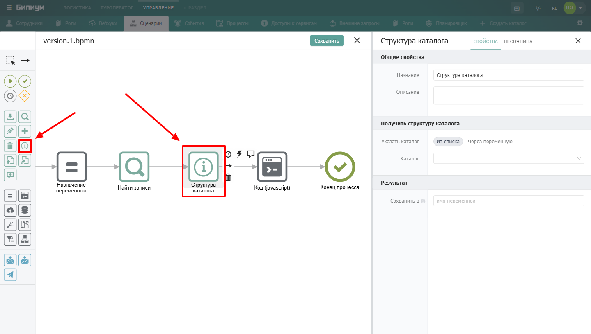
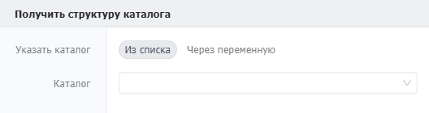
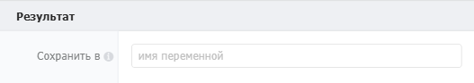

Компонент для получения описания структуры каталога: список полей, их типы, настройки, а также метаданные самого каталога.

{width=1440px height=816px}

## Когда использовать

Используйте **Структура каталога**, когда сценарию нужно узнать устройство каталога программно. Типичные примеры:

-  Получить список всех полей каталога и их ID

-  Узнать, какие значения доступны в поле типа «Статус»

-  Определить, является ли поле обязательным

-  В универсальном сценарии, который работает с разными каталогами

## Настройка компонента

### Секция «Общие свойства»



---

*  

   Поле

*  

   Описание

---

*  

   Название

*  

   По умолчанию «Структура каталога». Можно изменить на своё -- например, «Получить поля заявок»

---

*  

   Описание

*  

   Необязательное поле. Можно добавить комментарий для себя или коллег



### Секция «Получить структуру каталога»

{width=528px height=140px}

**Указать каталог**\
Способ выбора каталога для получения структуры каталога. Доступные варианты: `из списка` и `через переменную`. Вариант «из списка» подойдет, когда вы знаете из какого каталога хотите получить структуру каталога. Вариант «через переменную» используется, если нужно получить структуру каталога из разных каталогов в зависимости от логики в сценарии.

**Каталог**\
Свойство доступно при выбранном значении `Указать каталог = Из списка`. Выбор каталога из числа доступных в системе для получения структуры каталога. Формат: выбор из списка каталогов.

**ID каталога**\
Свойство доступно при выбранном значении `Указать каталог = Через переменную`. Идентификатор (ID) каталога, из которого нужно получить структуру каталога. Формат: значение/выражение.

### Секция «Результат»

{width=527px height=93px}



---

*  

   Поле

*  

   Описание

---

*  

   Сохранить в

*  

   Имя переменной, в которую сохраняется структура каталога. Вместо имени переменной можно указать ключ объекта -- тогда данные сохранятся как значение этого ключа



**Пример сохранения в ключ объекта:** если указать `data.temp`, то результат будет сохранён как `data.temp`.

#### Формат возвращаемых данных

Компонент возвращает объект со следующей структурой:

```json
{
  "fields": {
    "2": {
      "orderIndex": 1,
      "id": "2",
      "name": "Название",
      "type": "text",
      "config": {},
      "hint": "",
      "required": true,
      "apiOnly": false
    },
    "3": {
      "orderIndex": 2,
      "id": "3",
      "name": "Статус",
      "type": "dropdown",
      "config": {
        "items": {
          "1": { 
            "orderIndex": 1, 
            "id": "1", 
            "name": "новая", 
            "color": "F9C2C2" 
          },
          "2": { 
            "orderIndex": 3, 
            "id": "2", 
            "name": "отказ", 
            "color": "F9C2C2" 
          },
          "3": { 
            "orderIndex": 2, 
            "id": "3", 
            "name": "оказано", 
            "color": "F9C2C2" 
          }
        },
        "defaultEmptyValue": ["1"],
        "defaultValue": true
      },
      "hint": "",
      "required": true,
      "apiOnly": false
    },
    "4": {
      "orderIndex": 3,
      "id": "4",
      "name": "Файл",
      "type": "file",
      "config": {},
      "hint": "",
      "required": true,
      "apiOnly": false
    }
  },
  "fieldPrivilegeCodes": {},
  "icon": "content-34",
  "id": "100",
  "name": "Заявки",
  "privilegeCode": "admin",
  "sectionId": "1"
}
```

:::note 

**Разница форматов с API**

Компонент возвращает результат в отличном от API формате. Разница заключается в том, что компонент возвращает поля (`fields`) в формате объекта с ключами ID полей, а не массива, как API.

Для восстановления очередности полей (порядка их следования в каталоге) в поля добавлено свойство `orderIndex`(начинается с 1).

Аналогичные изменения сделаны для элементов полей типа «статус», «набор галочек» и «выбор» (`config.items` возвращается в виде объекта, а не массива).

Эти изменения внесены, чтобы было проще получать параметры поля по его ID. Например получить название 2 статуса: `resultVar.fields[3].config.items[2].name`

:::

### Пограничные события

 (1).png>)

Компонент поддерживает 2 типа пограничных событий: Ошибка -- выход из компонента, если произошла какая-либо ошибка Таймаут -- выход из компонента, спустя заданное ограничение по времени Если компонент завершился с ошибкой, но на нем не было пограничного события, то процесс завершается. Сообщение ошибки возвращается в результатах процесса.