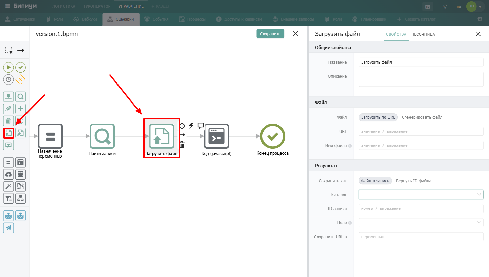

Компонент для загрузки файлов в Бипиум из интернета или файлов, сгенерированных в сценарии.

{width=1440px height=816px}

## Когда использовать

Используйте **Загрузить файл**, когда нужно сохранить в Бипиуме файл из внешнего источника или создать файл программно. Типичные примеры:

-  Скачать и сохранить PDF, сгенерированный внешним сервисом

-  Создать текстовый файл из данных сценария и прикрепить к записи

-  Загрузить аватарку пользователя по URL

-  Скопировать временный файл в постоянное хранилище

:::note 

**Важно:** Файлы из интернета могут быть прикреплены к записям **без загрузки в хранилище** (как ссылка на внешний источник). Этот компонент позволяет скопировать такие файлы в файловое хранилище Бипиума, что бывает нужно для генерируемых временных файлов.

:::

## Настройки компонента

### Секция «Общие свойства»



---

*  

   Поле

*  

   Описание

---

*  

   Название

*  

   По умолчанию «Загрузить файл». Можно изменить на своё -- например, «Скачать PDF отчёт»

---

*  

   Описание

*  

   Необязательное поле. Можно добавить комментарий для себя или коллег



### Секция **«Файл**»

.png> "Секция Файл"){width=652px height=192px}



---

*  

   Поле

*  

   Описание

---

*  

   Файл

*  

   Способ получения файла:\
   • **Загрузить по URL** -- скачать файл из интернета\
   • **Сгенерировать файл** -- создать файл из содержимого, сформированного в сценарии

---

*  

   URL

*  

   Доступно при выборе «Загрузить по URL». Адрес файла в интернете. Формат: значение или выражение

---

*  

   Содержание файла

*  

   Доступно при выборе «Сгенерировать файл». Содержимое создаваемого файла (текст, HTML и т.д.). Формат: значение или выражение

---

*  

   Имя файла

*  

   Название файла с расширением (например, `"document.pdf"` или `"Отчёт.htm"`). Если не задано, система попробует взять имя из URL. Формат: значение или выражение



### Секция **«Результат»**



---

*  

   Поле

*  

   Описание

---

*  

   Сохранить как

*  

   Способ сохранения файла:\
   • **Файл в запись** -- сохранить файл в поле типа «Файл» указанной записи\
   • **Вернуть ID файла** -- вернуть идентификатор файла, чтобы сохранить его вручную (полезно, когда нужно несколько файлов в одно поле)



**При выборе «Файл в запись»**

.png> "Секция Результат "){width=650px height=263px}



---

*  

   Поле

*  

   Описание

---

*  

   Каталог

*  

   Каталог, в котором находится запись

---

*  

   ID записи

*  

   Идентификатор записи, в которую сохраняется файл. Формат: значение или выражение

---

*  

   Поле

*  

   Идентификатор поля типа «Файл», в которое сохраняется файл

---

*  

   Сохранить URL файла в

*  

   Переменная, в которую будет сохранён URL файла в файловом хранилище



:::note 

**Важно:** Если в поле уже сохранён файл, он будет заменён новым.

:::

**При выборе «Вернуть ID файла»**

.png> "Секция Результат"){width=651px height=178px}



---

*  

   Поле

*  

   Описание

---

*  

   ID файла

*  

   Переменная, в которую сохраняется идентификатор загруженного в хранилище файла

---

*  

   Сохранить URL файла в

*  

   Переменная, в которую сохраняется URL файла в файловом хранилище



## Пограничные события

Компонент поддерживает 2 типа пограничных событий:

-  Ошибка -- выход из компонента, если произошла какая-либо ошибка

-  Таймаут -- выход из компонента, спустя заданное ограничение по времени

Если компонент завершился с ошибкой, но на нем не было пограничного события, то процесс завершается. Сообщение ошибки возвращается в результатах процесса.