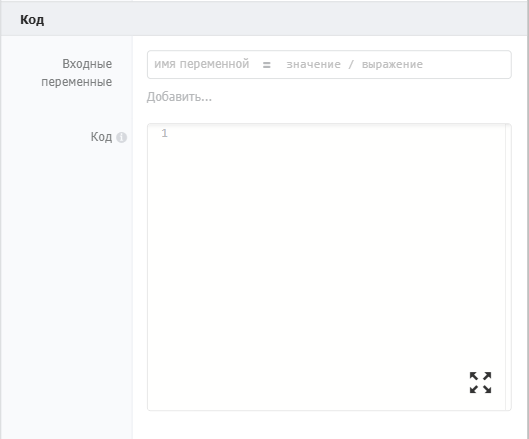
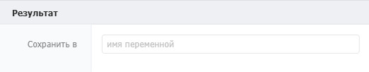

Компонент для выполнения фрагмента кода на языке JavaScript прямо в сценарии. Позволяет реализовать сложную логику, которую нельзя собрать из стандартных компонентов.

"){width=1440px height=816px}

## Когда использовать

Используйте **Код (JavaScript)**, когда стандартных компонентов недостаточно для решения задачи. Типичные примеры:

-  Сложные математические расчёты (статистика, аггрегация данных)

-  Глубокое преобразование массивов или объектов (фильтрация, сортировка, группировка)

-  Работа с датами в нестандартных форматах

-  Логика, которую проще написать на JS, чем собирать из десятка компонентов

**Важно:** код выполняется на сервере и ограничен **5 секундами**. Асинхронные функции (`setInterval`, `setTimeout`, `setImmediate`) не поддерживаются.

## Настройка компонента

### Секция «Общие свойства»



---

*  

   Поле

*  

   Описание

---

*  

   Название

*  

   По умолчанию «Код (javascript)». Можно изменить на своё -- например, «Рассчитать итоговую сумму» или «Преобразовать массив клиентов»

---

*  

   Описание

*  

   Необязательное поле. Можно добавить комментарий для себя или коллег



### Секция «Код»

{width=529px height=439px}

#### **Входные переменные**

Для безопасности код **не имеет доступа** ко всем переменным сценария по умолчанию. Входные переменные определяют, какие именно данные будут переданы в JS-код.

Формат: список пар «локальная переменная = значение / выражение»

| Колонка        | Что указывать                                                     |
|----------------|-------------------------------------------------------------------|
| Имя переменной | Имя переменной, под которым данные будут доступны внутри кода     |
| Значение       | Текст (в кавычках: "Иванов"), число (42) или выражение (\{Сумма}) |

Каждая новая пара добавляется кнопкой **«Добавить...»**.

**Пример:** если указать `price = {Цена товара}`, то внутри кода можно обращаться к переменной `price`.

#### Код

Сюда пишется сам код на JavaScript. Правила:

-  Допустимо использовать локальные переменные, переданные через «Входные переменные»

-  Доступны встроенные объекты и функции JavaScript

-  **Запрещены** асинхронные функции: `setInterval`, `setTimeout`, `setImmediate`

-  Код должен возвращать результат через конструкцию `return`

**Пример:**

javascript

```javascript
let a = 10;
return a*a;
```

### Секция  «Результат»

{width=522px height=102px}

#### **Сохранить в**

Выходной параметр. Сохраняет результат исполнения кода (возвращенные посредством `return`) в указанную переменную процесса. Формат: имя переменной.

:::info 

В поле «**Сохранить в**» можно указать ключ объекта и результат исполнения кода сохранится как значения этого ключа.

:::

## Чем компонент код отличается от выражений?

Компонент код -- то же вычислимое выражение. Разница в том, что в компоненте код доступны вспомогательные JS-библиотеки, упрощающие работу с данными:

-  [Lodash](https://lodash.com/) (\_) -- набор расширенных функций для работы с массивами, объектами, строками

-  [Moment](https://momentjs.com/) (Moment JS)-- набор функций для работы с датами.

Пример:

```javascript
let a = moment().add(1, 'days').calendar();
let b = _.concat(array, 2, [3], [[4]]);
return a;
```

В обычных выражениях этих библиотек нет.

## Пограничные события


Компонент поддерживает 2 типа пограничных событий:

-  Ошибка -- выход из компонента, если произошла какая-либо ошибка

-  Таймаут -- выход из компонента, спустя заданное ограничение по времени

Если компонент завершился с ошибкой, но на нем не было пограничного события, то процесс завершается. Сообщение ошибки возвращается в результатах процесса.