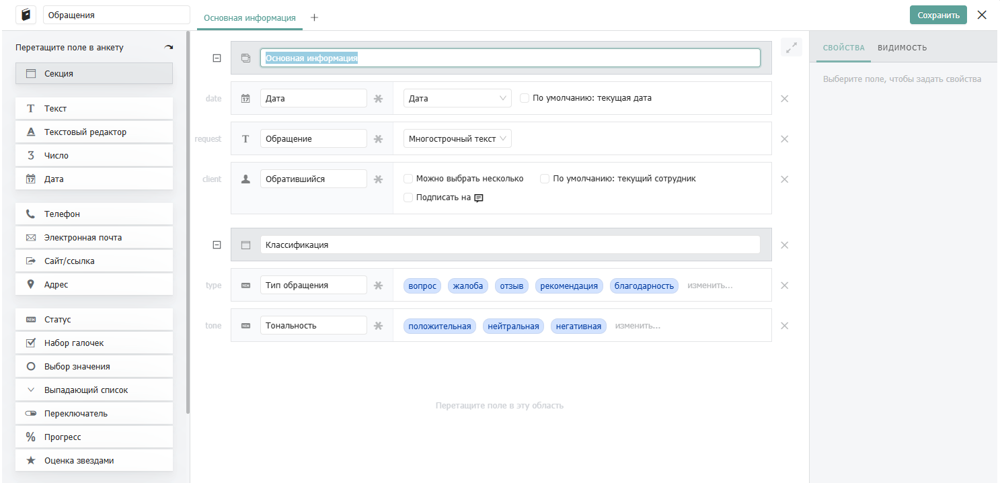
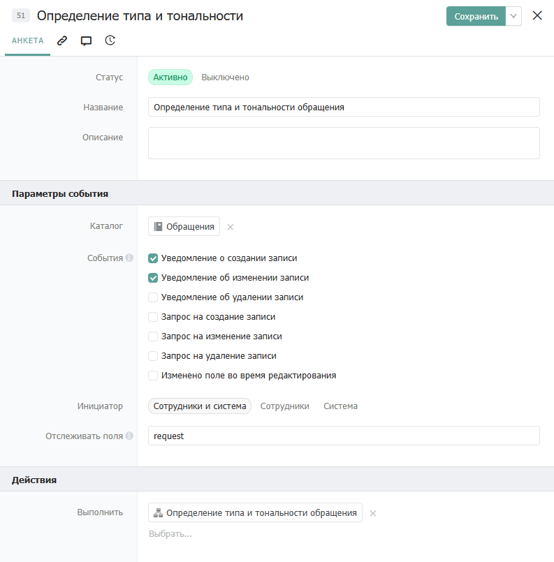
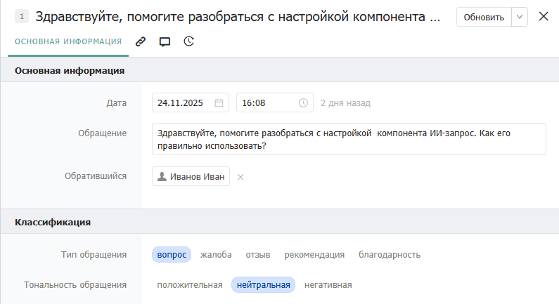

# ИИ-запрос

## Свойства

### Секция «Подключение»

**Сервис**  \
Выбор языковой модели для обращения. Подключиться можно к одной из следующих моделей: `Deepseek, Grok, Sonar(Perplexity), YandexGpt, GigaChat`.

**Указать модель**  \
Позволяет выбрать вариант указания модели.&#x20;

**Модель.** \
Позволяет указать модель для подключения, выбрав её из списка или через переменную.

**Каталог Yandex Cloud.** \
Позволяет выбрать вариант указания идентификатора каталога Yandex Cloud.

**Идентификатор каталога Yandex Cloud.** \
Позволяет указать идентификатор каталога Yandex Cloud через переменную или выбрать из списка уже добавленных в каталог Доступы к сервисам.

**Авторизация.** \
Позволяет выбрать вариант указания авторизационного токена.

**Авторизационный токен.** \
Позволяет указать авторизационный токен для подключения через переменную или выбрать его из списка уже добавленных в каталог Доступы к сервисам.

### Секция «Запрос»

**Контекст.** \
Набор переменных, которые будут выступать в роли инструкции для ИИ. Формат: список «параметр = значение/выражение».

**Промт.** \
Основной текстовый запрос(инструкция) для языковой модели. Подробно опишите задачу, которую должен выполнить ИИ. Формат: «значение в кавычках» или выражение.

### Секция «Параметры»

**Креативность.** \
Параметр, контролирующий степень случайности и творчества в ответах модели. Определяет, насколько модель отклоняется от наиболее вероятных шаблонов и генерирует неочевидные варианты ответов. Формат: «Шкала прогресса»

**Словарный запас.** \
Частота повторения одних и тех же слов или фраз в ответах модели. Формат: «Шкала прогресса»

**Уровень рассуждения.** \
Параметр, определяющий глубину анализа и сложность логических цепочек, которые модель применяет при генерации ответа. Влияет на качество решения сложных задач, требующих многошагового мышления.

**Охват поиска.** \
Объем информационного пространства, используемого при поиске.

**Фильтрация доменов.** \
Домены, которые будут использоваться моделью для поиска.

**Дополнительные параметры.** \
Продвинутые параметры API для тонкой настройки модели. Подробности о доступных параметрах можно найти на официальном сайте сервиса. Формат: список «параметр = значение/выражение».

### Секция «Результат»

**Результат.** \
Определяет, будет ли возвращён только текстовый ответ(текст) или весь объект с параметрами от API (все параметры)

**Сохранить в Выходной параметр.** \
Сохраняет ответ в указанную переменную. В зависимости от значения Результат в качестве ответа компонент возвращает строку, JSON-объект или весь объект с параметрами от API.&#x20;

## Пограничные события

Компонент поддерживает 2 типа пограничных событий:

* Ошибка — выход из компонента, если произошла какая-либо ошибка
* Таймаут — выход из компонента, спустя заданное ограничение по времени

Если компонент завершился с ошибкой, но на нем не было пограничного события, то процесс завершается. Сообщение ошибки возвращается в результатах процесса.

## Использование

Рассмотрим вариант использования компонента ИИ-запрос для определения тональности обращения в техническую поддержку.&#x20;

### **Структура каталогов**

#### **Каталог «Обращения»**

Создайте каталог «Обращения» и добавьте в него следующие поля:&#x20;

<figure><figcaption>
Структура каталога "Обращения"
</figcaption></figure>

*   **Дата** (Дата)&#x20;

    Описание: Дата обращения. Заполняется вручную. Настройки: Дата с временем.
*   **Обращение** (Текст)&#x20;

    Описание: Текст поступившего обращения. Заполняется вручную. Настройки: Многострочный текст.
*   **Обратившийся** (Сотрудник)&#x20;

    Описание: Сотрудник, обратившийся с вопросом. Заполняется вручную.
* **Тип обращения** (Статус) \
  Описание: Тип обращения. Заполняется автоматически в зависимости от текста обращения. Настройки: вопрос, жалоба, отзыв, рекомендации, благодарность.
*   **Тональность обращения** (Статус)&#x20;

    Описание: Тональность обращения. Заполняется автоматически в зависимости от текста обращения Настройки: Текст.

### **Создание автоматизаций**

#### Определение типа и тональности обращения

Для запуска сценария по определению типа и тональности обращения используется событие с типами «Уведомление о создании записи» и «Уведомление об изменении записи», которое отслеживает изменение поля с Обращением. Пример события:

<figure><figcaption>
Событие определения типа и тональности
</figcaption></figure>

При изменении поля с Обращением в карточке каталога событие запускает [сценарий автозаполнения](https://drive.google.com/file/d/1Jl-2ff9-5jOnZF6UE9O2TIcSeMqxaEpl/view?usp=drive_link).\
Сценарий для определения типа и тональности обращения выглядит следующим образом:

<figure><figcaption>
Сценарий определения типа и тональности
</figcaption></figure>

**Сценарий выполняет:**

* Получает структуру каталога Обращения
* Получение типа и тональности Обращения. Компонентом «ИИ-Запрос» сценарий обращается к «YandexGpt» и пытается получить ответ на запрос. Формат получаемых данных – JSON. [Описание](https://dadata.ru/api/find-party/).
* После обработки полученного JSON сценарий записывает необходимые значения в текущую запись.

**В сценарии необходимо изменить следующие компоненты:**

* Компонент «ИИ-Запрос». Замените Идентификатор каталога Yandex Cloud и Авторизационный токен в секции Подключение.

### Тестирование

Создайте новую запись в созданном (измененном) каталоге Обращения и введите Дату, Обращение и выберите Обратившегося и сохраните запись.

<figure><figcaption>
Пример обращения. ИИ-запрос
</figcaption></figure>

После сохранения записи срабатывает событие и ИИ-запрос определяет Тип и Тональность обращения.

<figure><figcaption>
Пример работы ИИ-запроса.
</figcaption></figure>

\
 
