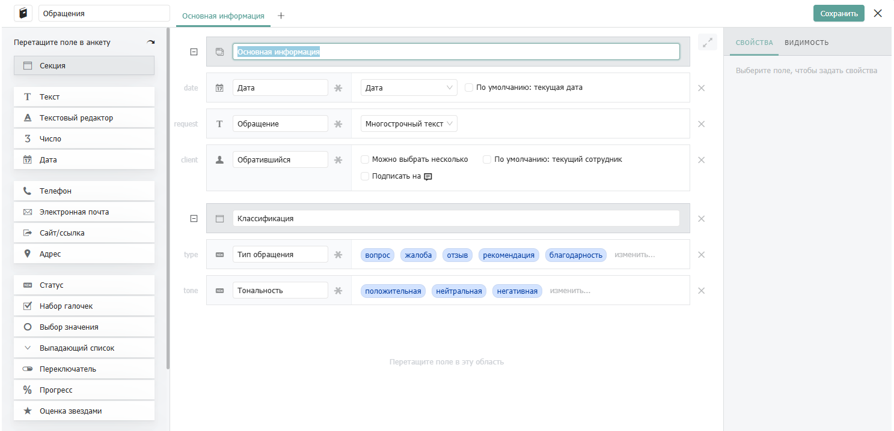
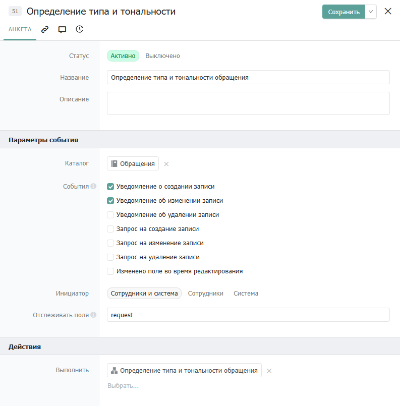
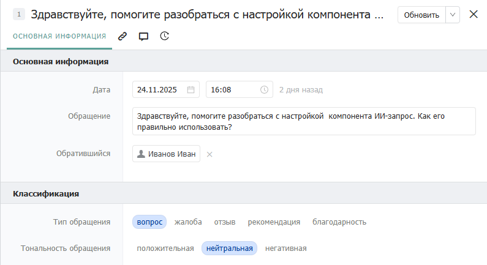

# ИИ-запрос

## Когда использовать

Используйте **ИИ-запрос**, когда нужно применить возможности языковой модели к данным в сценарии. Типичные примеры:

* Определение тональности обращения клиента
* Классификация текста по категориям
* Генерация ответов на вопросы
* Извлечение сущностей из текста (даты, имена, суммы)
* Перевод текста на другой язык

## Свойства

### Настройка компонента

### Секция «Общие свойства»

<table data-header-hidden><thead><tr><th width="143"></th><th></th></tr></thead><tbody><tr><td>Поле</td><td>Описание</td></tr><tr><td><strong>Название</strong></td><td>По умолчанию «ИИ-запрос». Можно изменить на своё — например, «Определить тональность» или «Сгенерировать ответ»</td></tr><tr><td><strong>Описание</strong></td><td>Необязательное поле. Можно добавить комментарий для себя или коллег</td></tr></tbody></table>

### Секция «Подключение»

<figure><figcaption></figcaption></figure>

<table data-header-hidden><thead><tr><th width="237"></th><th></th></tr></thead><tbody><tr><td>Поле</td><td>Описание</td></tr><tr><td><strong>Сервис</strong></td><td>Выбор языковой модели. Доступны: <code>Deepseek</code>, <code>Grok</code>, <code>Sonar (Perplexity)</code>, <code>YandexGpt</code>, <code>GigaChat</code></td></tr><tr><td><strong>Указать модель</strong></td><td>Способ указания модели: «Из списка» (выбрать из предустановленных) или «Через переменную»</td></tr><tr><td><strong>Модель</strong></td><td>Конкретная модель для подключения. Появляется при выборе соответствующего способа</td></tr><tr><td><strong>Каталог Yandex Cloud</strong></td><td>(Только для YandexGpt) Способ указания идентификатора каталога: через переменную или выбор из списка <a href="../../../systemcatalogs/upravlenie/oauthservices.md">«Доступы к сервисам»</a></td></tr><tr><td><strong>Идентификатор каталога Yandex Cloud</strong></td><td>ID каталога в Яндекс Облаке</td></tr><tr><td><strong>Авторизация</strong></td><td>Способ указания токена: через переменную или выбор из списка <a href="../../../systemcatalogs/upravlenie/oauthservices.md">«Доступы к сервисам»</a></td></tr><tr><td><strong>Авторизационный токен</strong></td><td>Токен для доступа к выбранному сервису</td></tr></tbody></table>

### Секция «Запрос»

<figure><figcaption></figcaption></figure>

<table data-header-hidden><thead><tr><th width="143"></th><th></th></tr></thead><tbody><tr><td>Поле</td><td>Описание</td></tr><tr><td><strong>Контекст</strong></td><td>Набор переменных, которые выступают в роли инструкции для ИИ. Формат: список пар «имя переменной = значение / выражение». Каждая новая пара добавляется кнопкой <strong>«Добавить...»</strong></td></tr><tr><td><strong>Промпт</strong></td><td>Основной текстовый запрос (инструкция) для языковой модели. Подробно опишите задачу, которую должен выполнить ИИ. Формат: текст в кавычках или выражение</td></tr></tbody></table>

### Секция «Параметры»

<figure><figcaption></figcaption></figure>

<table data-header-hidden><thead><tr><th width="220"></th><th></th></tr></thead><tbody><tr><td>Поле</td><td>Описание</td></tr><tr><td><strong>Креативность</strong></td><td>Контролирует степень случайности и творчества в ответах модели. Определяет, насколько модель отклоняется от наиболее вероятных шаблонов. Формат: шкала прогресса (0–100%)</td></tr><tr><td><strong>Словарный запас</strong></td><td>Частота повторения одних и тех же слов или фраз в ответах. Формат: шкала прогресса (0–100%)</td></tr><tr><td><strong>Уровень рассуждения</strong></td><td>Глубина анализа и сложность логических цепочек, которые модель применяет при генерации ответа. Влияет на качество решения сложных задач, требующих многошагового мышления</td></tr><tr><td><strong>Охват поиска</strong></td><td>Объём информационного пространства, используемого при поиске (для моделей с доступом в интернет)</td></tr><tr><td><strong>Фильтрация доменов</strong></td><td>Домены, которые будут использоваться моделью для поиска</td></tr><tr><td><strong>Дополнительные параметры</strong></td><td>Продвинутые параметры API для тонкой настройки модели. Формат: список пар «параметр = значение / выражение». Подробности о доступных параметрах можно найти на официальном сайте сервиса</td></tr></tbody></table>

### Секция «Результат»

<figure><figcaption></figcaption></figure>

<table data-header-hidden><thead><tr><th width="134"></th><th></th></tr></thead><tbody><tr><td>Поле</td><td>Описание</td></tr><tr><td><strong>Результат</strong></td><td>Определяет, что будет возвращено: • <strong>Ответ текстом</strong> — только текстовый ответ модели • <strong>Ответ в JSON</strong> — ответ, преобразованный в JSON-объект • <strong>Все параметры</strong> — полный объект ответа от API</td></tr><tr><td><strong>Сохранить в</strong></td><td>Имя переменной, в которую сохраняется результат. В зависимости от выбранного формата ответа переменная будет содержать строку, JSON-объект или полный объект API</td></tr></tbody></table>

## Пограничные события

Компонент поддерживает 2 типа пограничных событий:

* Ошибка — выход из компонента, если произошла какая-либо ошибка
* Таймаут — выход из компонента, спустя заданное ограничение по времени

Если компонент завершился с ошибкой, но на нем не было пограничного события, то процесс завершается. Сообщение ошибки возвращается в результатах процесса.

## Использование

Рассмотрим вариант использования компонента ИИ-запрос для определения тональности обращения в техническую поддержку.&#x20;

### **Структура каталогов**

#### **Каталог «Обращения»**

Создайте каталог «Обращения» и добавьте в него следующие поля:&#x20;

<figure><figcaption>
Структура каталога "Обращения"
</figcaption></figure>

*   **Дата** (Дата)&#x20;

    Описание: Дата обращения. Заполняется вручную. Настройки: Дата с временем.
*   **Обращение** (Текст)&#x20;

    Описание: Текст поступившего обращения. Заполняется вручную. Настройки: Многострочный текст.
*   **Обратившийся** (Сотрудник)&#x20;

    Описание: Сотрудник, обратившийся с вопросом. Заполняется вручную.
* **Тип обращения** (Статус) \
  Описание: Тип обращения. Заполняется автоматически в зависимости от текста обращения. Настройки: вопрос, жалоба, отзыв, рекомендации, благодарность.
*   **Тональность обращения** (Статус)&#x20;

    Описание: Тональность обращения. Заполняется автоматически в зависимости от текста обращения Настройки: Текст.

### **Создание автоматизаций**

#### Определение типа и тональности обращения

Для запуска сценария по определению типа и тональности обращения используется событие с типами «Уведомление о создании записи» и «Уведомление об изменении записи», которое отслеживает изменение поля с Обращением. Пример события:

<figure><figcaption>
Событие определения типа и тональности
</figcaption></figure>

При изменении поля с Обращением в карточке каталога событие запускает [сценарий автозаполнения](https://drive.google.com/file/d/1Jl-2ff9-5jOnZF6UE9O2TIcSeMqxaEpl/view?usp=drive_link).\
Сценарий для определения типа и тональности обращения выглядит следующим образом:

<figure><figcaption>
Сценарий определения типа и тональности
</figcaption></figure>

**Сценарий выполняет:**

* Получает структуру каталога Обращения
* Получение типа и тональности Обращения. Компонентом «ИИ-Запрос» сценарий обращается к «YandexGpt» и пытается получить ответ на запрос. Формат получаемых данных – JSON.
* После обработки полученного JSON сценарий записывает необходимые значения в текущую запись.

**В сценарии необходимо изменить следующие компоненты:**

* Компонент «ИИ-Запрос». Замените Идентификатор каталога Yandex Cloud и Авторизационный токен в секции Подключение.

### Тестирование

Создайте новую запись в созданном (измененном) каталоге Обращения и введите Дату, Обращение и выберите Обратившегося и сохраните запись.

<figure><figcaption>
Пример обращения. ИИ-запрос
</figcaption></figure>

После сохранения записи срабатывает событие и ИИ-запрос определяет Тип и Тональность обращения.

<figure><figcaption>
Пример работы ИИ-запроса.
</figcaption></figure>

\
 
